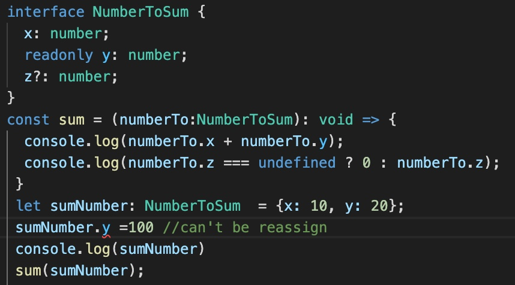
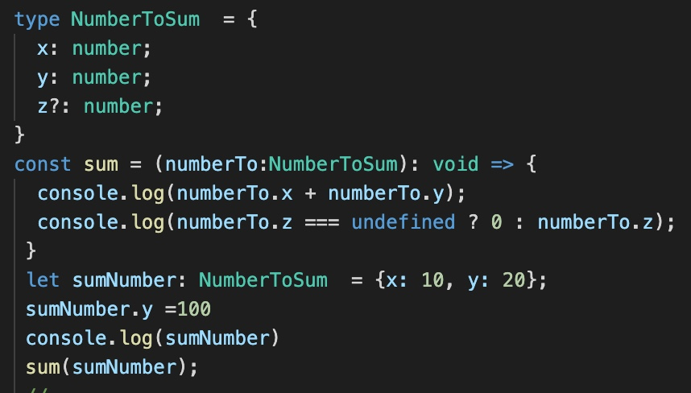
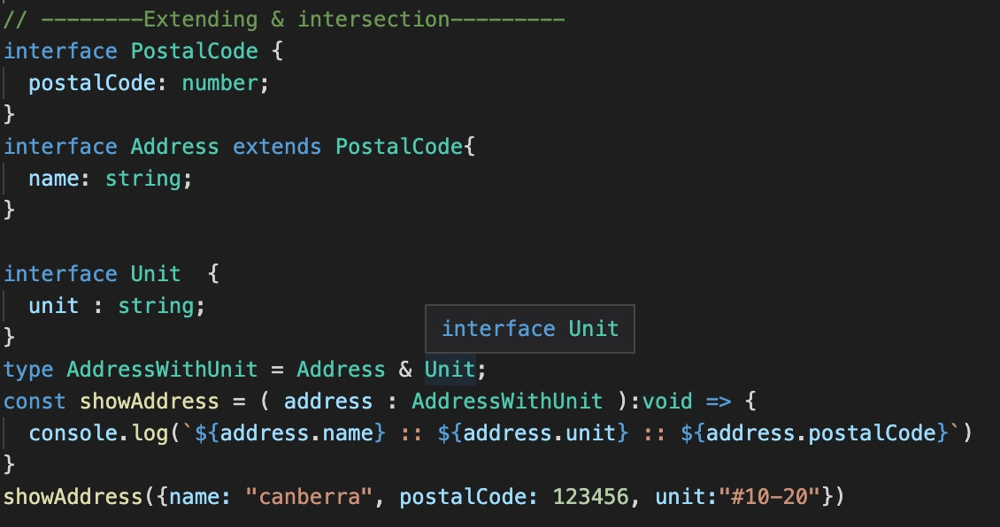

 

  <h3 align="center">Learning Journal Day 4 - 07/04/2022</h3>

  

    Hi, I am Wei Li, this is my learning journal with Activate for my apprenticeship. 
      
  

<!-- What I Am Doing -->
## What I Am Doing
<oL>
  <li>    
    Continue to learn TypeScript to have better understanding.
    <ul>
        <li>
            <b>Types vs interface in TypeScript.</b>  
            <b>Interface</b> are basically a way to describe data shapes, for example, an object.  
            <b>Type</b> us a definition of a type of data, for example, a union, primitive, intersection, tuple, or any other type.
            <ul>
                <li>
                    Interface and Type accept both Optional & readonly. Readonly can't be change during runtime.
                    
                    
                </li>
            </ul>
        </li>
        <li>
            Extending - Extends use for interface to extend all original field to new interface and added new field that are unique for that new interface.
        </li>
        <li>
            Intersection  - interfaces allowed up to build up new types from other types by extending them. Intersection types that is mainly used to combine existing object type
            
        </li>
        <li>
            <b>CLASS</b>
            <ul>
                <li>Classes are a way of describing what data you want certain object to hold, along with methods that act on that data in various way.
                </li>
                <li>Class can implement interface</li>
                <li>Inheritance - Class can extend base class. Create new classes that are based on the implementation of existing(parent) classes using key word extends. </li>
                </li>Using <b>super</b> keyword to pass in the argument to main class. Super key word is also used to refer in general to any other method you may want to call on parent class.</li>
                <li><b>Static</b> properties are helpful for anything that you want to share across all instances of a class.</li>
                <li></li>
                <li>Generic Classes - has a generic type parameter list in an angle bracket &lt; &gt; that follows the name of the class  
                    
                </li>
            </ul>
        </li>
    </ul>
    </li>
</ol>
  

<!-- Challenge -->
## Challenge
1. From all the youtube video there have own build ts file to a js file. But we didn't manage to found any js file inside our project. Do a research online. We set noEmit to true in our tsconfig.json. NoEmit to true if just want to check weather file are correct but don't want to write all these output file to save some time. 
2. Still a bit confusing when come to Interface and type. Hope can have a better understanding when we doing more project.
3. Quite familiar with class. Not a big issue for me.
  

<!-- CONTACT -->
## Contact

Wang Wei Li - weiliwang@activate.sg 
Project Link: [https://github.com/WillyWangwl/rn-training](https://github.com/WillyWangwl/rn-training)
  

<!-- Useful Link -->
## Useful Link
[Day 3: React Native Training Course](https://docs.google.com/document/d/1gvp4YxdE8aR26AYspRR52oY_SPSofc-eFteKg-imUCU/edit#) 
[More on Functions](https://www.typescriptlang.org/docs/handbook/2/functions.html) 
[Generic Arrow Functions](https://www.carlrippon.com/generic-arrow-functions/) 
[What is a Type Guard - TypeScript Narrowing #1](https://www.youtube.com/watch?v=EoPubc1u5IY) 
[What is a Type Guard - TypeScript Narrowing #2](https://www.youtube.com/watch?v=ZdMfiVK7fcM) 
[TypeScript Course for Beginners 2021 - Learn TypeScript from Scratch!](https://www.youtube.com/watch?v=BwuLxPH8IDs&t=5297s) 
    
