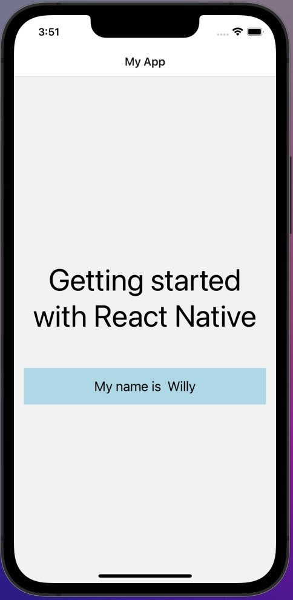

 

  <h3 align="center">Learning Journal Day 6 - 11/04/2022</h3>

  

    Hi, I am Wei Li, this is my learning journal with Activate for my apprenticeship. 
      
  

<!-- What I Am Doing -->

## What I Am Doing

<oL>
  <li>    
    Learning for React Native.
    <ul>
        <li>
            <b>What is React Native</b>  
            <ul>
                <li>React Native is a JavaScript framework for writing real, natively rendering mobile application for iOS and Android.
                </li>
            </ul>
        </li>
        <li>
            <b>Learning follow Udemy guide</b>
            <ul>
                <li><b>macOS setup</b>
                <ol>
                    <li>Install NVM - Completed</li>
                    <li>Install Node - Completed</li>
                    <li>Boilerplate Download - Completed</li>
                    <li>App Setup - npm install --legacy-peer-deps  - Completed</li>
                </ol>
                </li>
                <li><b>React Component File</b>
                <ol>
                    <li>Import libraries</li>
                    <li>Create a component</li>
                    <li>Create a stylesheet</li>
                    <li>Export the component</li>
                </ol>
                </li>
                <li><b>Rules of JSX</b>
                <ol>
                    <li>We can assemble different JSX element like normal HTML</li>
                    <li>Configure different JSX element using properties</li>
                    <li>Using { } refer to JS variables</li>
                    <li>Show JSX variable inside of a JSX block except Object</li>
                </ol>
                </li>
                <li><b>Able to complete the challenge question.</b> 
                
            </ul>
        </li>
    </ul>
    </li>
    <li>
        Continue TypeScript revision on codecademy.
    </li>
</ol>
  

<!-- Challenge -->

## Challenge

1. No issue for today
     

<!-- CONTACT -->

## Contact

Wang Wei Li - weiliwang@activate.sg 
Project Link: [https://github.com/WillyWangwl/rn-training](https://github.com/WillyWangwl/rn-training)
  

<!-- Useful Link -->

## Useful Link

[Day 6: React Native Training Course](https://docs.google.com/document/d/1fa032pQuv8I8gXU7pqMd20sJfbnJZnPqVqdSlo9_v8s/edit#) 
[Codecademy - Learn TypeScript](https://www.codecademy.com/learn/learn-typescript) 
[The Complete React Native + Hooks Course](https://www.udemy.com/course/the-complete-react-native-and-redux-course/learn/lecture/15706402#overview) 
[Installing typescript with React Native](https://reactnative.dev/docs/typescript) 
[Core Components and APIs](https://reactnative.dev/docs/0.67/components-and-apis) 
