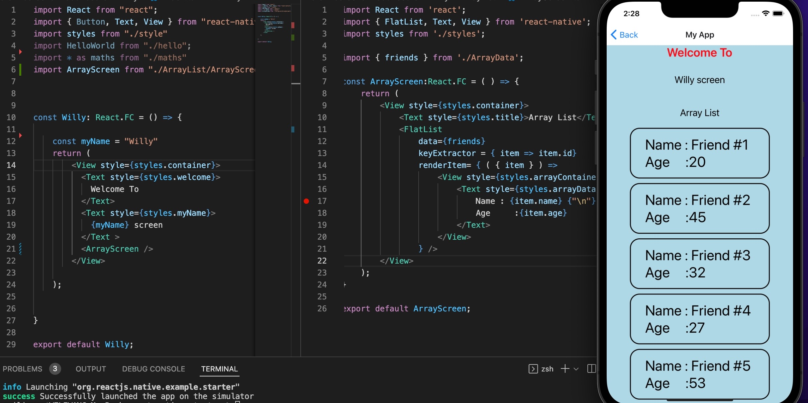
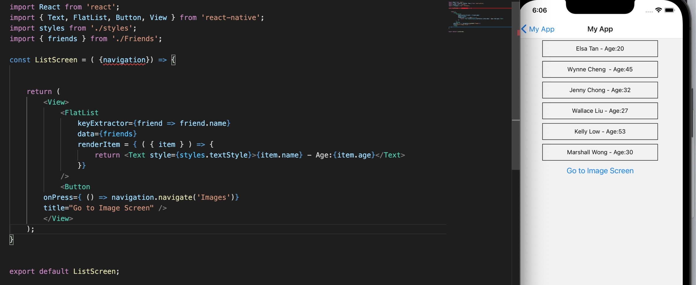
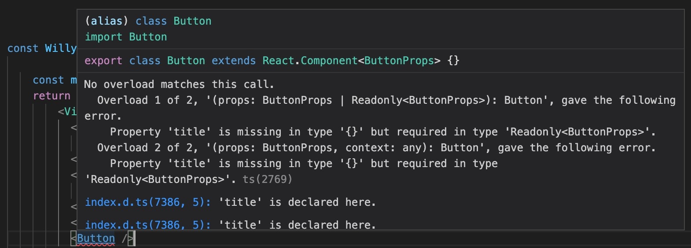

 

  <h3 align="center">Learning Journal Day 7 - 12/04/2022</h3>

  

    Hi, I am Wei Li, this is my learning journal with Activate for my apprenticeship. 
      
  

<!-- What I Am Doing -->

## What I Am Doing

<oL>
  <li>    
    Learning for React Native.
    <ul>
        <li>
            <b>FlatList</b>  
            <ul>
                <li>It’s an easy way to make an efficient scrolling list of data</li>
                <li>There are two primary props you need to know about in a FlatList and that’s data and renderItem</li>
                <li><b>data</b> - Used to create the list, typically an array of objects</li>
                <li><b>renderItem</b> - Is a function that will take an individual element of the data array and render a component for it 
                renderItem = { ( { item } ) => { &lt;T,&gt;
                    &emsp;return &lt;Text style={styles.textStyle}&gt;{item.name} - Age:{item.age}&lt;/Text&gt; 
                }} 
                </li>
                <li>FlatList component requires that each item has a unique key such as an id</li>
                <li>The key from the data array is extracted using the keyExtractor prop on the FlatList component.</li>
                <li>By default, the keyExtractor prop checks for properties like key and id</li>
                 
                 
            </ul>
        </li>
    </ul>
    </li>
</ol>
  

<!-- Challenge -->

## Challenge

1. Error message show that No overload matches this call. When I try to create a button. Doing research and follow the instruction to upgrade and install react-native paper still can't solve the issue. Found one of the post that mention somethings could just be missing required props from a component. Problem solve after declare a title in the button. 
    
     

<!-- CONTACT -->

## Contact

Wang Wei Li - weiliwang@activate.sg 
Project Link: [https://github.com/WillyWangwl/rn-training](https://github.com/WillyWangwl/rn-training)
  

<!-- Useful Link -->

## Useful Link

[Day 6: React Native Training Course](https://docs.google.com/document/d/1fa032pQuv8I8gXU7pqMd20sJfbnJZnPqVqdSlo9_v8s/edit#) 
[Codecademy - Learn TypeScript](https://www.codecademy.com/learn/learn-typescript) 
[React Native Tutorial #7 - Flat List Component](https://www.youtube.com/watch?v=iMCM1NceGJY) 
[Installing typescript with React Native](https://reactnative.dev/docs/typescript) 
[Core Components and APIs](https://reactnative.dev/docs/0.67/components-and-apis) 
