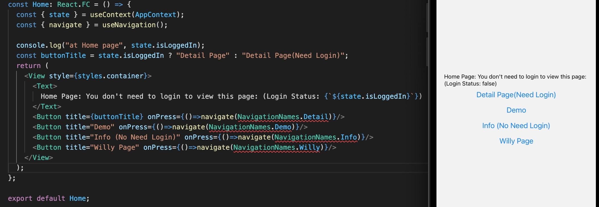
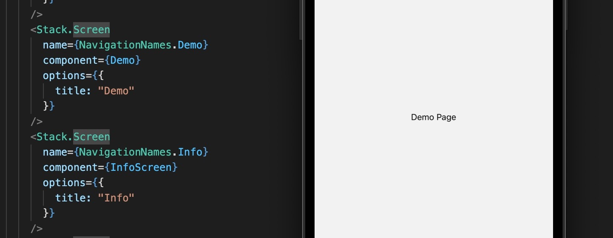
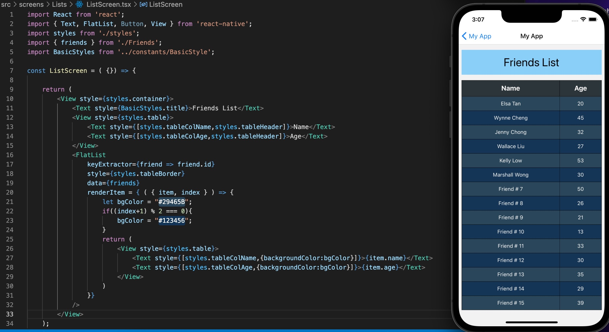
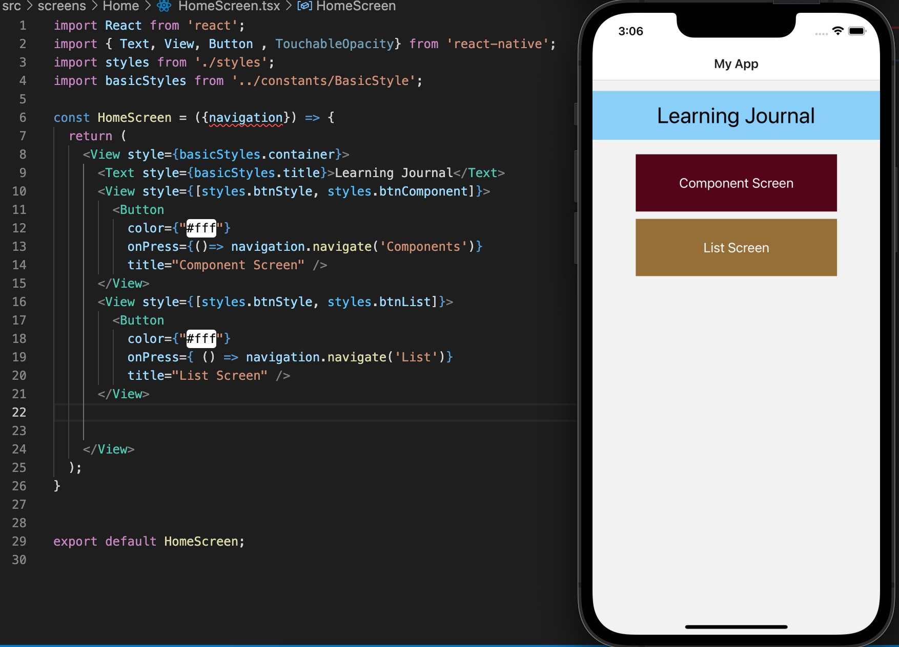

 

  <h3 align="center">Learning Journal Day 8 - 13/04/2022</h3>

  

    Hi, I am Wei Li, this is my learning journal with Activate for my apprenticeship. 
      
  

<!-- What I Am Doing -->

## What I Am Doing

<oL>
  <li>    
    Learning for React Native.
    <ul>
        <li>
            <b>Button & TouchableOpacity</b>  
            <ul>
                <li><b>Button</b></li>
                <li>Very simple component for showing a button and detecting a press</li>
                <li>onPress - Handler to be call when user taps the button</li>
                <li>title - Text to display inside the button</li>
                <li>color - Color of the text (iOS), or background color of the button (Android).</li> 
                <li><b>TouchableOpacity</b></li>
                <li>Highly customizable component that can detect a press on just about any kind of element</li>
                <li>onPress - Handler to be call when user taps the button</li>
                <li>style - can apply the custom styling.</li>
            </ul>
        </li>
        <li>
            <b>Stack Navigator</b>  
            <ul>
                <li>Stack Navigator provides a way for your app to transition between screens where each new screen is placed on top of a stack.</li>
                <li>Stack navigator shows one of our components and passes in that props object</li>
                <li>There are a lot of properties exist inside the props object.</li>
                <li>Use navigation property object added in specifically by React Native library.</li>
                <li>Navigate is a specific property inside navigation. It is a function that we can use to change the content that is visible on the screen device.</li>
            </ul>
        </li>
        <li>
            <b>Challenge Question</b>  
            <ol>
                <li>Create a Demo folder with index.tsx and style.ts file in the src -> screens -> dashboard folder.</li>
                <li>Export Demo and import on AppStack.tsx</li>
                <li>adding Demo = "Demo" in de navigation-name.ts</li>
                <li>Create a stack.screen for the demo</li>
                <li>Add the button on the home -> index.tsx</li>
                 
                 
            </ol>
        </li>
    </ul>
    </li>
</ol>
  

<!-- Challenge -->

## Challenge

1. Try to covert the list to a table format by setting flex direction to row and set the width for both item. Face a issue that make that table header. Original plan is to make it inside the flatlist. At the end found that it is unable to return two view without a wrapper. So I am creating header outside the flatlist. 
    

2. Try to combining two or more style in one component. Do a research and solve the problem by using [] to wrap both style.  
   style = { [styles.first, styles.second ] }
3. Button didn't provide style element. Using View to do the styling. 
    

<!-- CONTACT -->

## Contact

Wang Wei Li - weiliwang@activate.sg 
Project Link: [https://github.com/WillyWangwl/rn-training](https://github.com/WillyWangwl/rn-training)
  

<!-- Useful Link -->

## Useful Link

[Day 8: React Native Navigation](https://docs.google.com/document/d/1Ae2L7WqB_7fwU7dcnm8JtFNdTtyrRr8flq5aGFCDsUU/edit) 
[The Complete React Native + Hooks Course](https://www.udemy.com/course/the-complete-react-native-and-redux-course/learn/lecture/15706372#overview) 
[React Native Tutorial #20 - Stack Navigator](https://www.youtube.com/watch?v=cS4PgI3zBzY) 
[Navigating Between Screens](https://reactnative.dev/docs/navigation) 
