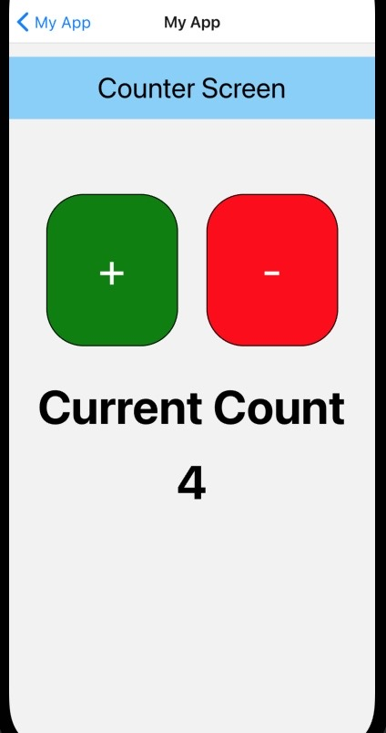
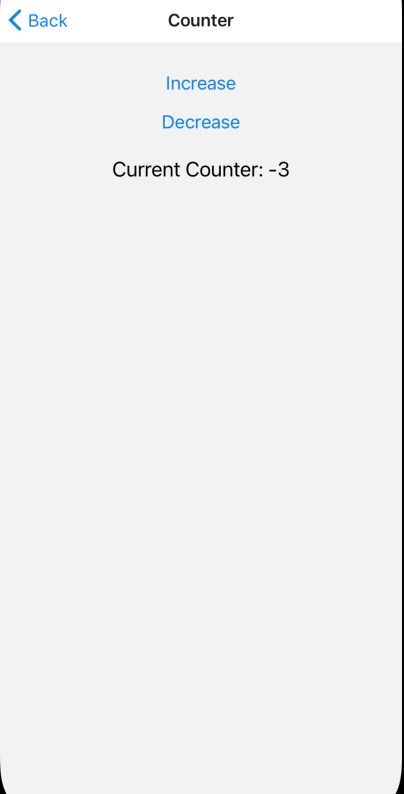

 

  <h3 align="center">Learning Journal Day 10 - 18/04/2022</h3>

  

    Hi, I am Wei Li, this is my learning journal with Activate for my apprenticeship. 
      
  

<!-- What I Am Doing -->

## What I Am Doing

<oL>
  <li>    
    Learning for React Native.
    <ul>
        <li>
            <b>State</b>  
            <ul>
                <li>There are two types of data state and props in React Native which control the component.</li> 
                <li>The component that uses the state is mutable. They can be changed later on if required.</li>
                <li>The props component is immutable, and it is fixed throughout the lifetime.</li>
                <li>The state is generally initialized in constructor and then call setState when we want to change it.</li>
                <li>We never directly modify a state variable. React doesn't detect this change. Only use the "setter" function </li>
                <li>We can track any kind of data that changes over time - a number , string, array of object, etc.</li>
                <li>When a component is rerendered, all of its children get rerendered too.</li>
                <li>A state variable can be passed to a child component. At that point, the state variable is now being used as props.</li>
                <li><b>Why never change the state directly</b> 
                    - You may just replace the update you made. 
                    - When you directly update the state, it does not change this.state immediately. Instead, it creates a pending state transition, and accessing it after calling this method will only return the present value.  
                    - You will lose control of the state across all components. 
                </li>
            </ul> 
             
        </li>
        <li>
            <b>Challenge Question</b>  
            <ul>
                <li>Try to use normal declaration for variable counter, and no error for that.</li>
                <li>Next try to change onPress function to normal adding function - counter++  
                We change get any update on screen and console log.
                <li>replace by using state. And able to see update on the spot when we click on the increase or decrease.</li>
                 
            </ul>
        </li>
    </ul>
    </li>
</ol>
  

<!-- Challenge -->

## Challenge

1. No issue for today
    
    

<!-- CONTACT -->

## Contact

Wang Wei Li - weiliwang@activate.sg 
Project Link: [https://github.com/WillyWangwl/rn-training](https://github.com/WillyWangwl/rn-training)
  

<!-- Useful Link -->

## Useful Link

[Day 10: React Native State Management](https://docs.google.com/document/d/1qo1kA0VyDVUT-HQd4CsTLzU00hcaKdTnuog4xts1gz4/edit#heading=h.sjc7nb6il2di) 
[The Complete React Native + Hooks Course](https://www.udemy.com/course/the-complete-react-native-and-redux-course/learn/lecture/15706372#overview) 
[React useState Hook](https://www.w3schools.com/react/react_usestate.asp) 
[React Hooks - useState() - CodeSandBox](https://codesandbox.io/s/mpnoljl19?file=/src/index.js:149-157)
[React Native Tutorial #4 - Using State](https://www.youtube.com/watch?v=1FiIYaRr148)
[Why should we not update the state directly?](https://www.bestinterviewquestion.com/question/why-should-we-not-update-the-state-directly-in-react-qxzqu5592op)
