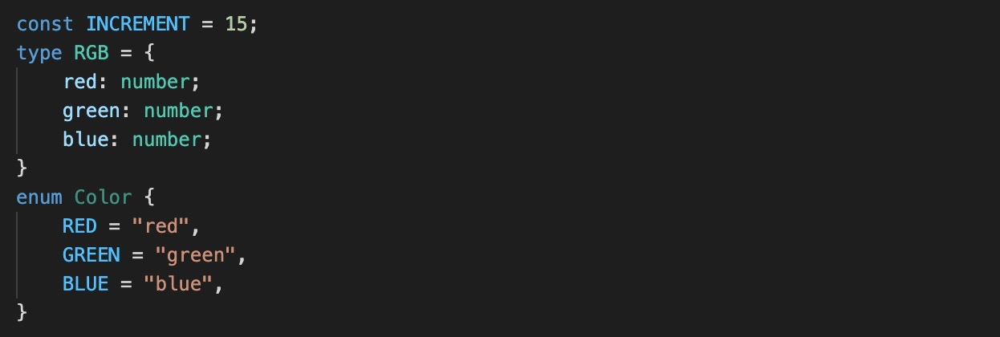
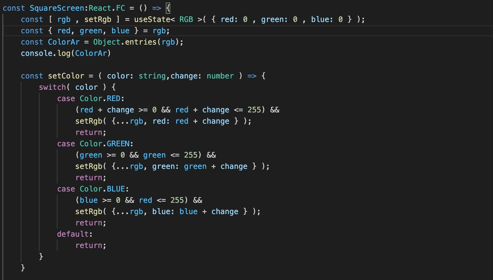
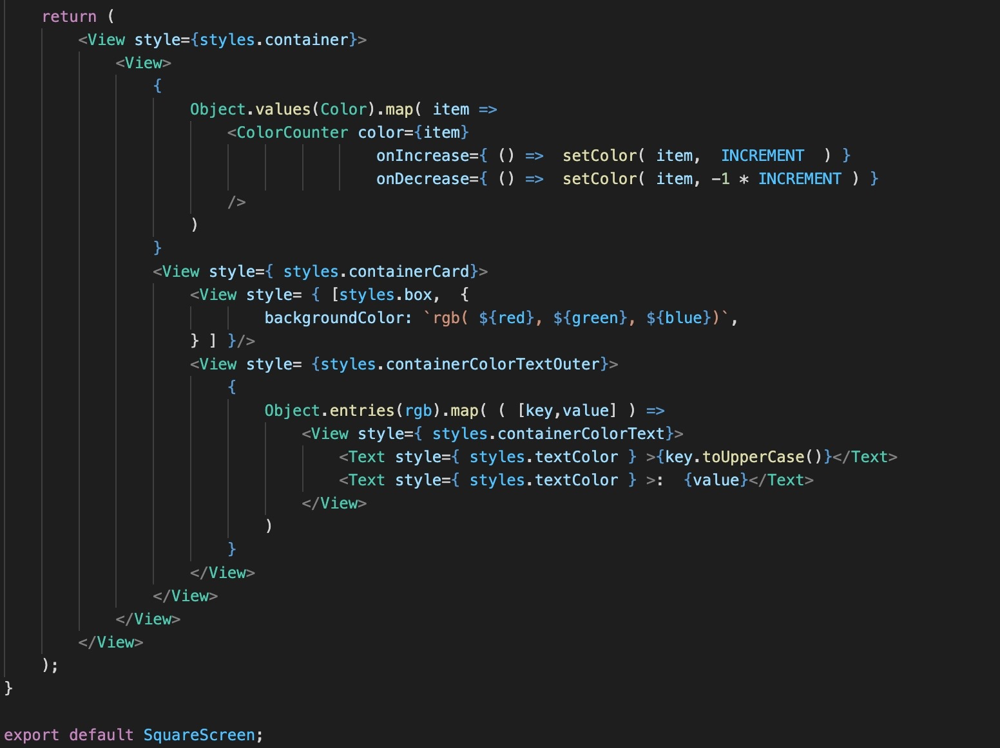
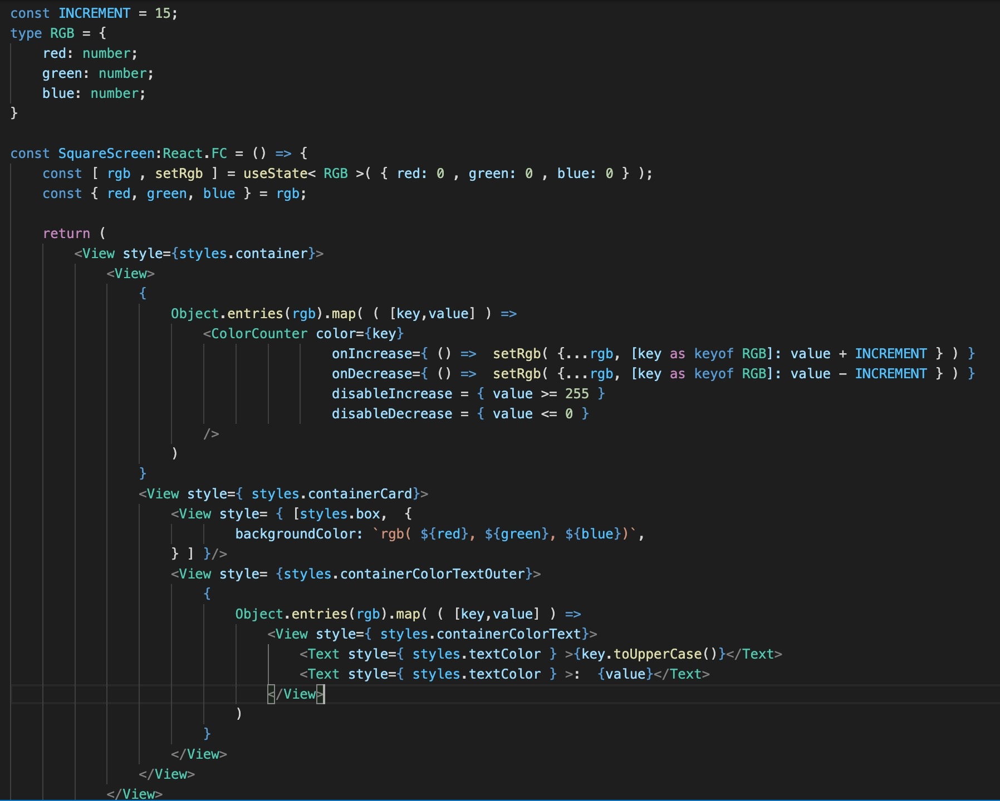
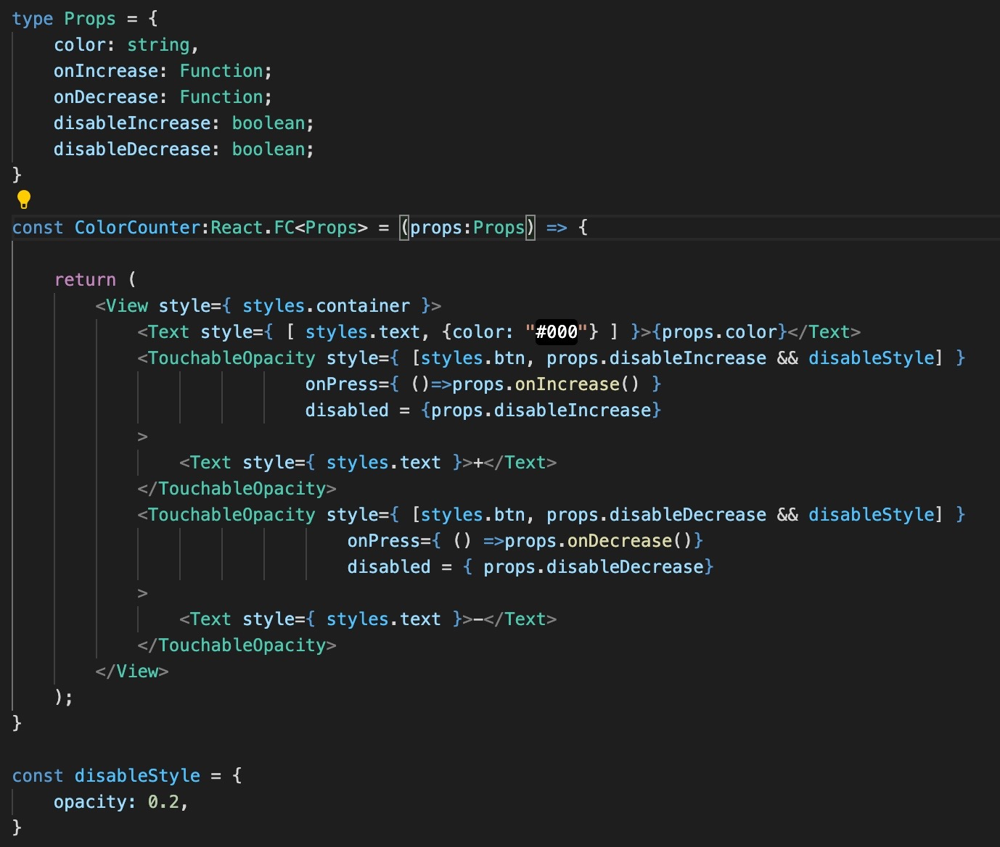
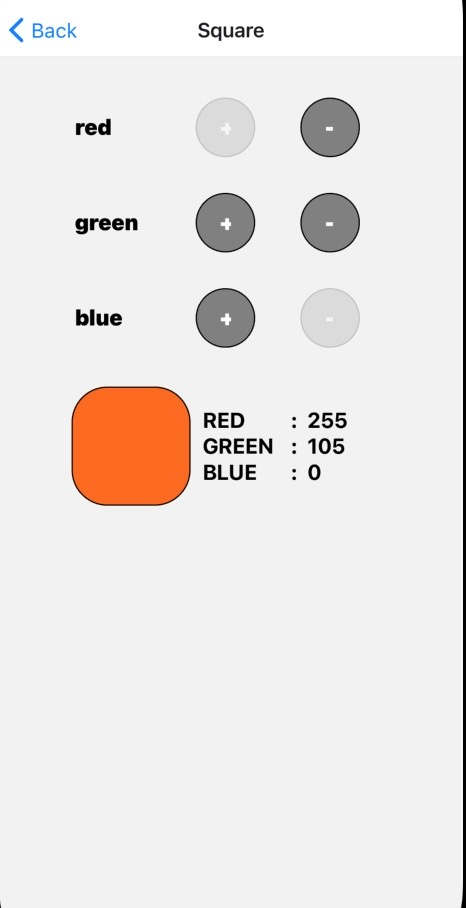
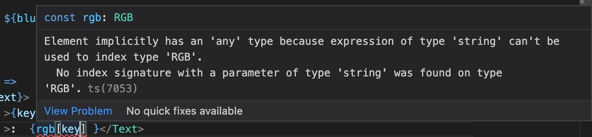

 

  <h3 align="center">Learning Journal Day 13 - 22/04/2022</h3>

  

    Hi, I am Wei Li, this is my learning journal with Activate for my apprenticeship. 
      
  

<!-- What I Am Doing -->

## What I Am Doing

<oL>
  <li>    
    Learning for React Native.
    <ul>
        <li>
            <b>State</b>  
            <ul>
                <li>Validating State Change
                    <ul>
                        <li>Do the checking before updating the state to prevent any error.</li>
                        <li>Using if else to do the verification of the color. </li>
                        <li>Better way is to use switch case to simplify the code.</li>
                        <li>use ternary operator to make sure number are within 0 - 255 for each color.</li>
                        <li>update the INCREMENT if then amount is within the range. </li>
                         
                        </li>
                    </ul>
                </li>
            </ul>
        </li>
        <li>
            <b>Challenge Question</b>  
            <ul>
                <li>Refactor of the code
                    <ol>
                        <li>Use enum of Color for string constant<li>
                        <li>Combine the state of three colors to be one state with colors object with three properties: red, green and blue.</li>
                        <li>Please note that we have a destruct here: const { red, green, blue } = colors; 
                            This makes the minimal change of the previous codes.</li>
                        <li>Please note that we use  {[Color.RED, Color.BLUE, Color.GREEN].map(item => (...)) to render the buttons for each color</li>
                        <li>5. It can be refactored furthermore. Please try to do the refactor by yourselves.</li>    
                         
                         
                           
                    </ol>
                </li>
                <li>Challenge for myself
                    <ol>
                        <li>Try to disable the button when it's reach maximum or minimum number.</li>
                        <li>Remove the validation checking after using disable function.</li>
                        <li>Replace hardcoded [Color.RED, Color.BLUE, Color.GREEN].map to Object.key(Color).map(...).</li>
                        <li>Try to shorter the code by using Object.entries(rgb).map( ( [key,value] ) => ...</li>
                        <li>By using Object.entires(rgb) I remove the enum because it no longer been use. </li>
                         
                        <li>The button look same after disable. Try to change opacity to make it look different when the button is disable</li>
                         
                         
                    </ol>
                </li>
            </ul>
        </li>
    </ul>
    </li>

</ol>
  

<!-- Challenge -->

## Challenge

1. I realize that the key in Object.entries(rgb).map( ( [key,value] ) => are in string format, my idea is convert the string to object of the rgb which means object red , green and blue so i can use setRgb directly to in the button.
2. Take some time to search for the solution. Normally we are using dot notation to access an object property. But we also can use bracket notation to access too. Which means color.red and color['red'] both can access red object property.
3. Encounter error of and the solution is set to type RGB object that declared on top.
    
    
    

<!-- CONTACT -->

## Contact

Wang Wei Li - weiliwang@activate.sg 
Project Link: [https://github.com/WillyWangwl/rn-training](https://github.com/WillyWangwl/rn-training)
  

<!-- Useful Link -->

## Useful Link

[Day 12: React Native State Management](https://docs.google.com/document/d/1BL3dsmubQsmnpAQhi0fTYJIMz8O4lv69ROukn39dsuc/edit#heading=h.sjc7nb6il2di) 
[The Complete React Native + Hooks Course](https://www.udemy.com/course/the-complete-react-native-and-redux-course/learn/lecture/15706678#overview) 
[React useState Hook](https://www.w3schools.com/react/react_usestate.asp) 
[Accessing Data through Props with Known Key Names in React.js](https://www.pluralsight.com/guides/accessing-data-through-props-with-known-key-names-in-reactjs) 
[Property accessors](https://developer.mozilla.org/en-US/docs/Web/JavaScript/Reference/Operators/Property_accessors) 
[React how to convert string to object property](https://stackoverflow.com/questions/53843378/react-how-to-convert-string-to-object-property) 
[Element implicitly has an 'any' type because expression of type 'string' can't be used to index](https://stackoverflow.com/questions/57086672/element-implicitly-has-an-any-type-because-expression-of-type-string-cant-b) 
[Disable child's button from parent conditionally - React](https://stackoverflow.com/questions/59562165/disable-childs-button-from-parent-conditionally-react) 
