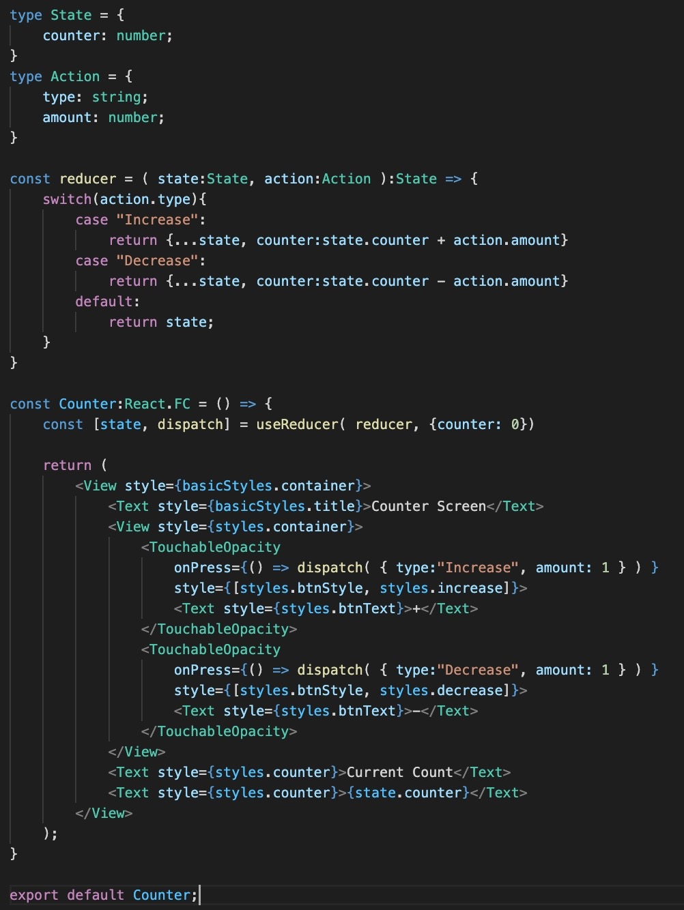
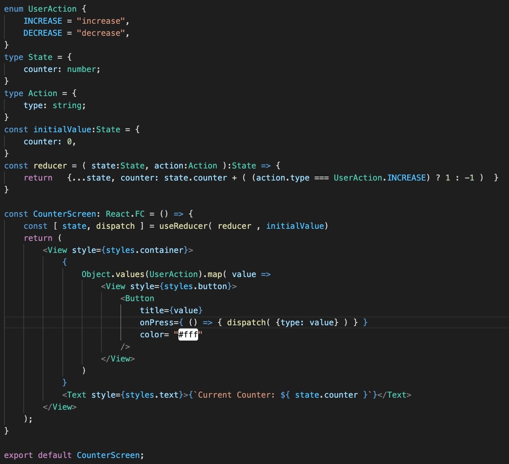
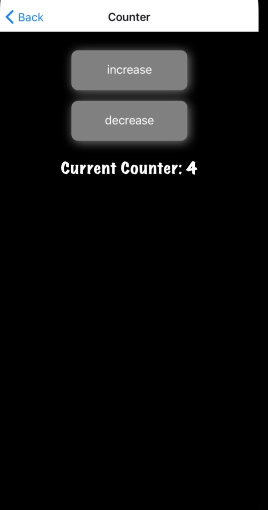

 

  <h3 align="center">Learning Journal Day 15 - 26/04/2022</h3>

  

    Hi, I am Wei Li, this is my learning journal with Activate for my apprenticeship. 
      
  

<!-- What I Am Doing -->

## What I Am Doing

<oL>
  <li>    
    Learning for React Native.
    <ul>
        <li>
            <b>Reducer</b>  
            Continue to do read up and underhand the concept of Reducer.
        </li>
        <li>Convert counterScreen from useState to useReducer 
             
        </li>
        <li>
            <b>Challenge Question</b>  
            <ul>
                <li>Change to typescript + code refactor
                    <ol>
                        <li>Change the code from js to typescript and try to refactor.</li>
                        <li>Replace switch-case by ternary operator due to only two type of action<li>
                         
                         
                    </ol>
                </li>
                <li>Challenge for myself
                    <ol>
                        <li>Planning to create a calculator and using useReducer to handling action.</li>
                        <li>Complete with some layout setting. Will continue to work on it tomorrow.</li>
                    </ol>
                </li>
            </ul>
        </li>
    </ul>
    </li>

</ol>
  

<!-- Challenge -->

## Challenge

1. Reducer a bit different with use state and it much more complicated.
2. Practice more to have better understanding of the Reducer.
    
    

<!-- CONTACT -->

## Contact

Wang Wei Li - weiliwang@activate.sg 
Project Link: [https://github.com/WillyWangwl/rn-training](https://github.com/WillyWangwl/rn-training)
  

<!-- Useful Link -->

## Useful Link

[Day 15: React Native State Management](https://docs.google.com/document/d/1oZ-Y1BUfvoJBbGLuQL6tRokAkdU84RGOYHG8hrvq1_M/edit#heading=h.sjc7nb6il2di) 
[The Complete React Native + Hooks Course](https://www.udemy.com/course/the-complete-react-native-and-redux-course/learn/lecture/15706736#overview) 
[Learn useReducer In 20 Minutes](https://www.youtube.com/watch?v=kK_Wqx3RnHk) 
[An Easy Guide to React useReducer() Hook](https://dmitripavlutin.com/react-usereducer/) 

