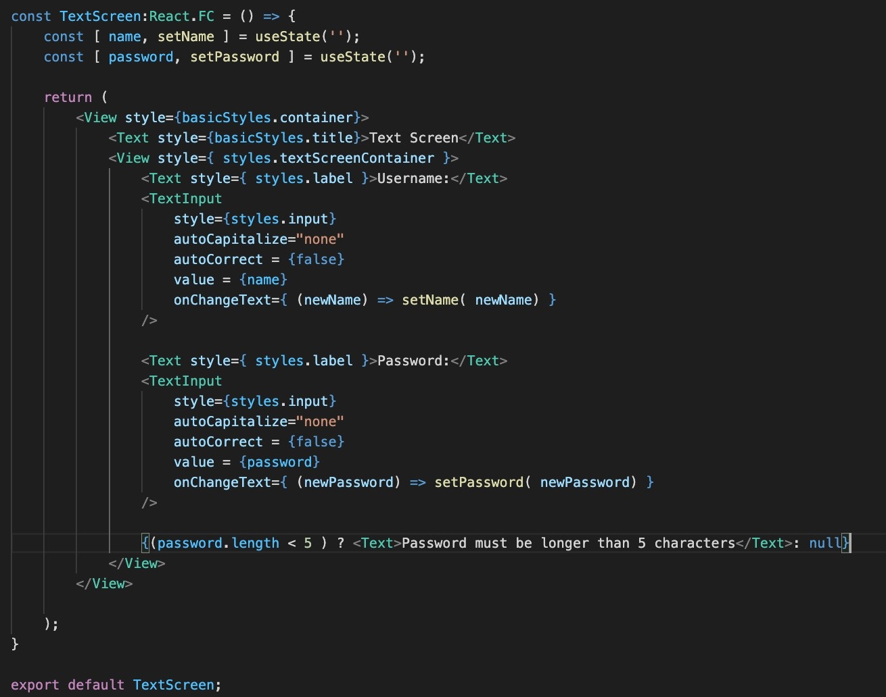
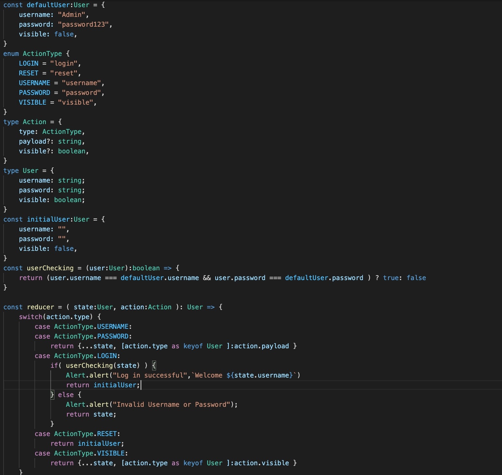
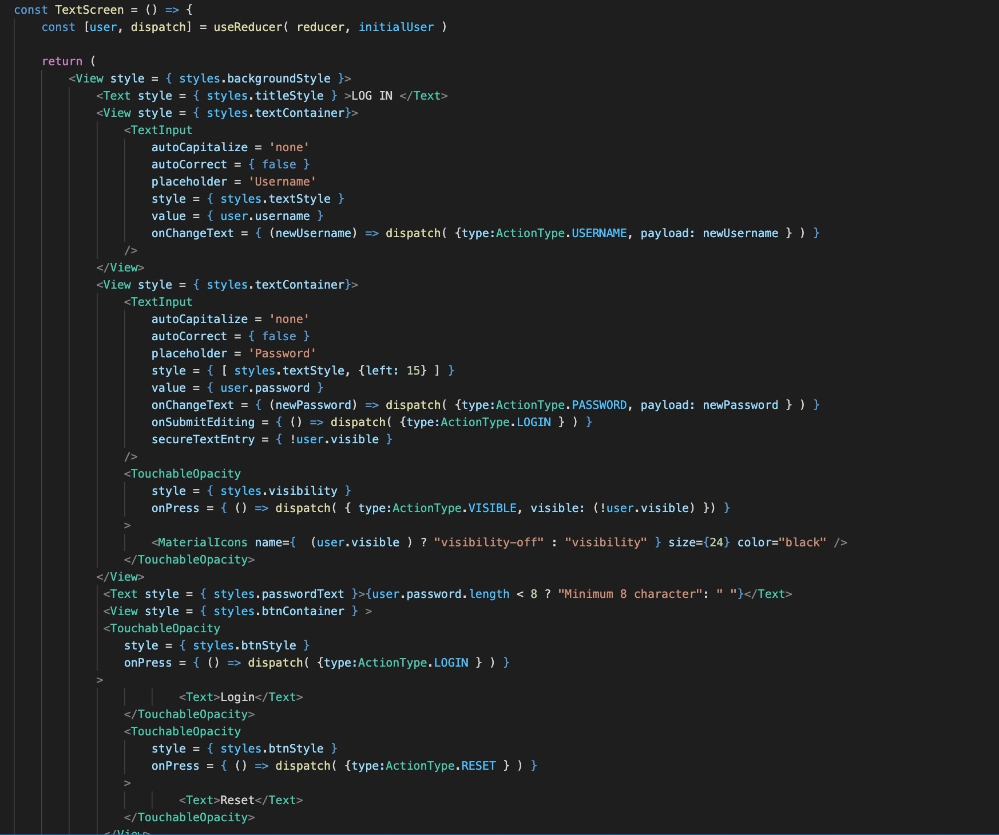
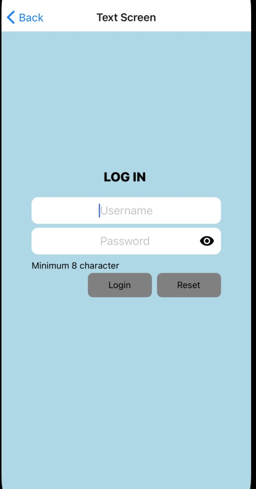
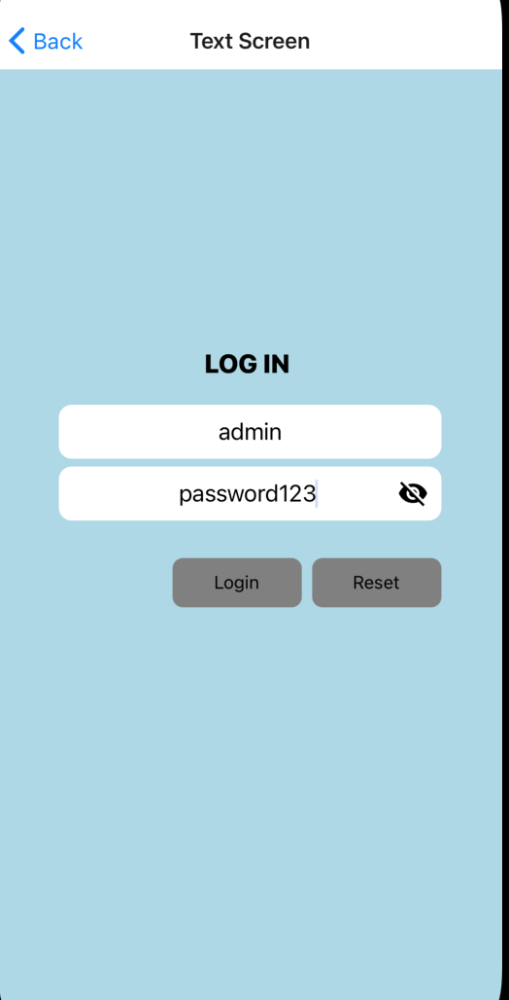
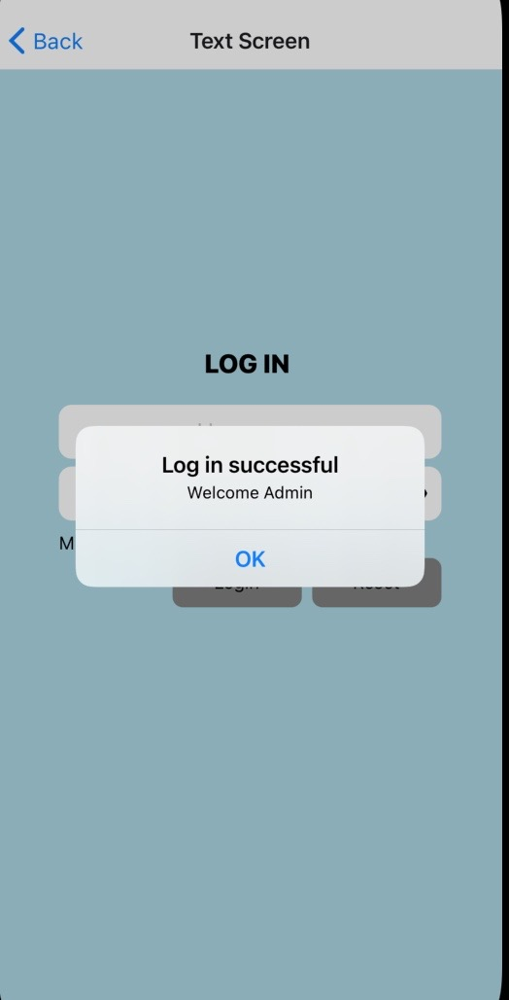
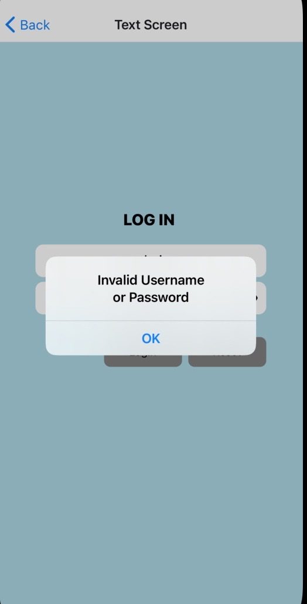
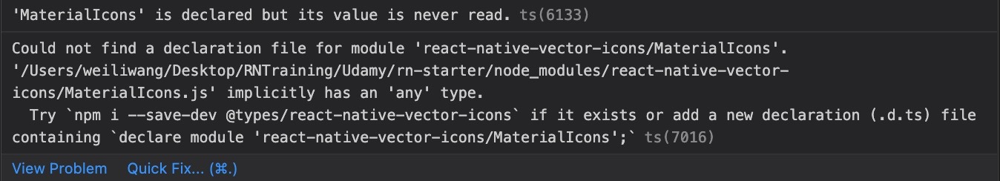

 

  <h3 align="center">Learning Journal Day 16 - 27/04/2022</h3>

  

    Hi, I am Wei Li, this is my learning journal with Activate for my apprenticeship. 
      
  

<!-- What I Am Doing -->

## What I Am Doing

<oL>
  <li>    
    Learning for React Native.
    <ul>
        <li>
            <b>Handling Text Input</b>  
            update state when input something in to textInput.
             <ol>
                <li>AutoCapitalize - Tells TextInput to automatically capitalize certain characters</li>
                <li>AutoCorrect = {false} - is to  disables auto-correct </li>
                <li>secureTextEntry - the text input obscures the text entered so that sensitive text like passwords stay secure. </li>
                <li>placeholder - The string that will be rendered before text input has been entered.</li>
                <li>value = {state} - will display the state date each time we update the state.</li>
                <li>onChangeText - Callback that is called when the text input's text changes</li>
                <li>onSubmitEditing - Callback that is called when "Enter" pressed.</li>
                <li>Text screen element hold the state current input and going to show the input element by passing props in the props to value every single time render the text screen. </li>
                <li>Input is a callback function under the prop name on change text. Callback function will be invoked anytime a user types inside of the input.</li>
            </ol>
             
        </li>
        <li>
            <b>Challenge Question</b>  
            <ul>
                <li>Change to typescript + code refactor
                    <ol>
                        <li>Add a reset button.</li>
                        <li>show masked password instead of plain text ******</li>
                    </ol>
                </li>
                <li>Challenge for myself
                    <ol>
                        <li>Set a default password and username</li>
                        <li>Add log in button to do the verify the username and password. </li>
                        <li>prompt alert for valid and invalid login</li>
                        <li>create a toggle visibility button for the password.</li>
                         
                         
                         
                         
                         
                    </ol>
                </li>
            </ul>
        </li>
    </ul>
    </li>

</ol>
  

<!-- Challenge -->

## Challenge

1. Try to import icon for the react-native-vector-icons. Still get the error after i follow the step their provide. 
    
2. Solve it after i follow the errorMessage from typescript by using  
   npm i --save-dev @types/react-native-vector-icons  
    
    

<!-- CONTACT -->

## Contact

Wang Wei Li - weiliwang@activate.sg 
Project Link: [https://github.com/WillyWangwl/rn-training](https://github.com/WillyWangwl/rn-training)
  

<!-- Useful Link -->

## Useful Link

[Day 16: React Native State Management](https://docs.google.com/document/d/1CgCVkYPjIPhzmCocm61pk1aq9m_HoGSM0jazJdqVxyM/edit#) 
[The Complete React Native + Hooks Course](https://www.udemy.com/course/the-complete-react-native-and-redux-course/learn/lecture/15706736#overview) 
[TextInput](https://reactnative.dev/docs/textinput) 
[Learn useReducer In 20 Minutes](https://www.youtube.com/watch?v=kK_Wqx3RnHk) 
[Enter key press in react native](https://www.youtube.com/watch?v=G4MJnkeNu08) 
[What does "keyof typeof" mean in TypeScript?](https://stackoverflow.com/questions/55377365/what-does-keyof-typeof-mean-in-typescript) 
[Alert](https://reactnative.dev/docs/alert) 
[react-native-vector-icons](https://www.npmjs.com/package/react-native-vector-icons) 
[oblador/react-native-vector-icons](https://github.com/oblador/react-native-vector-icons#icon-component) 
[@expo/vector-icons@13.0.0]https://icons.expo.fyi) 
[Passing checkbox value to show / hide Password via react native](https://stackoverflow.com/questions/44628346/passing-checkbox-value-to-show-hide-password-via-react-native) 
