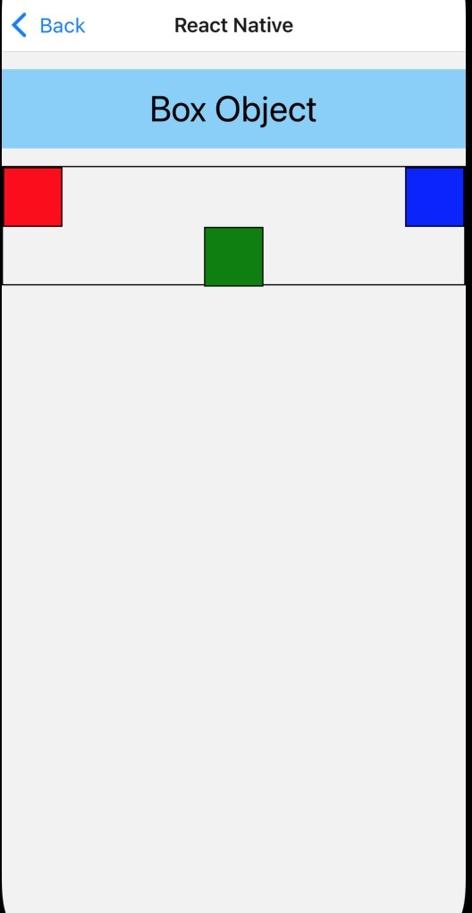
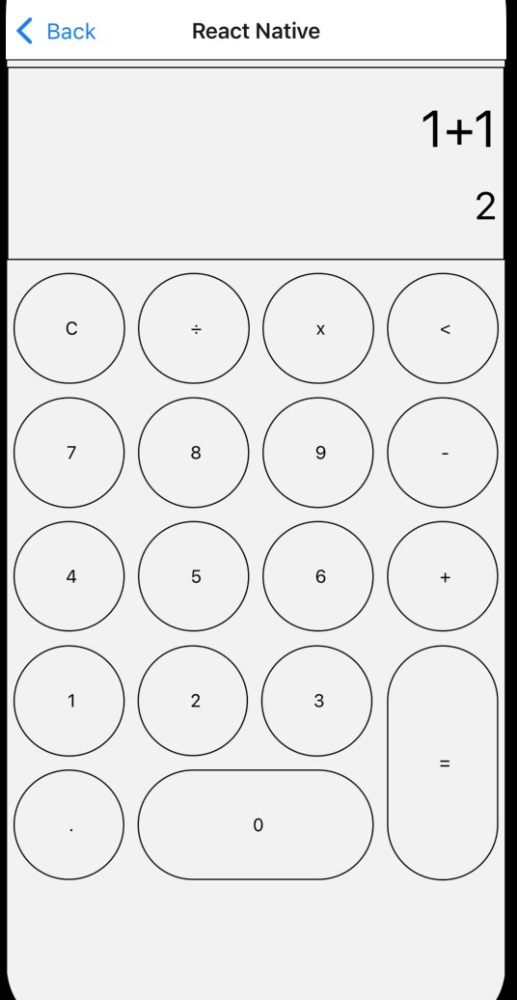

 

  <h3 align="center">Learning Journal Day 17 - 28/04/2022</h3>

  

    Hi, I am Wei Li, this is my learning journal with Activate for my apprenticeship. 
      
  

<!-- What I Am Doing -->

## What I Am Doing

<oL>
  <li>    
    Learning for React Native.
    <ul>
        <li>
            <b>Handling Screen Layout</b>  
             <ol>
                <li>flex - will define how your items are going to “fill” over the available space along your main axis.</li>
                <li>flexDirection -  controls the direction in which the children of a node are laid out </li>
                <li>justifyContent - describes how to align children within the main axis of their container. </li>
                <li>alignItems - describes how to align children along the cross axis of their container.</li>
                <li>alignSelf - has the same options and effect as alignItems but instead of affecting the children within a container, you can apply this property to a single child to change its alignment within its parent..</li>
                <li>flexWrap - property is set on containers and it controls what happens when children overflow the size of the container along the main axis</li>
                <li>The position type of an element defines how it is positioned within its parent</li>
                <li>relative - By default, an element is positioned relatively. This means an element is positioned according to the normal flow of the layout, and then offset relative to that position based on the values of top, right, bottom, and left. The offset does not affect the position of any sibling or parent elements. </li>
                <li>absolute - when positioned absolutely, an element doesn't take part in the normal layout flow. It is instead laid out independent of its siblings. The position is determined based on the top, right, bottom, and left values</li>
            </ol>
             
        </li>
        <li>
            <b>Challenge Question</b>  
            <ul>
                <li>Challenge for myself
                    <ol>
                        <li>Create a calculator layout</li>
                        <li>Add log in button to do the verify the username and password. </li>
                    </ol>
                </li>
            </ul>
            
        </li>
    </ul>
    </li>

</ol>
  

<!-- Challenge -->

## Challenge

1. I have issue with my xcode and react-native-starter, and i type spend a lot of time try to solve it. But i still unable to solve it. Thanks to Anya, Janan and Alvin help me on my isuse.
2. I unable to run my react-native-starter project. I try to reinstall xcode , cocoaPod and everything and clone a rew react-native-starter from Anya, but still unable to run the project. Will carry on to solve my issue tomorrow.
    

<!-- CONTACT -->

## Contact

Wang Wei Li - weiliwang@activate.sg 
Project Link: [https://github.com/WillyWangwl/rn-training](https://github.com/WillyWangwl/rn-training)
  

<!-- Useful Link -->

## Useful Link

[Day 17: React Native Design System](https://docs.google.com/document/d/1oqOjm59OuK4851gzJ2tOMHdC5G2OcKV067PUKadJjho/edit#heading=h.sjc7nb6il2di) 
[Layout with Flexbox](https://reactnative.dev/docs/flexbox) 
