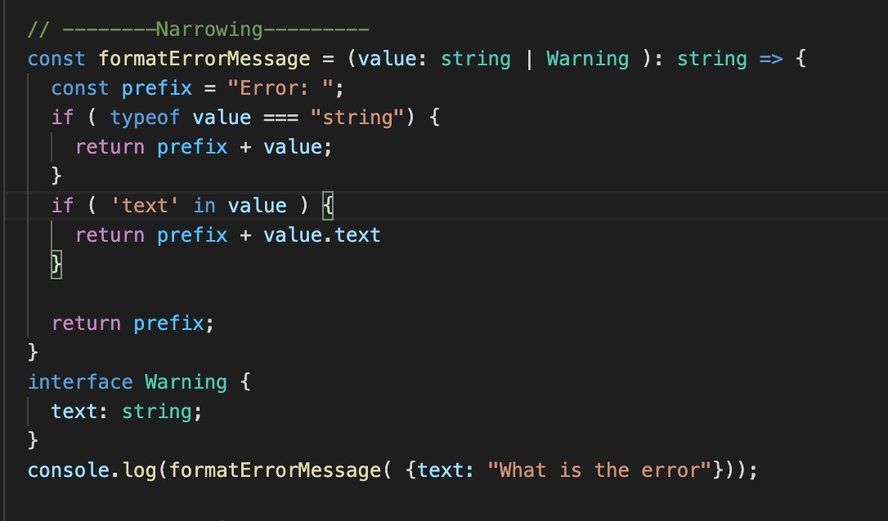

 

  <h3 align="center">Learning Journal Day 3 - 06/04/2022</h3>

  

    Hi, I am Wei Li, this is my learning journal with Activate for my apprenticeship. 
      
  

<!-- What I Am Doing -->
## What I Am Doing
<oL>
  <li>    
    Continue to learn TypeScript to have better understanding.
    <ul>
        <li>
            Enum - Added by TypeScript that automatically enumerated global constant identifiers, it has human readable label. Allow user to develop to define a set of named constants. Using enums can make it easier to document intent,or create a set of distinct case.
            <ul>
                <li>
                    enum Role { Admin, Read_Only, User };   Its automatically assign Admin to 0 and Read_Only to 1 and so on<
                </li>
                <li>
                    enum Role { Admin = "ADMIN", Read_Only = 100, User = "USER" };  We can assign our own value as well.
                </li>
            </ul>
        </li>
        <li>
            Narrowing - Process of refining a broader type to one that is more specify to handle the cases individually.  
            
        </li>
        <li>
            Function - Arrow Function.
            <ul>
                <li>Void arrow function
                    <ul>
                        <li>
                            const greeting =  ( firstName: string ) : void  => { ... };
                        </li>
                    </ul>
                </li>
                <li>1 line code 
                    <ul>
                        <li>
                            const greeting = ( firstName: string ) : string => `Hello ${firstName}`;
                        </li>
                    </ul>
                </li>
                <li>Js allow optional parameter, but we need to use ? or pre-assign a value to the optional parameter
                    <ul>
                        <li>
                            const greeting = ( firstName: string, lastName?: string ) : string => `Hello ${firstName}`; 
                        </li>
                        <li>
                            const greeting = ( firstName: string, lastName: string = "James" ) : string => {  
                                &emsp;return `Hello ${firstName} ${lastName}`; 
                            }
                        </li>
                    </ul>
                </li>
                <li>Generic functions - Generics uses the type variable <T>, a special kind of variable that denotes types. The type variable remembers the type that the user provides and works with that particular type only.
                    <ul>
                        <li>
                            const combineAdd = &lt;T,&gt;(input1 : T, input2: T) : T => { 
                                &emsp; return input1 + input2;  
                            } 
                            console.log(combineAdd(30,26)); Result : 56 
                            console.log(combineAdd("30","26"));Result : 3026 
                            console.log(combineAdd("Hello"," World"));Result : Hello World 
                        </li>
                    </ul>
                </li>
                <li>Type Function - to define a function that assign the value and it return type. Which other function can refer to the type function format.
                    <ul>
                        <li>Return Type Function  
                            type GreetFunction1 = ( name: string ) => string ; 
                            const greeter: GreetFunction1 = (fn ) => {return  "hello " + fn ;}
                        </li>
                        <li>Void Type Function  
                            type GreetFunction2 = ( name: string ) => void ; 
                            const goodbye: GreetFunction2 = ( bye ) => console.log( "Bye " + bye );
                        </li>
                    </ul>
                </li>
                <li>Parameter Destructuring - Functional object might just define the variable type after the destructed variable.
                    <ul>
                        <li>
                            const displayDetail = ( { stdName, stdAge, stdAddress} : 
                            { stdName : string ; stdAge: number; stdAddress : string }):void => { 
                            &emsp;console.log(` Name: ${stdName}, Age: ${stdAge}, Address: ${stdAddress}`) 
                        } 
                        displayDetail({stdName: "willy",stdAge: 35,stdAddress: "Singapore"});                      
                        </li>
                    </ul>
                </li>
                <li>Parameter Destructuring - The correct way to handle TypeScript functional destructuring is to define an interface and reference after the destructure.
                    <ul>
                        <li>
                            interface NumberToSum { 
                                &emsp;x: number; 
                                &emsp;y: number; 
                                &emsp;z: number; 
                            } 
                            const sum = ({ x, y, z }:NumberToSum): void => { 
                                &emsp;console.log(x + y + z); 
                            } 
                            const sumNumber = {x: 10, y: 20, z:30}; 
                            sum(sumNumber);                     
                        </li>
                    </ul>
                </li>
            </ul>
        </li>
      
</ol>
  

<!-- Challenge -->
## Challenge
1. Convert all function to arrow function. Take some time do pratice and get use for it. And try to explore more by learning from youtube
  

<!-- CONTACT -->
## Contact

Wang Wei Li - weiliwang@activate.sg 
Project Link: [https://github.com/WillyWangwl/rn-training](https://github.com/WillyWangwl/rn-training)
  

<!-- Useful Link -->
## Useful Link
[Day 3: React Native Training Course](https://docs.google.com/document/d/1gvp4YxdE8aR26AYspRR52oY_SPSofc-eFteKg-imUCU/edit#) 
[More on Functions](https://www.typescriptlang.org/docs/handbook/2/functions.html) 
[Generic Arrow Functions](https://www.carlrippon.com/generic-arrow-functions/) 
[What is a Type Guard - TypeScript Narrowing #1](https://www.youtube.com/watch?v=EoPubc1u5IY) 
[What is a Type Guard - TypeScript Narrowing #2](https://www.youtube.com/watch?v=ZdMfiVK7fcM) 
[TypeScript Course for Beginners 2021 - Learn TypeScript from Scratch!](https://www.youtube.com/watch?v=BwuLxPH8IDs&t=5297s) 
    
