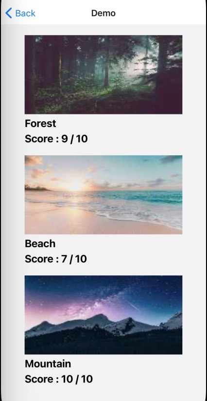
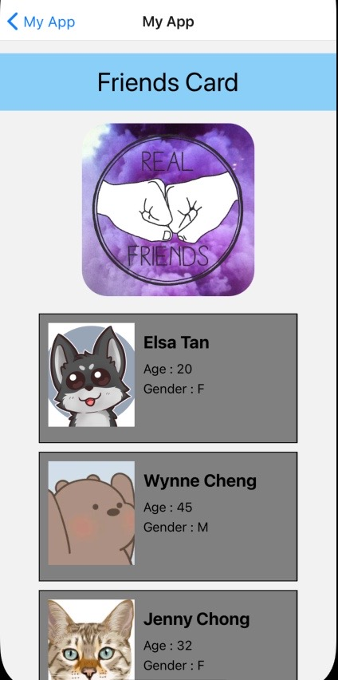
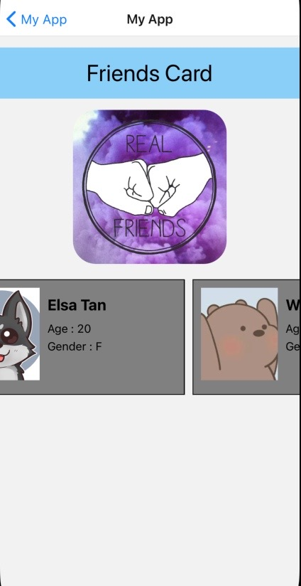

 

  <h3 align="center">Learning Journal Day 9 - 14/04/2022</h3>

  

    Hi, I am Wei Li, this is my learning journal with Activate for my apprenticeship. 
      
  

<!-- What I Am Doing -->

## What I Am Doing

<oL>
  <li>    
    Learning for React Native.
    <ul>
        <li>
            <b>Image</b>  
            <ul>
                <li>A React component for displaying different types of images, including network images, static resources, temporary local images, and images from local disk, such as the camera roll.</li>
                <li> Source - The image source (either a remote URL or a local file resource)./li>
                <li>The static images are added in app by placing it in somewhere in the source code directory and provide its path as: 
                    &emsp;&lt;Image source={require('./icon_name.png')} /&gt;
                </li>
                <li>The dynamic and network images are also be displayed in the Image component. To access the network image, it is required to specify the dimensions of image manually. 
                    &emsp;&lt;Image source={{uri: 'https://url_of_image.png'}}  
       style={{width: 60, height: 60}} /&gt; 
                </li>
            </ul>
        </li>
        <li>
            <b>Reusable Component</b>  
            <ul>
                <li>With the growing number of properties and features in the application, even simple reusable components like Button can become complicated as a result of mutations and possible combinations.</li>
            </ul>
        </li>
        <li>
            <b>Challenge Question</b>  
            <ol>
                <li>Create a folder name ImageScreen to keep index.tsx and style.ts</li>
                <li>create component that accept data pass in and render the data.</li>
                <li>Reuse the component with different data passed it.</li>
                 
            </ol>
        </li>
    </ul>
    </li>
</ol>
  

<!-- Challenge -->

## Challenge

1. Create Object array to store the data. Use flatlist to call reusable component to display card item.
2. having issue with the require(''). 
   - Unable to call the link with method require({object.address}) 
   - Unable to assign whole link directly. imageUrl = require("../.../assets/test.jpg") 
   - Solution found online it to store whole of the require("../.../assets/test.jpg") in the object. 
      
      

<!-- CONTACT -->

## Contact

Wang Wei Li - weiliwang@activate.sg 
Project Link: [https://github.com/WillyWangwl/rn-training](https://github.com/WillyWangwl/rn-training)
  

<!-- Useful Link -->

## Useful Link

[Day 9: React Native Custom Component](https://docs.google.com/document/d/192rnWp4581_NDErzvnU-9kithr9-D-6_YbJr0jmPdOs/edit#) 
[The Complete React Native + Hooks Course](https://www.udemy.com/course/the-complete-react-native-and-redux-course/learn/lecture/15706372#overview) 
[Reusable React Native components](https://www.callstack.com/blog/reusable-react-native-components) 
[React Native - Image Require Module using Dynamic Names](https://stackoverflow.com/questions/30854232/react-native-image-require-module-using-dynamic-names)
