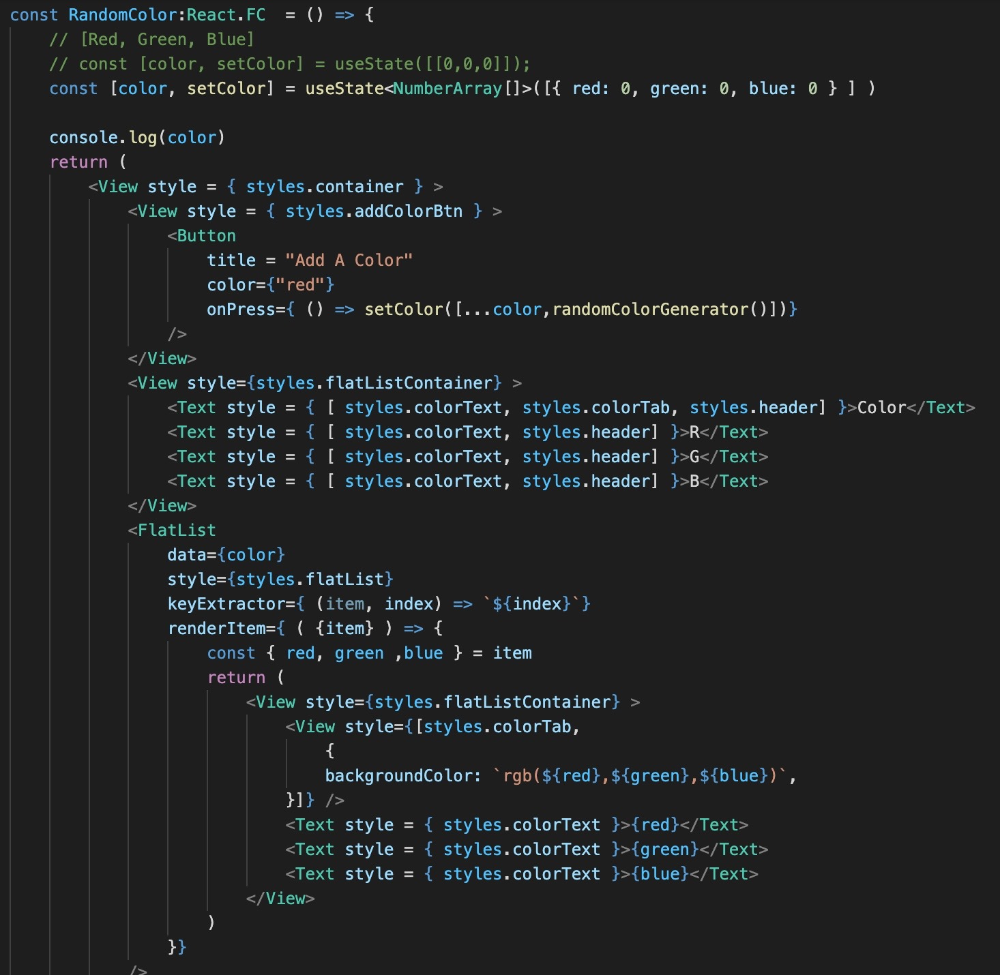

 

  <h3 align="center">Learning Journal Day 11 - 19/04/2022</h3>

  

    Hi, I am Wei Li, this is my learning journal with Activate for my apprenticeship. 
      
  

<!-- What I Am Doing -->

## What I Am Doing

<oL>
  <li>    
    Learning for React Native.
    <ul>
        <li>
            <b>State</b>  
            <ul>
                <li>Use state to store item into array.
                    <ul>
                        <li>The declaration with pre define variable. 
                        - Set color as an empty array 
                        - const [colors, setColors] = useState([]) 
                        - set color to and initialize variable 
                        - const [colors, setColors] = useState( [ "rgb( 0, 0, 0 )" ] ) 
                        </li>
                        <li>Add variable/object to array 
                        -  setColors( [...colors,randomRGB()] )  
                        -  ...colors = An array object which contain all the data  
                        </li>
                        <li>Three question:
                            <ol>
                                <li>What piece of data inside this application is changing? 
                                color</li>
                                <li>What type of data is it? Is it number, a string an object or and array? 
                                array of string.<li>
                                <li>What is the starting value of that piece of data? 
                                empty array []</li>
                            </ol>
                        </li>
                    </ul>
                </li>
            </ul> 
             
            
        </li>
        <li>
            <b>Challenge Question</b>  
            <ul>
                <li>Apply the same component to the react-native-starter project, Try to add the color label under the color square.</li>
                <ol>
                    <li>Try to store rgb to an array and keep inside the array. 
                     
                     
                     
                    </li>
                    <li>Try to store rgb to an object and keep inside the array 
                     
                     
                     
                    </li>
                </ol>
                <li>both of object and 2D array have the same output. 
                 
            </ul>
        </li>
    </ul>
    </li>

</ol>
  

<!-- Challenge -->

## Challenge

1. No issue for today
    
    

<!-- CONTACT -->

## Contact

Wang Wei Li - weiliwang@activate.sg 
Project Link: [https://github.com/WillyWangwl/rn-training](https://github.com/WillyWangwl/rn-training)
  

<!-- Useful Link -->

## Useful Link

[Day 11: React Native State Management](https://docs.google.com/document/d/1cRvpoFv6bLiW_IqifuowDRvnL07YTNZ_O9bdT-GoYOg/edit#heading=h.sjc7nb6il2di) 
[The Complete React Native + Hooks Course](https://www.udemy.com/course/the-complete-react-native-and-redux-course/learn/lecture/15706372#overview) 
[React useState Hook](https://www.w3schools.com/react/react_usestate.asp) 
[React Native Tutorial #4 - Using State](https://www.youtube.com/watch?v=1FiIYaRr148) 
[What do these three dots (…) in React do ?](https://www.geeksforgeeks.org/what-do-these-three-dots-in-react-do/) 
