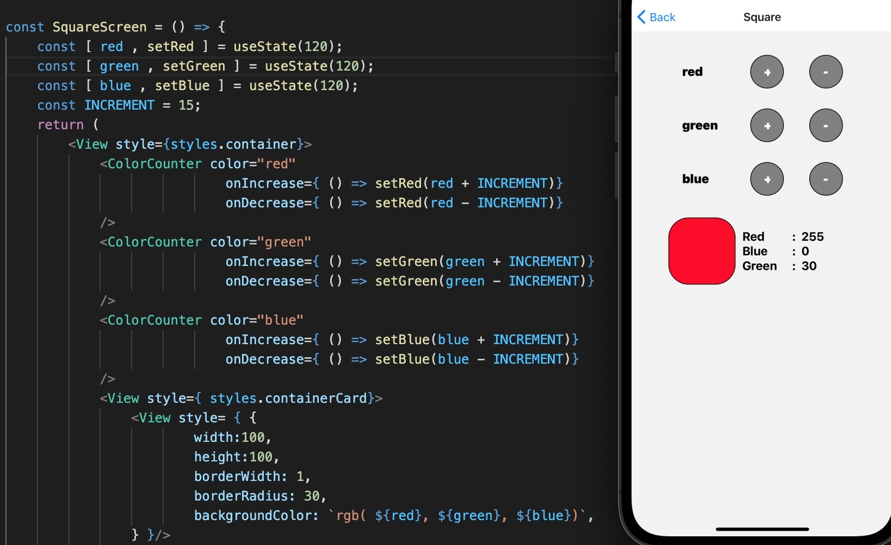
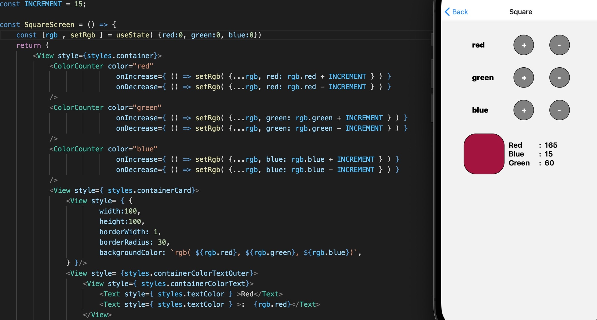
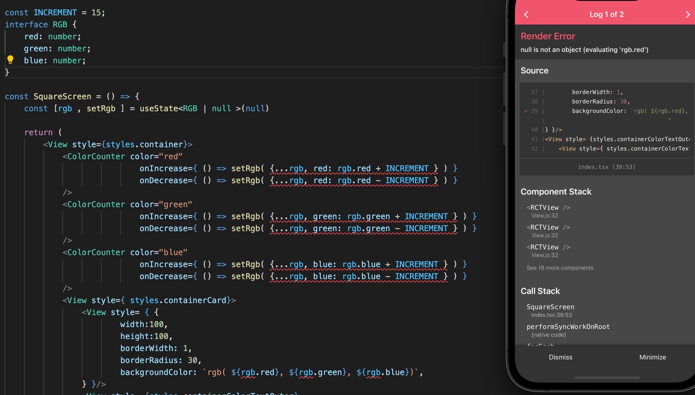
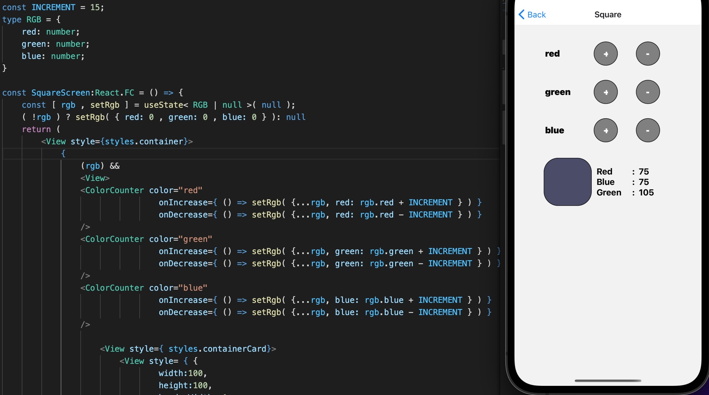
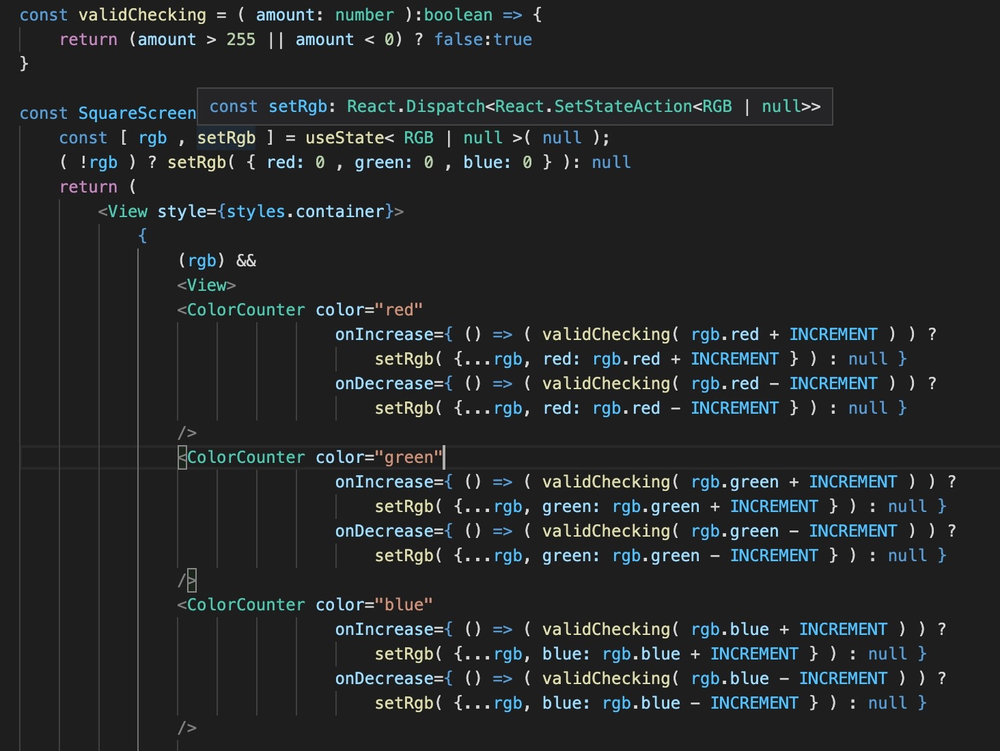
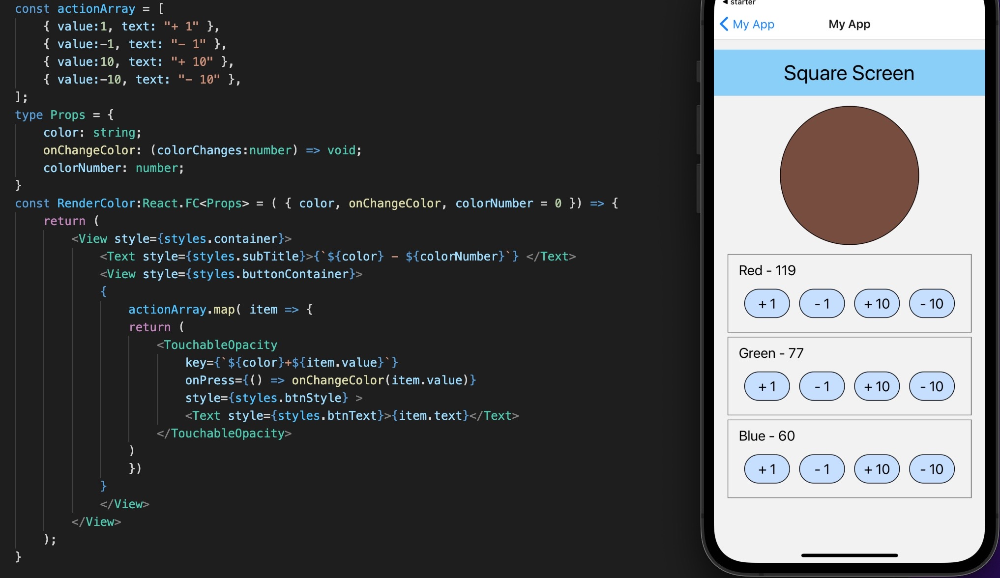

 

  <h3 align="center">Learning Journal Day 12 - 20 & 21/04/2022</h3>

  

    Hi, I am Wei Li, this is my learning journal with Activate for my apprenticeship. 
      
  

<!-- What I Am Doing -->

## What I Am Doing

<oL>
  <li>    
    Learning for React Native.
    <ul>
        <li>
            <b>State</b>  
            <ul>
                <li>Callback functions in React
                    <ul>
                        <li>Information in React gets passed around to components in two different ways.</li>
                        <li>First, information can get passed from parent to child as props. That seems pretty straightforward</li>
                        <li>Establish the property when creating an instance of the child component and it will be available to that instance</li>
                        <li>Instead of passing down a piece of the state to a child component, the parent can pass down a callback function. </li>
                        <li>This callback function is run at a later time, usually through some interaction with the child component. </li>
                        <li>The purpose of this callback function is to change a piece of the state that is a part of the parent component. </li>
                        <li>This closes the data loop 
                         
                        </li>
                    </ul>
                </li>
                <li>React Native useState
                    <ul>
                        <li>Three question
                            <ol>
                                <li>What piece of data inside this application is changing?  
                                    Color - Red , Green, Blue.
                                </li>
                                <li>What type of data is it? Is it a number, a string an object, or an array?< br />
                                number
                                </li>
                                <li>What is the starting value of piece of data? 
                                    0
                                </li>
                            </ol>
                        </li>
                        <li></li>
                    </ul>
                </li>
            </ul>
        </li>
        <li>
            <b>Challenge Question</b>  
            <ul>
                <li>Apply the same component to the react-native-starter project, Try to add the color label under the color square.
                    <ol>
                        <li>Try to add the color label under the color square<li>
                        <li>Convert the states of red, blue, green into a state of object with property of red, blue and green. 
                             
                        </li>
                        <li>Try to initial state with null and fix the issue to make it work. 
                             
                            Error message showed even I try to declare object to rgb, due to reading null object. 
                            hardcode to do null checking and everything can display with warning. 
                             
                        </li>
                        <li>Write a function to checking the value is more than 255 or less than 0 
                             
                        </li>
                    </ol>
                </li>
                <li>Challenge for myself
                    <ol>
                        <li>Try to pass different value from Child component and doing increase or decrease at the parent component. 
                             
                            squareScreen onChangeColor accepted value that passed from it child component. 
                            child component TouchableOpacity onPress function will pass in a value( 1, -1, 10, -10) to parent function.
                            Parent function will take in the value and adding color base on the value that passed in. 
                        </li>
                    </ol>
                </li>
            </ul>
        </li>
    </ul>
    </li>

</ol>
  

<!-- Challenge -->

## Challenge

1. Take sometime to understand the null issue and how to solve it. Getting error after even I setRgb to the value at the beginning. 
   try to use console log to check the sequence of page render. Realize that page will render component first before set the value. 
   Try to remove the display rgb part and it works. So decide to add on the rgb null checking in the display part to avoid the error. 
   For this challenge I notice that is not a good way to set useState initial value to null. It will make a lot of error and warning. 
    
    

<!-- CONTACT -->

## Contact

Wang Wei Li - weiliwang@activate.sg 
Project Link: [https://github.com/WillyWangwl/rn-training](https://github.com/WillyWangwl/rn-training)
  

<!-- Useful Link -->

## Useful Link

[Day 12: React Native State Management](https://docs.google.com/document/d/1BL3dsmubQsmnpAQhi0fTYJIMz8O4lv69ROukn39dsuc/edit#heading=h.sjc7nb6il2di) 
[The Complete React Native + Hooks Course](https://www.udemy.com/course/the-complete-react-native-and-redux-course/learn/lecture/15706678#overview) 
[React useState Hook](https://www.w3schools.com/react/react_usestate.asp) 
[Everything you need to know about setState()](https://medium.com/hootsuite-engineering/everything-you-need-to-know-about-setstate-8233a7042677) 
[Understanding useState's initial value](https://maxrozen.com/how-to-use-react-usestate-hook-initial-value) 
