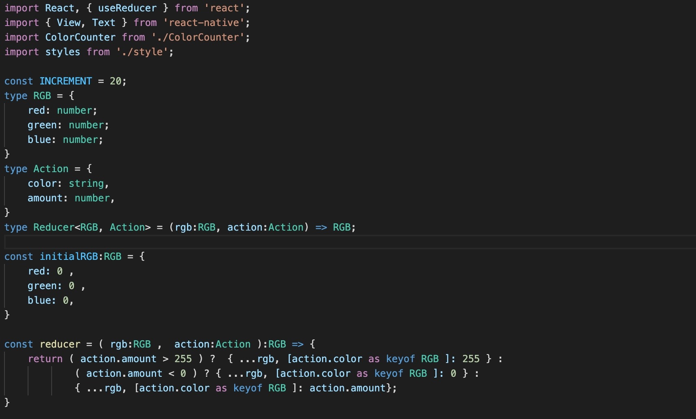
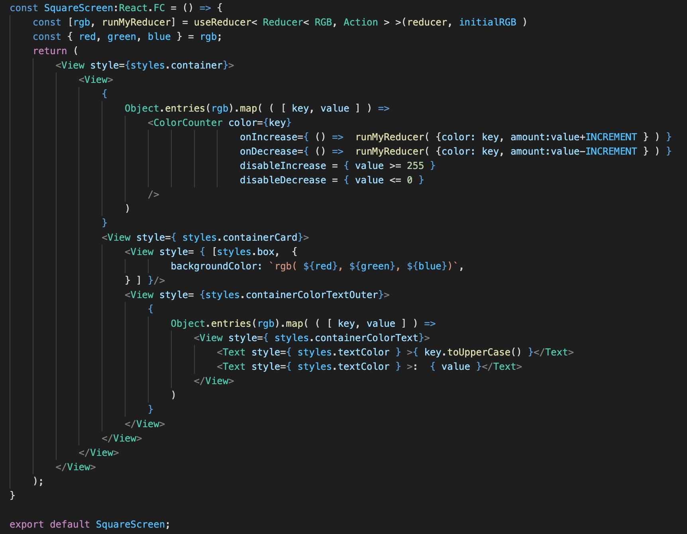
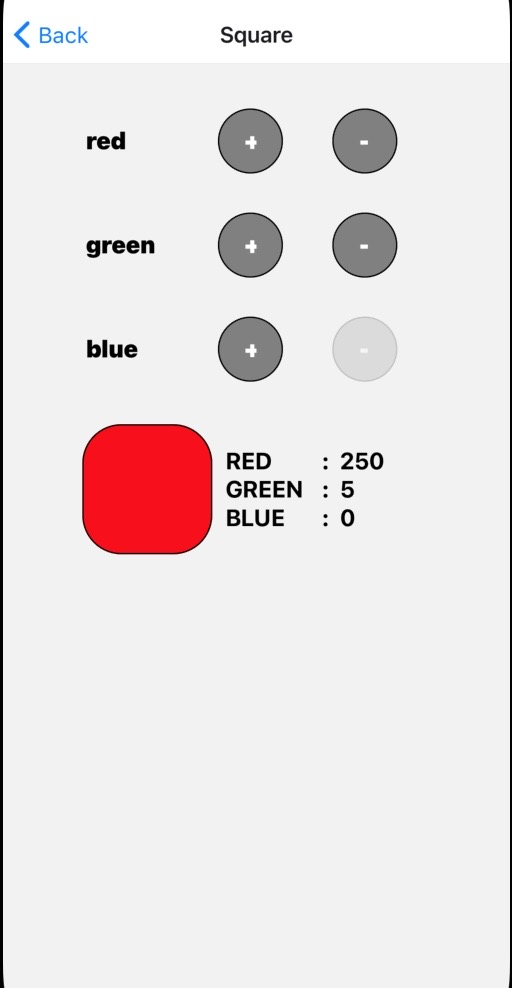
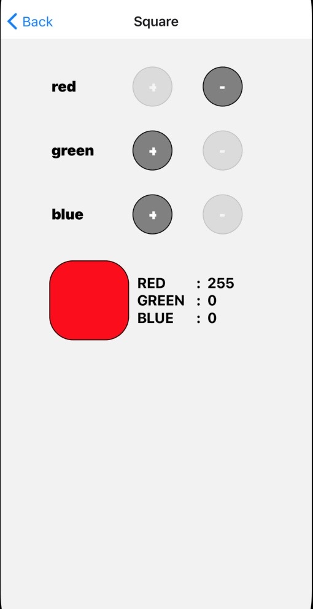

 

  <h3 align="center">Learning Journal Day 14 - 25/04/2022</h3>

  

    Hi, I am Wei Li, this is my learning journal with Activate for my apprenticeship. 
      
  

<!-- What I Am Doing -->

## What I Am Doing

<oL>
  <li>    
    Learning for React Native.
    <ul>
        <li>
            <b>Reducer</b>  
            The useReducer() hook in React lets you separate the state management from the rendering logic of the component.
            <ul>
                 
                <li>useReducer also allows you to manage state and re-render a component whenever that state changes.</li>
                <li>Reducer give you more concrete way to handle complex states so it give you set actions that you can perform on your state and it's going to convert your current to a new version fo the state based on the action that you send.</li>
                <li>To import reducer -  
                    import { useReducer } from 'react'.</li>
                <li>Reducer going to return an array with two portions 
                    1. This first potion is state 
                    2. Second things is return a function</li>  
                <li>the reducer function is going to take 2 different parameters to start. 
                    1. reducer - which is a function that perform on our state to get new state. 
                    2. initial value. 
                    const [state, dispatch] = useReducer( reducer, {value: 0})</li>
                <li>dispatch function is essentially what we call in order to update our state.</li>
                <li>The reducer function take in two different object 
                    1. State - current state  
                    2. Action - action that pass into the dispatch function 
                    The reducer going to return new updated state. 
                    const reducer( state, action ) = { return value: state.value + 1 }</li>
                <li>Use dispatch to call the reducer function by with the type of action  
                    dispatch( {type: "increment" } ); </li>
            </ul>
        </li>
        <li>
            <b>Challenge Question</b>  
            <ul>
                <li>Change to typescript + code refactor
                    <ol>
                        <li>Change the code from js to typescript and try to refactor.</li>
                        <li>Add or minus the value before passed in the value.</li>
                        <li>[action.color as keyof RGB ]: action.amount can direct add the value to the red , green, or blue.</li>
                        <li>So we don't need to switch case to check the color before we add.</li>
                         
                         
                    </ol>
                </li>
                <li>Challenge for myself
                    <ol>
                        <li>Continue work for the disable button</li>
                        <li>Auto set to maximum or minimum value if the number more or less than the limit.</li>
                        
                         
                    </ol>
                </li>
            </ul>
        </li>
    </ul>
    </li>

</ol>
  

<!-- Challenge -->

## Challenge

1. Reducer a bit different with use state. We can directly assign the type of the color object to the useState. Reducer much more complicated.
    
    

<!-- CONTACT -->

## Contact

Wang Wei Li - weiliwang@activate.sg 
Project Link: [https://github.com/WillyWangwl/rn-training](https://github.com/WillyWangwl/rn-training)
  

<!-- Useful Link -->

## Useful Link

[Day 14: React Native State Management](https://docs.google.com/document/d/1u2p6RYAXM0bIEpcq3QLcvNYzZqDFWO_BHsbyUvRAuXM/edit#heading=h.e9flh4v041dw) 
[The Complete React Native + Hooks Course](https://www.udemy.com/course/the-complete-react-native-and-redux-course/learn/lecture/15706702#overview) 
[How to Use useReducer with TypeScript](https://www.newline.co/@bespoyasov/how-to-use-usereducer-with-typescript--3918a332) 
[Typing a useReducer React hook in TypeScript](https://www.sumologic.com/blog/react-hook-typescript/) 
[Learn useReducer In 20 Minutes](https://www.youtube.com/watch?v=kK_Wqx3RnHk) 
[An Easy Guide to React useReducer() Hook](https://dmitripavlutin.com/react-usereducer/) 
[A Simple Reducer Example with TypeScript, No Need for Redux or MobX](https://www.newline.co/@eigenjoy/a-simple-reducer-example-with-typescript-no-need-for-redux-or-mobx--968d3b35) 
