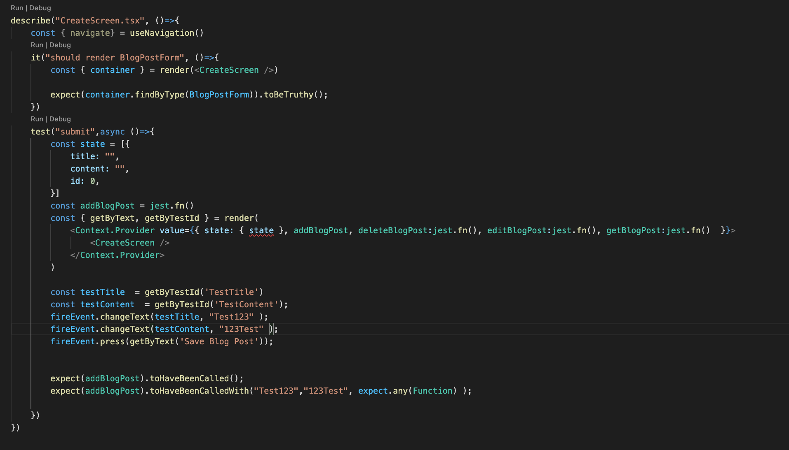
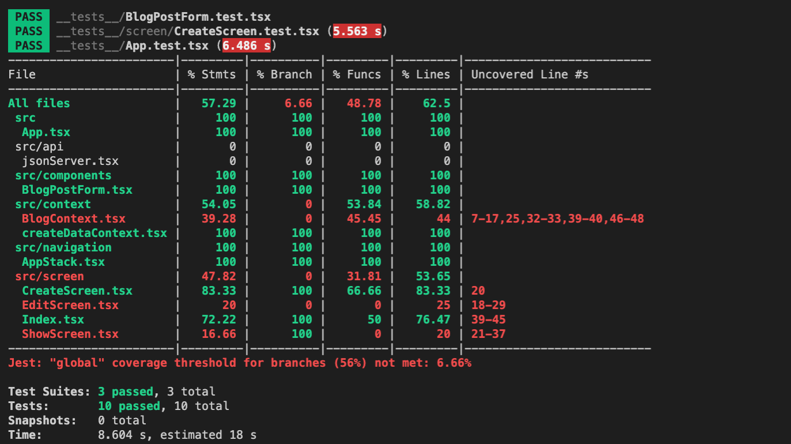
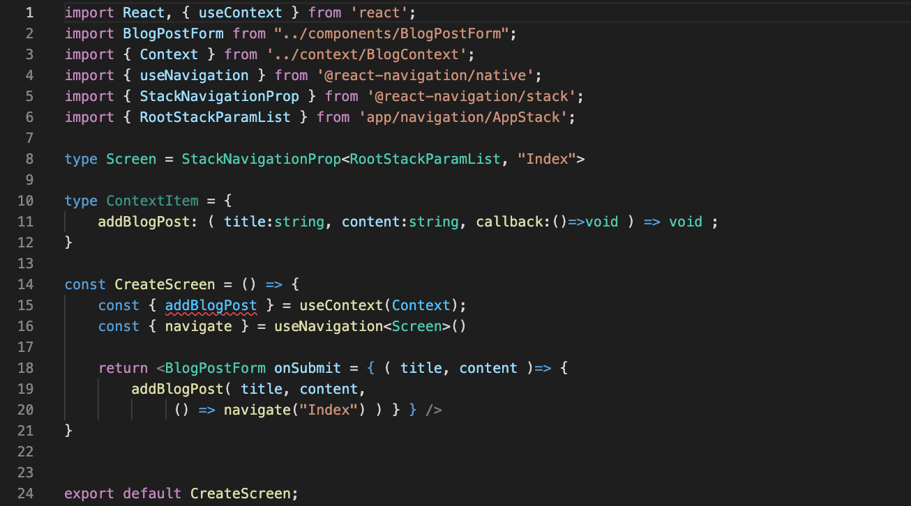

 

  <h3 align="center">Learning Journal Day 36 - 01/05/2022</h3>

  

    Hi, I am Wei Li, this is my learning journal with Activate for my apprenticeship. 
      
  

<!-- What I Am Doing -->

## What I Am Doing

<oL>
  <li>    
    Learning for React Native. 
    <ul>
        <li>
            <b></b>  
             <ol>
                <li>Unit Testing 
                  <ul>
                    <li>Try to work on the createScreen but unable to complete 100% 
                         
                         
                    </li>
                    <li>
                        Uncovered line 20 which is a anonymous function with navigation. Still can find any solution test on it 
                         
                    </li>
                  </ul>
                </li>
            </ol>
        </li>
    </ul>
    </li>
</ol>
  

<!-- Challenge -->

## Challenge

<!-- CONTACT -->

## Contact

Wang Wei Li - weiliwang@activate.sg 
Project Link: [https://github.com/WillyWangwl/rn-training](https://github.com/WillyWangwl/rn-training)
  

<!-- Useful Link -->

## Useful Link
