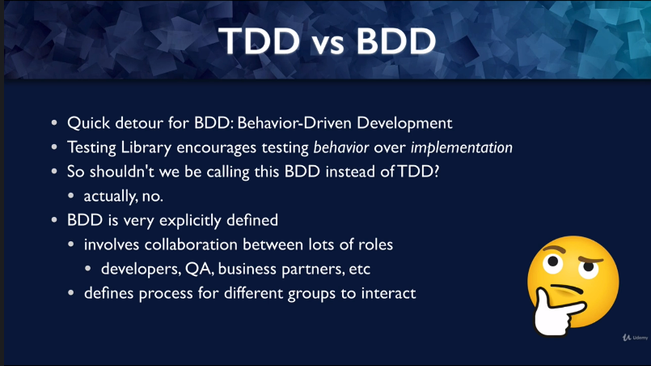

 

  <h3 align="center">Learning Journal Day 37 - 02/06/2022</h3>

  

    Hi, I am Wei Li, this is my learning journal with Activate for my apprenticeship. 
      
  

<!-- What I Am Doing -->

## What I Am Doing

<oL>
  <li>    
    Learning for React Native. 
    <ul>
        <li>
            <b></b>  
             <ol>
                <li>Unit Testing 
                  <ul>
                    <li>Assertion -  
                        expect(linkElement).toBe(5) 
                        expect - Jest global, starts the assertion 
                        (linkElement) -  expect argument - subject of the assertion 
                        toBe(5) - matcher - type of assertion, this matcher comes from jest-DOM 
                    </li>
                    <li>TDD(Test-Driven Development)  
                        <ul>
                            <li>Write tests before writing code</li>
                            <li>write a function shell ->  write a test -> Test fail -> write code -> test pass</li>
                            <li>why - TDD  
                                Make a huge different in how it feels to write tests 
                                part of the coding process, not to do at the end. 
                                More efficient 
                            </li>
                        </ul>
                    </li>
                    <li>Type of Tests  
                        <ul>
                            <li>Unit tests - Tests one unit of code in isolation</li>
                            <li>Integration test - How multiple units work together</li>
                            <li>Functional Test - Tests a particular function of software</li>
                            <li>Acceptance/ End-to-end (E2E) tests - Use actual browser and server(Cypress, Selenium)</li>
                        </ul>
                    </li>
                    <li>Functional Testing  
                        <ul>
                            <li>Unit tests - Isolated: mock dependencies, test internals 
                                - 👍 Very easy to pinpoint failures 
                                - 👎 More Further from how user interact with software 
                                - 👎 More likely to break with refactoring 
                            </li>
                            <li>Functional Testing - Include all relevant units, test behavior. 
                                - 👍 Close to how users interact with software 
                                - 👍 Robust test. 
                                - 👎 More difficult to debug failing test. 
                            </li>
                        </ul>
                    </li>
                    <li>TDD VS BDD  
                         
                    </li>
                  </ul>
                </li>
            </ol>
        </li>
    </ul>
    </li>
</ol>
  

<!-- Challenge -->

## Challenge

<!-- CONTACT -->

## Contact

Wang Wei Li - weiliwang@activate.sg 
Project Link: [https://github.com/WillyWangwl/rn-training](https://github.com/WillyWangwl/rn-training)
  

<!-- Useful Link -->

## Useful Link

[Testing React with Jest and React Testing Library (RTL)](https://nlbsg.udemy.com/course/react-testing-library/learn/lecture/24450612#overview) 
