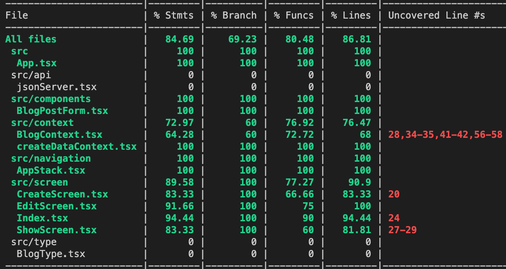

 

  <h3 align="center">Learning Journal Day 40,41 - 07, 08/06/2022</h3>

  

    Hi, I am Wei Li, this is my learning journal with Activate for my apprenticeship. 
      
  

<!-- What I Am Doing -->

## What I Am Doing

<oL>
  <li>    
    Learning for React Native. 
    <ul>
        <li>for 07/06 unable to solve the issue with unit test. For the header part, unable the get the icon not sure is on useEffect or others issue. Base on some reading we use getByText for the render item before useEffect. Follow some solution on stackOverFlow to use await waitFor to wait for the useEffect render. But still unable to get the icon on header.</li>
        <li>Try to mock on the axios and data but not able to pass the test for the dispatch and action ons server. No idea how to solve it. </li>
        <li>Progress remain the same.  
             
        </li>
        <li>08/06/2022</li>
        <li>Clone latest share_frontEnd from bitbucket. Downloaded android studio, and follow the instruction to setup environment </li>
        <li>need to setup the zprofile to run android
            <ol>
                <li>Open the Terminal in your Mac.</li>
                <li>Type "cd ~/" to go to your home folder.</li>
                <li>Type ls -la to show hidden file and check is the zProfile exist.</li>
                <li>Type "touch .zprofile" to create your new file.</li>
                <li>Type "open -e .zprofile" to open it in TextEdit</li>
                <li>paste into zprofile and save.  
                    export ANDROID_SDK_ROOT=$HOME/Library/Android/sdk  
                    export PATH=$PATH:$ANDROID_SDK_ROOT/emulator  
                    export PATH=$PATH:$ANDROID_SDK_ROOT/platform-tools  
                </li>
                <li>Type source $HOME/.zprofile to load the config into your current shell</li>
                <li>Verify that ANDROID_SDK_ROOT has been set by running echo $ANDROID_SDK_ROOT and the appropriate directories have been added to your path by running echo $PATH.</li>
                <li>https://www.insightsjava.com/2022/01/how-to-create-bash-profile-on-mac.html?m=1 
                    https://reactnative.dev/docs/environment-setup</li>
            </ol>
        </li>
        <li>Test to run on android and its work.</li>
        <li>Test to run on iOS and its work</li>
        <li>Last is test to run on Web portal and its work too.</li>
        <li>Try to find some source for learning NodeJs.</li>
    </ul>
    </li>
</ol>
  

<!-- Challenge -->

## Challenge

<!-- CONTACT -->

## Contact

Wang Wei Li - weiliwang@activate.sg 
Project Link: [https://github.com/WillyWangwl/rn-training](https://github.com/WillyWangwl/rn-training)
  

<!-- Useful Link -->

## Useful Link
