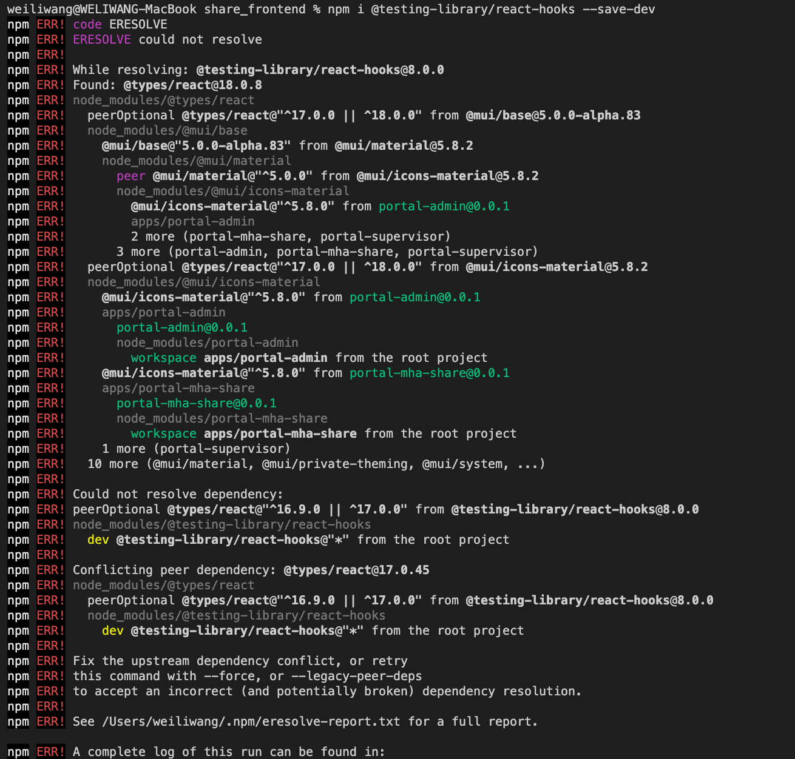
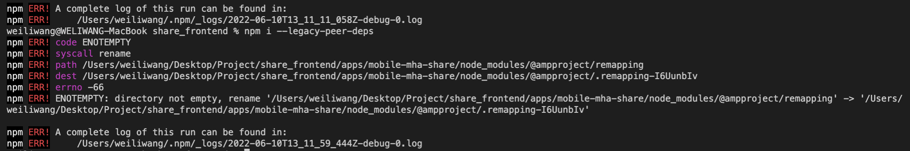

 

  <h3 align="center">Learning Journal Day 42,43 - 09, 10/06/2022</h3>

  

    Hi, I am Wei Li, this is my learning journal with Activate for my apprenticeship. 
      
  

<!-- What I Am Doing -->

## What I Am Doing

<oL>
  <li>    
    Learning for React Native. 
    <ul>
        <li>09/06/2022 - Use half day to learn nodeJs. After that try to understand testing sample that provided by Anya for the shared_frontend.  </li>
        <li>10/06/2022</li>
        <li>Try to do some testing on share_frontend, need ot use renderHook to test on the custom hook. </li>
        <li>Try to install npm i @testing-library/react-hooks to do the testing. but unable to install. Use  --legacy-peer-deps not able to install too. Then try to  --force to install, And whole project crash. Reclone and run try, still unable to install @testing-library/react-hooks. 
         
        </li>
        <li>Thanks Anya help me fix the issue. still face other issue when i try to do npm install after pull the updated file. 
         
        </li>
        <li>Delete node_modules and package-lock.json and run npm install --legacy-peer-devs. Then everything work prefectly.</li>
    </ul>
    </li>
</ol>
  

<!-- Challenge -->

## Challenge

<!-- CONTACT -->

## Contact

Wang Wei Li - weiliwang@activate.sg 
Project Link: [https://github.com/WillyWangwl/rn-training](https://github.com/WillyWangwl/rn-training)
  

<!-- Useful Link -->

## Useful Link
