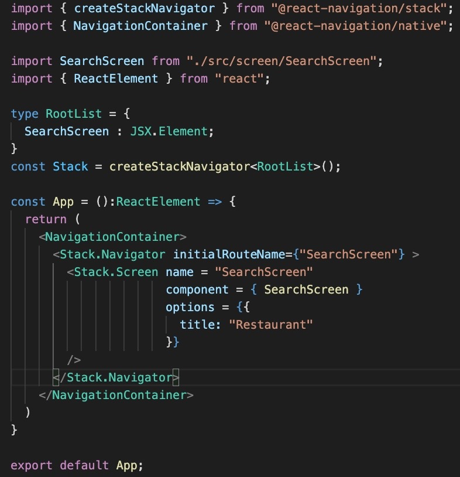

 

  <h3 align="center">Learning Journal Day 19 - 04/05/2022</h3>

  

    Hi, I am Wei Li, this is my learning journal with Activate for my apprenticeship. 
      
  

<!-- What I Am Doing -->

## What I Am Doing

<oL>
  <li>    
    Learning for React Native.
    <ul>
        <li>
            <b>React Native Restaurant App</b>  
            learn how to create an app from scratch and create the navigation and search bar
             <ol>
                <li>npx expo-cli init food to create a new project</li>
                <li>choose a template - I am choose blank ( TypeScript ) since we are using type script.</li>
                <li>Drawer Navigator - side menu</li>
                <li>BottomTabNavigator - Is a navibar at the bottom of the pace.</li>
                <li>StackNavigator - top navibar , npm install </li>
                <li>npm i @react-navigation/native - to install package for routing and navigation for your React Native apps.</li>
                <li>npm i @react-navigation/stack - Stack Navigator provides a way for your app to transition between screens where each new screen is placed on top of a stack</li>
                <li>Try to convert the React navigation v4 to v5 </li>
                 
                 
            </ol>
        </li>
        <li>
            <b>Challenge Question</b>  
            <ul>
                <li>continue to work on the login and sign up </li>
                <li>set up the validation for the sign up and add new user to the array</li>
                <li>validation for login and able to compare the data from the array.</li>
                
                
                
                
                
            </ul>
        </li>
        <li>Working on mini project, will try to create the food project in react native on tomorrow </li>
    </ul>
    </li>

</ol>
  

<!-- Challenge -->

## Challenge

1. No issue for today.
    
    

<!-- CONTACT -->

## Contact

Wang Wei Li - weiliwang@activate.sg 
Project Link: [https://github.com/WillyWangwl/rn-training](https://github.com/WillyWangwl/rn-training)
  

<!-- Useful Link -->

## Useful Link

[Day 19: React Native Restaurant App](https://docs.google.com/document/d/1ORNCdknTltMnjBT9kYS7be3WTNDc6PXMe0r93LIa5JE/edit#heading=h.sjc7nb6il2di) 
[The Complete React Native + Hooks Course](https://www.udemy.com/course/the-complete-react-native-and-redux-course/learn/lecture/15707010#overview) 
