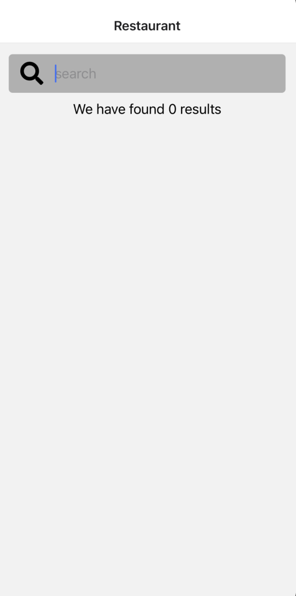

 

  <h3 align="center">Learning Journal Day 16 - 27/04/2022</h3>

  

    Hi, I am Wei Li, this is my learning journal with Activate for my apprenticeship. 
      
  

<!-- What I Am Doing -->

## What I Am Doing

<oL>
  <li>    
    Learning for React Native.
    <ul>
        <li>
            <b>React Native Restaurant App</b>  
            learn how to create an app from scratch and create the navigation and search bar
             <ol>
                <li>there are two things we can use to make a network request from react native app: fetch & axios</li>
                <li>fetch - build in function, error handling is a bit weird,  requires us to write a lot of wrapper code.</li>
                <li>axios - Separate library for making requests, east to use and sensible defaults,</li>
                <li>to install axios - npm install axios</li>
                <li>there are few way to the wait for response of the Api before we execute next code.</li>
                    - put async at the function. const searchApi = async () => { ... }  
                    - using .then after the Api. yelp.get( "/search" ).then ...  
                    - using await. const response = await yelp.get( "/search" );.  
                <li>We me tp pass in a couple of different parameter to customize the search</li>
                <li>first argument - /search -  it will concatenated onto our base URL back inside of our yelp.</li>
                <li>Second argument - object that include params</li>
                <li>params - any key value put in param will be automatically appended onto our request</li>
                <li>The try...catch statement specifies a block of code to try along with a response should an error occur. The try statement contains one or more try blocks, and ends with at least one catch.</li>
                 
                 
            </ol>
        </li>
    </ul>
    </li>

</ol>
  

<!-- Challenge -->

## Challenge

1. Try to init ad react native new project and get error same as the error i faced last time. Unable to solve it by using the same method CJ teach last time. 
   
2. Try to solve it buy comment out the some part related with nvm than everything work fine.
   
   [PhaseScriptExecution error in React Native](https://stackoverflow.com/questions/66742033/phasescriptexecution-cp-user-error-in-react-native) 
    
3. Get the error same with Janson "Unrecognised font family Material Design icons" after npm i --save-dev @types/react-native-vector-icons. Follow the solution that Janson provide.
   - Find info.plist at ios/starter/ .
   - copy the code from [stackoverflow](https://stackoverflow.com/questions/48601206/error-unrecognized-font-family-material-design-icons-after-installing-react-nat)
   - cd ios and pod install.
   - after close and restart app.. then everything work fine now.
     

<!-- CONTACT -->

## Contact

Wang Wei Li - weiliwang@activate.sg 
Project Link: [https://github.com/WillyWangwl/rn-training](https://github.com/WillyWangwl/rn-training)
  

<!-- Useful Link -->

## Useful Link

[Day 20: React Native Restaurant App - With API](https://docs.google.com/document/d/1MoVz3WviFhUTehx3xY7iEiufm1dgEpM-lwRwFtvokLo/edit#heading=h.sjc7nb6il2di) 
[The Complete React Native + Hooks Course](https://www.udemy.com/course/the-complete-react-native-and-redux-course/learn/lecture/15707130#overview) 
