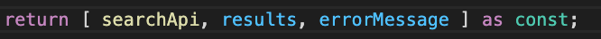

 

  <h3 align="center">Learning Journal Day 16 - 27/04/2022</h3>

  

    Hi, I am Wei Li, this is my learning journal with Activate for my apprenticeship. 
      
  

<!-- What I Am Doing -->

## What I Am Doing

<oL>
  <li>    
    Learning for React Native.
    <ul>
        <li>
            <b>React Native Restaurant App</b>  
            Making hook reusable.
             <ol>
                <li>Use effect is a hook or essentially a function that allows us to run some snippet of code just one time</li>
                 
                <li>useEffect( () => { ....} , [second argument] } second argument will determine single or multiple time we need to run the hook.  </li>
                <li>Refactor those code that are not related to some others location, so we can reuse the component on multiple component.</li>
                <li>We can call back the hook we created same as how we call the hook. </li>
                 
            </ol>
        </li>
    </ul>
    </li>
    <li>Try to refactor my mini project. Break item to multiple component.</li>

</ol>
  

<!-- Challenge -->

## Challenge

1. Because we a passing array so the positioning are very important, in order to keep elements in an array to keep position without allowing tsc infers thing you can set it as fixed by setting as const.
    
    
   [source](https://stackoverflow.com/questions/65680316/this-expression-is-not-callable-not-all-constituents-of-type-string-search) 

<!-- CONTACT -->

## Contact

Wang Wei Li - weiliwang@activate.sg 
Project Link: [https://github.com/WillyWangwl/rn-training](https://github.com/WillyWangwl/rn-training)
  

<!-- Useful Link -->

## Useful Link

[Day 21: React Native Restaurant App - With UseEffect](https://docs.google.com/document/d/1UWVxJki7XZkQu7VEFATDnJppBAa7iXlfxPsPXUMhZts/edit#heading=h.sjc7nb6il2di) 
[The Complete React Native + Hooks Course](https://www.udemy.com/course/the-complete-react-native-and-redux-course/learn/lecture/15707154#overview) 
