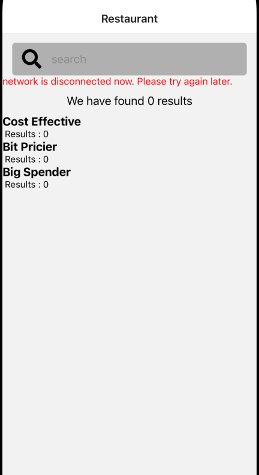

 

  <h3 align="center">Learning Journal Day 22 - 09/05/2022</h3>

  

    Hi, I am Wei Li, this is my learning journal with Activate for my apprenticeship. 
      
  

<!-- What I Am Doing -->

## What I Am Doing

<oL>
  <li>    
    Learning for React Native.
    <ul>
        <li>
            <b>Custom Hook</b>  
            Making hook reusable.
             <ol>
                <li>Custom Hooks are functions. Usually, they start with the word “use” (important convention).</li>
                <li>We can decide what it takes as arguments, and what, if anything, it should return. In other words, it’s just like a normal function</li>
                <li>When you have component logic that needs to be used by multiple components, we can extract that logic to a custom Hook.</li>
                <li>advantages to using Custom Hooks
                    <ul>
                        <li>Reusability — we can use the same hook again and again, without the need to write it twice</li>
                        <li>Clean Code — extracting all the component logic into a hook will provide a cleaner codebase.</li>
                        <li>Maintainability — easier to maintain. if we need to change the logic of the hook, we only need to change it once.</li>
                        <li>Great Community — there is a good chance somebody already created the hook you're thinking of. The web is filled with a ton of Custom Hooks! you can find a hook for your need and use it as-is or even better — you can use it as a starting point and make it awesome!</li>
                    </ul>
                </li>
            </ol>
        </li>
        <li>Study useLogin hook in the existing react-native-starter project
            <ol>
                <li></li>
            </ol>
        </li>
        <li>Add a custom hook to add network status monitor to the react-native-starter project.
            <ol>
                <li>Cant sport any different after i complete the code. It will show error message after i turn off the wifi and reload.</li>
                <li>Is just like how we calling useState.</li>
                 
            </ol>
        </li>
        <li>return {isNetworkConnected: isNetworkConnected ?? false}  The double question mark operator is called the nullish coalescing operator, and it’s a new feature of JavaScript ES2020 that allows you provide a default value to use when a variable expression evaluates to null or undefined</li>
    </ul>
    </li>
    <li>Try to refactor my mini project. Break item to multiple component. And create custom hook</li>

</ol>
  

<!-- Challenge -->

## Challenge

<!-- CONTACT -->

## Contact

Wang Wei Li - weiliwang@activate.sg 
Project Link: [https://github.com/WillyWangwl/rn-training](https://github.com/WillyWangwl/rn-training)
  

<!-- Useful Link -->

## Useful Link

[Day 22: React Native Restaurant App - With Customer Hook](https://docs.google.com/document/d/123eVR8bzWPcu7QMGD_EaYjEXxX1hnGGOco74zLXDURQ/edit#heading=h.sjc7nb6il2di)) 
[The Complete React Native + Hooks Course](https://www.udemy.com/course/the-complete-react-native-and-redux-course/learn/lecture/15707130#overview) 
[3 Ways We Use React Custom Hooks in Our Team](https://betterprogramming.pub/react-custom-hooks-with-real-life-examples-c259139c3d71)  
[Building Your Own Hooks](https://reactjs.org/docs/hooks-custom.html)  
