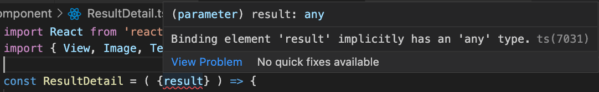
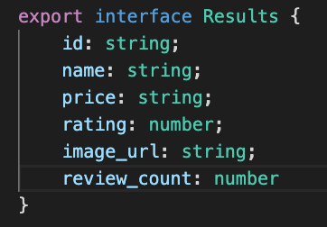
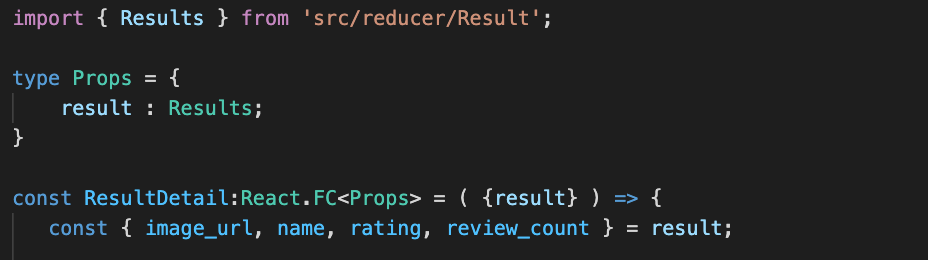
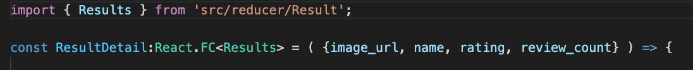
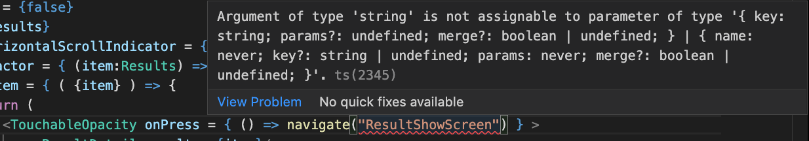
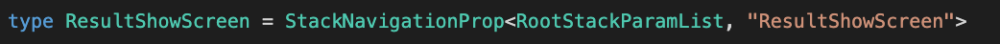
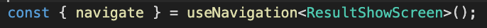
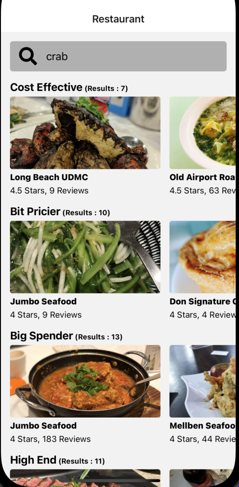
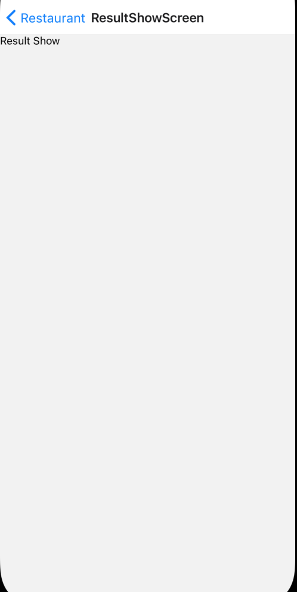

 

  <h3 align="center">Learning Journal Day 23 - 10/05/2022</h3>

  

    Hi, I am Wei Li, this is my learning journal with Activate for my apprenticeship. 
      
  

<!-- What I Am Doing -->

## What I Am Doing

<oL>
  <li>    
    Learning for React Native.
    <ul>
        <li>
            <b>Navigation to Single Result</b>  
             <ol>
                <li>Use object { result } take in as our parameter. And face some typesrcipt issue. 
                     
                </li>
                <li>Try to fix it by assign interface Results to result inside another type. And the error gone.  
                      
                      
                </li>
                <li>Try to destructure in the parameter after explanation of Janan. 
                      
                </li>
                <li>We can hide the horizontal scroll bar of flatlist by setting showsHorizontalScrollIndicator = {false} </li>
                <li>we can use &#60;&#62;...&#60;/&#62; to wrap the element instead of using &#60;View&#62;...&#60;/View&#62; </li>
                <li>It allow us to return a bunch of different element without any styling. All the item wrapped inside will automatically rendered on screen.</li>
                <li>Type script give type error with navigation.  
                 
                    <ol>
                        <li>Try to solve in by export type RootStackParamList </li>
                        <li>import RootStackParamList and assign to StackNavigationProp with the stack screen name 
                          
                          
                         [navigation.navigate Home showing some error in typescript](https://stackoverflow.com/questions/68779417/navigation-navigatehome-showing-some-error-in-typescript) 
                        </li>
                        <li>This solve my issue on my mini project also.</li>
                    </ol>
                </li>
            </ol>
        </li>
        <li>Screen 
             
             
        </li>
    </ul>
    </li>
</ol>
  

<!-- Challenge -->

## Challenge

<!-- CONTACT -->

## Contact

Wang Wei Li - weiliwang@activate.sg 
Project Link: [https://github.com/WillyWangwl/rn-training](https://github.com/WillyWangwl/rn-training)
  

<!-- Useful Link -->

## Useful Link

[Day 24: React Native Restaurant App - Navigation to Single Result](https://docs.google.com/document/d/1YHYjEg00tK1dWpwxV0v2FefcmLr-A1OfKVrpPw2DwDU/edit#) 
[The Complete React Native + Hooks Course](https://www.udemy.com/course/the-complete-react-native-and-redux-course/learn/lecture/15707182#overview) 
