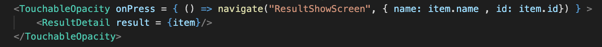
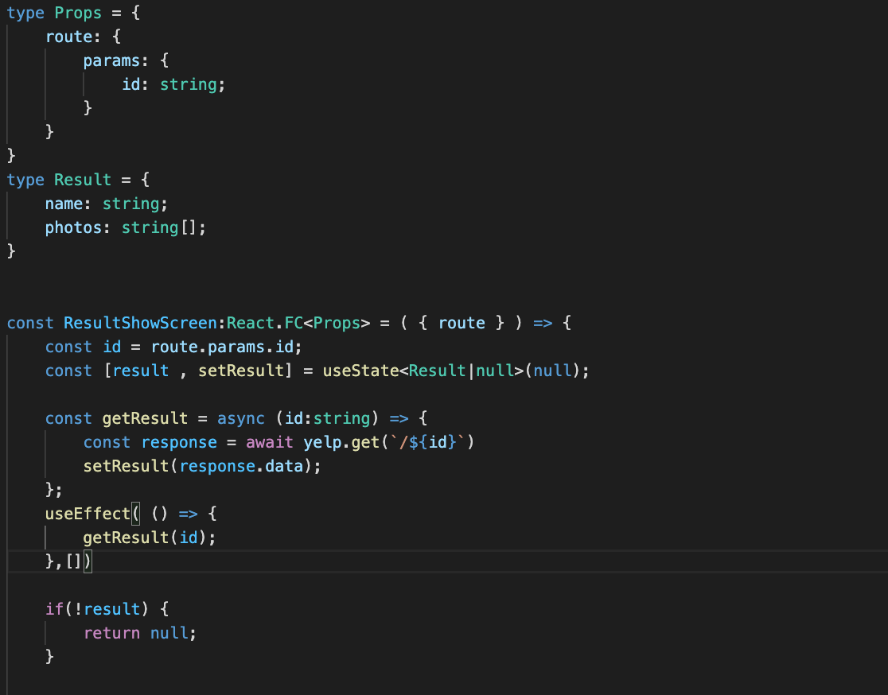
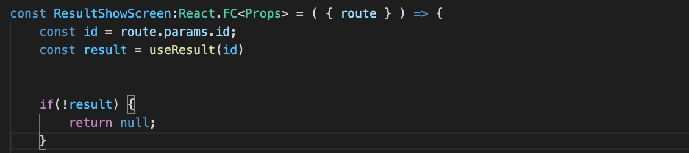
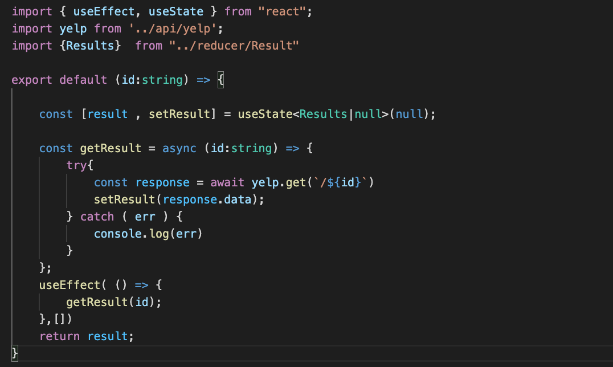
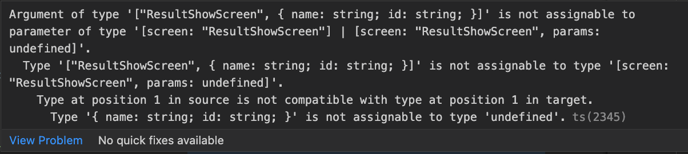
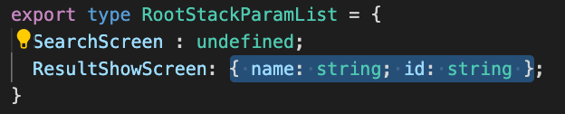
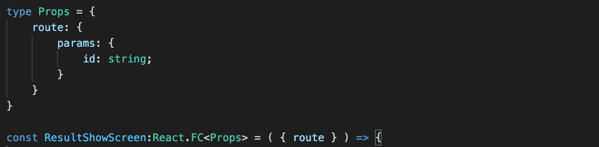

 

  <h3 align="center">Learning Journal Day 24 - 11/05/2022</h3>

  

    Hi, I am Wei Li, this is my learning journal with Activate for my apprenticeship. 
      
  

<!-- What I Am Doing -->

## What I Am Doing

<oL>
  <li>    
    Learning for React Native.
    <ul>
        <li>
            <b>React Native Restaurant App - Single result</b>  
             <ol>
                <li>Using second argument in navigate to pass item we need to next page.  
                     
                </li>
                <li>Try to get information that we passed in by using route. </li>
                <li>Use ID to make a request to the Yelp API</li>
                <li>Initial set state to null when we expect that is an object and we do not yet have any data available.</li>
                <li>state will be null when first render until we make update state and then i will be an actual object. </li>
                <li>Using useEffect to call the function when the page render and add in [] as second argument to make sure it run once. 
                     
                </li>
                <li>Try to move make a custom hook for the getResult 
                     
                     
                </li>
                <li>Practice create a reuseable component to display rating</li>
            </ol>
        </li>
        <li>Screen 
             
             
        </li>
    </ul>
    </li>
</ol>
  

<!-- Challenge -->

## Challenge

1. TypeScript issue on the parameter we pass in on the navigate.  
    
   Base on the message we assign the params type to undefined. So I change the type to object with id = string and name = string. This solve the issue.
    
2. Base on Udamy video, they are using navigation. but I unable to read the id follow his step. Find the solution online. And we are passing parameter to route so we should get route instead of navigation. Replay navigation.getParam('id') with route.params.id.
3. Try to destructure route and declare its type. I am not sure is it a correct or not.
    

<!-- CONTACT -->

## Contact

Wang Wei Li - weiliwang@activate.sg 
Project Link: [https://github.com/WillyWangwl/rn-training](https://github.com/WillyWangwl/rn-training)
  

<!-- Useful Link -->

## Useful Link

[Day 25: React Native Restaurant App - Single result](https://docs.google.com/document/d/1r1bZSt7AudY1e2cr7j6yAAILupXcYy-QbWT_WXlOefU/edit#heading=h.sjc7nb6il2di) 
[The Complete React Native + Hooks Course](https://www.udemy.com/course/the-complete-react-native-and-redux-course/learn/lecture/15707328#overview) 
[Passing parameters to routes](https://reactnavigation.org/docs/params/) 
