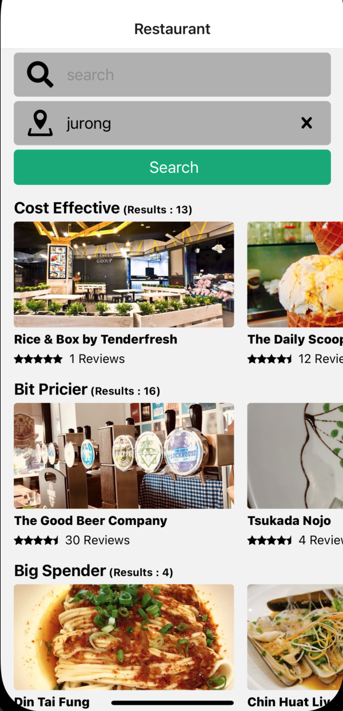
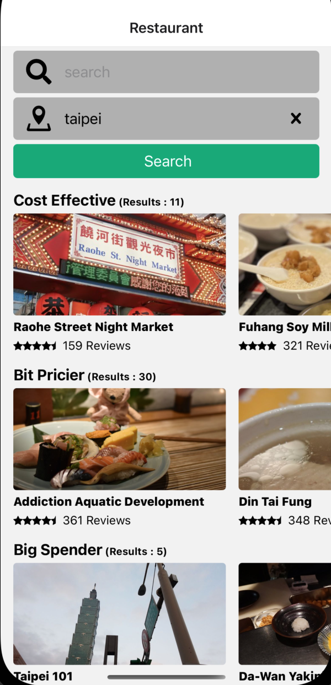
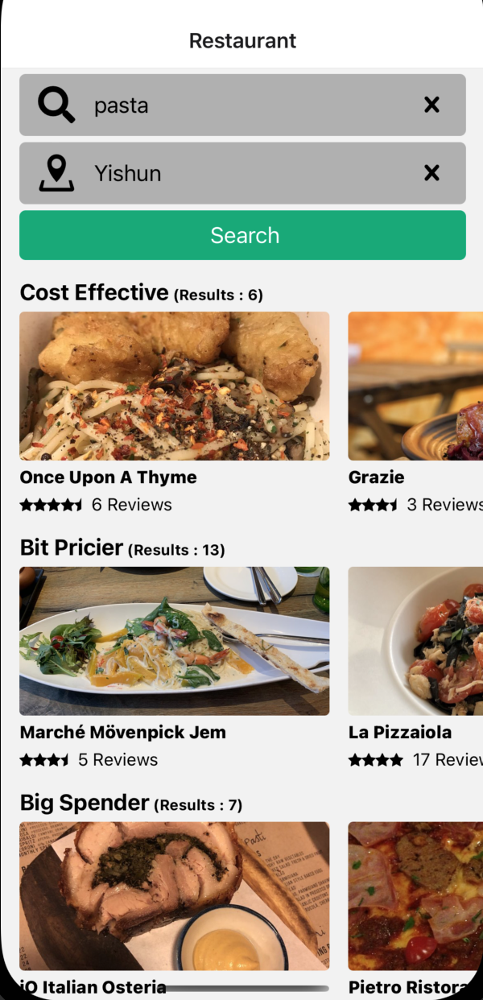

<br />
<div align="center">

  <h3 align="center">Learning Journal Day 25 - 12/05/2022</h3>

  <p align="center">
    Hi, I am Wei Li, this is my learning journal with Activate for my apprenticeship. 
    <br /><br />
  </p>
</div>

<!-- What I Am Doing -->

## What I Am Doing

<oL>
  <li>    
    Learning for React Native.
    <ul>
        <li>Continue yesterday challenge<br />
            <ol>
                <li>Create a dynamic search function for the location. </li>
                <li>Reuse the searchBar component for the location search and passing different variable.</li>
                <li>Add in searchLocation for the parameter in searchApi</li>
                <li>The location search working.<li>
                
                
                
            </ol>
        </li>
        <li>Understand recoil<br />
            <ol>
                <li>Flexible shared state. <br />
                    - Each component have their own state. The one of the item changes, it only rerender that particular item. It call Atoms.<br />
                    - Atoms is a changeable subscribable unit of state.<br />
                    ```
                    export const itemWithID =
                        memorize(id => atom( {
                            key: `item${id}`
                            default: {...}
                        }))
                    ``` 
                    <br />
                    - itemWithID is a function that take in ID for a particular item and return its atom the piece of state for that item.<br />
                </li>
                <li>Derived data and queries.<br />
                    - Selector is basically a function and information about state it depends on.<br />
                    - When state changes we can recompute the function and rerender any components that depend on it.<br />
                    ```
                    selector( { 
                        key: 'selectionBoundingBox',
                        get: ( ) => {
                            const selectedIDs = get(selectionAtom);
                            const selectedItems = 
                                selectedIDs.map( id => 
                                    get(itemWithID(id))
                                );
                            return computeBoundingBox(selectedItems);
                        }
                    })
                    ```
                    <br />
                    - selector only be rerender when component that involve changed.
                </li>
                <li>App-wide state observation. <br />
                    - Implement persistence, routing, time-travel debugging or undo by observing all state changes across app without impairing code-splitting.
                </li> 
            </ol>
        </li>
        <li>
            <b>Advanced State Management with Context</b> <br />
             <ol>
                <li>Build blog creation application.</li>
                <li>Project objective - Understand CRUD ( Create, Read, Update, Delete ) operation, and learn more about data management in React Native. </li>
                <li>Include index, detail, create and edit screen.</li>
                <ul>
                    <li>Index Screen<br />
                        - Showing a list of different blogs that user created.<br />
                        - Allow user to create new blog, show the blog information and delete the blog<br />
                    </li>
                    <li>Create Screen<br />
                        - Enter title and content for a blog post.<br />
                    </li>
                    <li>Show Screen<br />
                        - Display title and content of the blog.<br />
                        - Navigate to Edit Screen.<br />
                    </li>
                    <li>Edit Screen<br />
                        - Enter new title or contest and save it.<br />
                    </li>
                </ul>
                <li>Implement provider component that wrap entire application but it's not going to show on the screen. </li>
                <li>Provider centralizing all our data at root location inside of application is referred to as global state management.</li>
                <li>This allow child component can direct access to the list that inside provider.</li>
            </ol>
        </li>
        <li>Start Up<br />
            <ol>
                <li>Clone React-Native-Stater from Anya Repo. </li>
                <li>remove all the tsx file and edit app.tsx file too.</li>
                <li>Install navigation<br />
                    - npm i @react-navigation/native
                    - npm i @react-navigation/stack
                </li>
                <li>npm i </li>
                <li>start application by run npm run ios.</li>
            </ol>
        </li>
    </ul>
    </li>
</ol>
<br /><br />

<!-- Challenge -->

## Challenge

<!-- CONTACT -->

## Contact

Wang Wei Li - weiliwang@activate.sg<br />
Project Link: [https://github.com/WillyWangwl/rn-training](https://github.com/WillyWangwl/rn-training)
<br /><br />

<!-- Useful Link -->

## Useful Link

[Day 25: React Native Restaurant App - Single result](https://docs.google.com/document/d/1r1bZSt7AudY1e2cr7j6yAAILupXcYy-QbWT_WXlOefU/edit#heading=h.sjc7nb6il2di)<br />
[The Complete React Native + Hooks Course](https://www.udemy.com/course/the-complete-react-native-and-redux-course/learn/lecture/15707328#overview)<br />
[Recoil](https://recoiljs.org)<br />
[Recoil: State Management for Today's React](https://www.youtube.com/watch?v=_ISAA_Jt9kI)<br />
[Learn Recoil.js in 10 Minutes](https://www.youtube.com/watch?v=BchtCWxs7sA)<br />
[Recoil.js in 2 Minutes // What, How, and Why](https://www.youtube.com/watch?v=f7XoUU6B6y4)<br />
[How to Use Recoil for State Management in Your React Projects](https://www.freecodecamp.org/news/how-to-use-recoil-for-state-management-in-your-react-projects/)<br />
