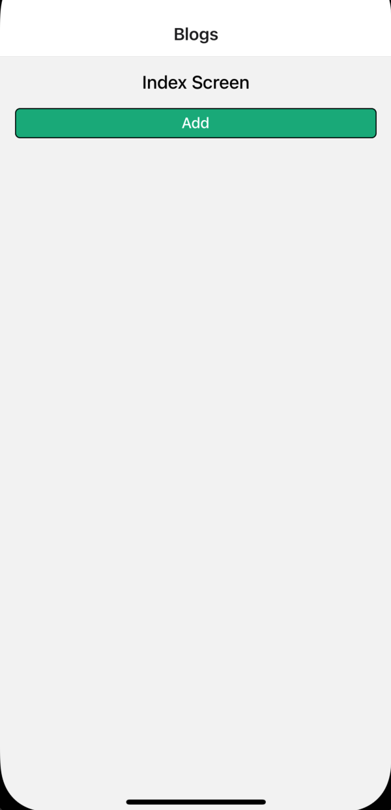
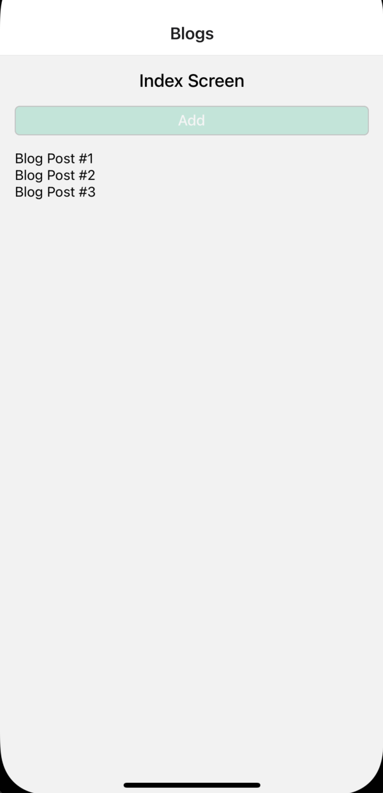
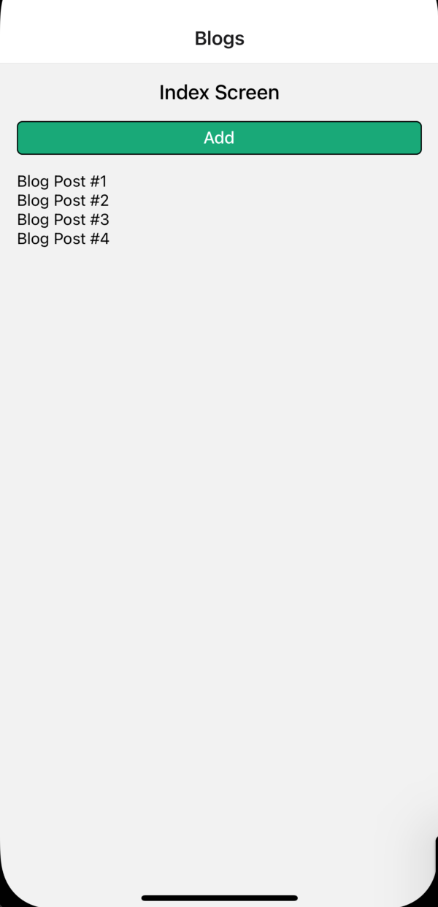

 

  <h3 align="center">Learning Journal Day 26 - 13-17/05/2022</h3>

  

    Hi, I am Wei Li, this is my learning journal with Activate for my apprenticeship. 
      
  

<!-- What I Am Doing -->

## What I Am Doing

<oL>
  <li>    
    Learning for React Native.
    <ul>
        <li>
            <b>Advanced State Management with Context</b>  
             <ol>
                <li>Create navigator as usual.</li>
                <li>To wire up blog Post Provide we need to wrap every component including stack navigator.</li>
                <li>Context 
                    - Move information from parent to nested child. It is not manage the state. 
                    - Complicated to setup, lot of special terms 
                    - Easy to communicate data from a parent to super nested child 
                </li>
                <li>create a new folder call context that keep the file of provider</li>
                <li>React createContext - Creates a Context object. When React renders a component that subscribes to this Context object it will read the current context value from the closest matching Provider above it in the tree.</li>
                <li>{ children } - A component that wrapped inside other component and accept as an argument. 
                     
                    so which means&#60;AppStack /&#62; is our children. 
                </li>
                <li>Context.Provider - Every Context object comes with a Provider React component that allows consuming components to subscribe to context changes.</li>
                <li>value in Provider - to be passed to consuming components that are descendants of this Provider</li>
                <li>Add the state on the Provider, so any time state variable change it will pass down new value from Provider to different component that are connected with that provider.  </li>
                 
                 
            </ol>
        </li>
        <li>Screen 
            
            
            
        </li>
    </ul>
    </li>
</ol>
  

<!-- Challenge -->

## Challenge

1. Encounter error "An error was encountered processing the command (domain=com.apple.CoreSimulator.SimError, code=405)” Simulator unable to open. Solve the issue after delete Xcode cache and Delete Project Build and indexes and reboot. 
   [How To Fix “An error was encountered processing the command (domain=com.apple.CoreSimulator.SimError, code=405)”?](https://trustsu.com/react-native/an-error-was-encountered-processing-the-command-domaincom-apple-coresimulator-simerror-code405/) 

<!-- CONTACT -->

## Contact

Wang Wei Li - weiliwang@activate.sg 
Project Link: [https://github.com/WillyWangwl/rn-training](https://github.com/WillyWangwl/rn-training)
  

<!-- Useful Link -->

## Useful Link

[Day 25: Blog App: React Native Context with useState](https://docs.google.com/document/d/1obVGcsmgY1SHk4I15jZEN0x2vCZH6x1GlTUiUmHw-tY/edit#heading=h.sjc7nb6il2di) 
[The Complete React Native + Hooks Course](https://www.udemy.com/course/the-complete-react-native-and-redux-course/learn/lecture/22028562#overview) 
[Context](https://reactjs.org/docs/context.html) 
[Learn useContext In 13 Minutes](https://www.youtube.com/watch?v=5LrDIWkK_Bc) 
