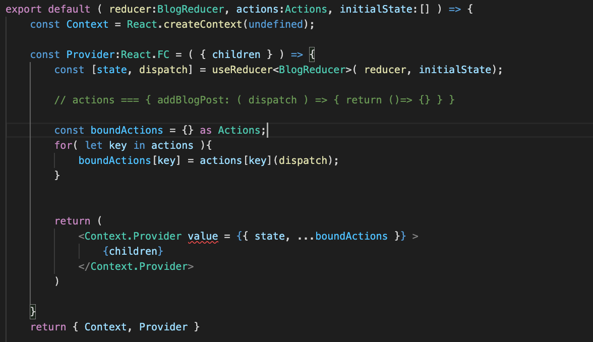
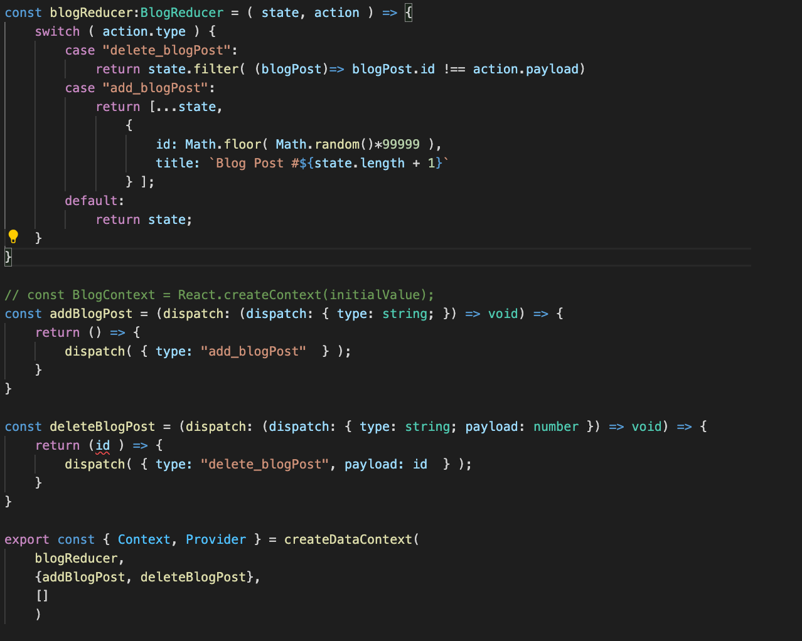
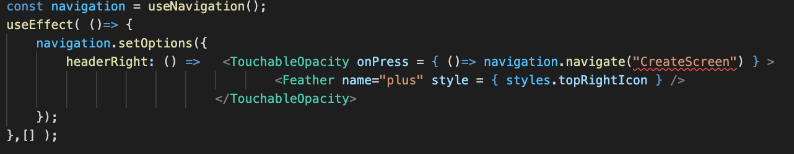
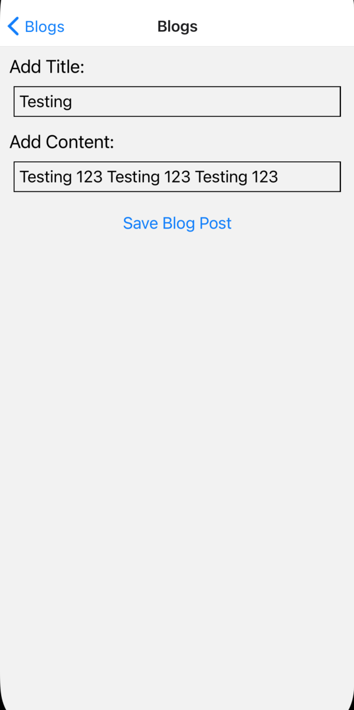

 

  <h3 align="center">Learning Journal Day 27 - 18/05/2022</h3>

  

    Hi, I am Wei Li, this is my learning journal with Activate for my apprenticeship. 
      
  

<!-- What I Am Doing -->

## What I Am Doing

<oL>
  <li>    
    Learning for React Native. 
    <ul>
        <li>
            <b>Advanced State Management with Context</b>  
             <ol>
                <li>React Native Context with useState.</li>
                <li>UseReducer to replace useState and all separate function for each operation.</li>
                <li>To reduce the amount of context and duplicate code and reducer. Idea of automating context creation is to make a function going to essentially automate.
                <li>How to create a automate context  
                     - create a new file and export default a function and pass the things that need to be customized. 
                     - 1st reducer function itself. To create a new data context automatically when we call this function. 
                     - 2nd helper function that contained some kin dof dispatch inside. 
                     - 3rd initial state of reducer. 
                       
                     - Same as previous create context and do it here. 
                       
                     - Context and provider come from calling create data context. 
                     - create data context pass in same amount of argument.  
                     - Reducer, function object, initial value. 
                     - To create a new type of resources inside the application. what we need to do is create  a new context file, reducer, function. 
                      
                </li>
                <li>The setOptions method lets us set screen options from within the component. This is useful if we need to use the component's props, state or context to configure our screen. </li>
                <li>Get warning Cannot update a component (StackNavigator) while rendering a different component and try to wrap it inside useEffect. 
                 
                </li>
            </ol>
        </li>
        <li>Screen 
            
            
            
        </li>
    </ul>
    </li>

</ol>
  

<!-- Challenge -->

## Challenge

1. Typescript show any type for the empty object assign. So we just set the empty object {} as type of action.

<!-- CONTACT -->

## Contact

Wang Wei Li - weiliwang@activate.sg 
Project Link: [https://github.com/WillyWangwl/rn-training](https://github.com/WillyWangwl/rn-training)
  

<!-- Useful Link -->

## Useful Link

[The Complete React Native + Hooks Course](https://www.udemy.com/course/the-complete-react-native-and-redux-course/learn/lecture/22028562#overview) 
[Cannot update a component StackNavigator while rendering a different component](https://github.com/react-navigation/react-navigation/issues/9478) 
