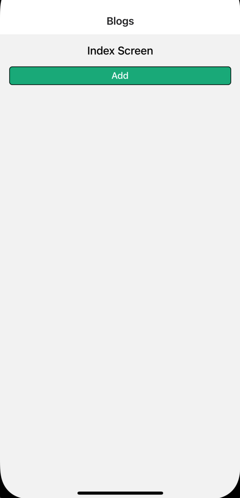
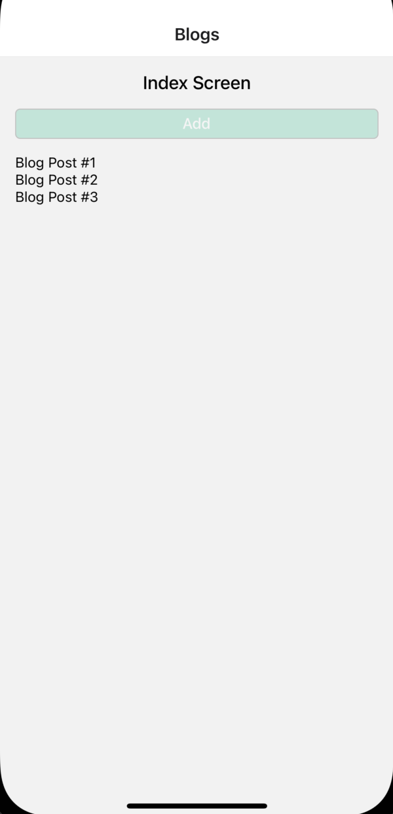
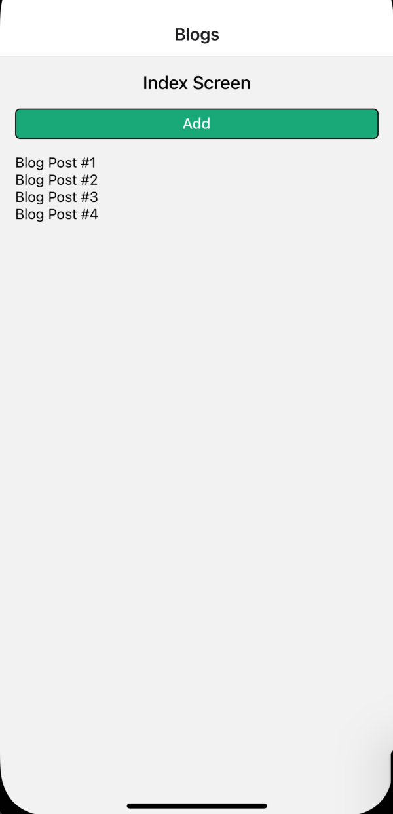

 

  <h3 align="center">Learning Journal Day 27 - 17/05/2022</h3>

  

    Hi, I am Wei Li, this is my learning journal with Activate for my apprenticeship. 
      
  

<!-- What I Am Doing -->

## What I Am Doing

<oL>
  <li>    
    Learning for React Native. 
    <ul>
        <li>
            <b>Advanced State Management with Context</b>  
             <ol>
                <li>React Native Context with useState.</li>
                <li>UseReducer to replace useState and all separate function for each operation.</li>

            </ol>
        </li>
        <li>Screen 
            
            
            
        </li>
    </ul>
    </li>

</ol>
  

<!-- Challenge -->

## Challenge

1. Typescript show any type for the empty object assign. So we just set the empty object {} as type of action.

<!-- CONTACT -->

## Contact

Wang Wei Li - weiliwang@activate.sg 
Project Link: [https://github.com/WillyWangwl/rn-training](https://github.com/WillyWangwl/rn-training)
  

<!-- Useful Link -->

## Useful Link

[Day 25: Blog App: React Native Context with useState](https://docs.google.com/document/d/1obVGcsmgY1SHk4I15jZEN0x2vCZH6x1GlTUiUmHw-tY/edit#heading=h.sjc7nb6il2di) 
[The Complete React Native + Hooks Course](https://www.udemy.com/course/the-complete-react-native-and-redux-course/learn/lecture/22028562#overview) 
[TypeScript empty object for a typed variable](https://stackoverflow.com/questions/45339065/typescript-empty-object-for-a-typed-variable) 
