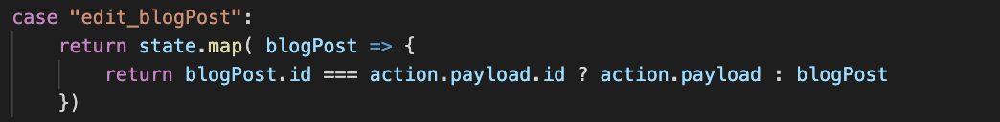

 

  <h3 align="center">Learning Journal Day 28 - 19/05/2022</h3>

  

    Hi, I am Wei Li, this is my learning journal with Activate for my apprenticeship. 
      
  

<!-- What I Am Doing -->

## What I Am Doing

<oL>
  <li>    
    Learning for React Native. 
    <ul>
        <li>
            <b>Advanced State Management with Context Video 151-160 </b>  
             <ol>
                <li>Use setOption to display a button on the header.</li>
                <li>passing the Id from ShowScreen to EditScreen so we can get the data for that particular ID.</li>
                <li>Getting state information from root reducer by using useContext( Context )</li>
                <li>And get the blog post information buy using .find() method. This method returns the value of the first element in an array that pass the test in a testing function. 
                To prevent undefined type try to fix it with blogPost?.title ?? "" blogPost may be undefined and set it to "" if it is undefined. 
                     
                    [A List of JavaScript Array Methods](https://medium.com/@mandeepkaur1/a-list-of-javascript-array-methods-145d09dd19a0) 
                </li>
                <li>We need to initial the useState value to the data value so state value can be display on the textInput and for edit use.</li>
                <li>Refactor the Add & Edit Screen. Both of the screen using duplicate component. Make the reuseable component and call by both page.</li>
                <li>Im not sure defaultProps are not working on me. So i decide to use default parameters to get the same result. 
                     
                </li>
                <li>for the edit_blogpost are using .map(). This method creates a new array with the results of calling a provided function on every element in this array.</li>
                <li>So when the id is not the id we passed in it will return the original data and return the data we passed to replace the original data. 
                 
                </li>
                <li>Replace navigation.pop() with nagivation.goback() - close active screen and move back in the stack 
                 
                </li>
            </ol>
        </li>
        <li>Screen 
            
            
            
        </li>
    </ul>
    </li>

</ol>
  

<!-- Challenge -->

## Challenge

<!-- CONTACT -->

## Contact

Wang Wei Li - weiliwang@activate.sg 
Project Link: [https://github.com/WillyWangwl/rn-training](https://github.com/WillyWangwl/rn-training)
  

<!-- Useful Link -->

## Useful Link

[The Complete React Native + Hooks Course](https://www.udemy.com/course/the-complete-react-native-and-redux-course/learn/lecture/22028562#overview) 
[Cannot update a component StackNavigator while rendering a different component](https://github.com/react-navigation/react-navigation/issues/9478) 
[How to use React Context with TypeScript](https://felixgerschau.com/react-typescript-context/) 
