 

  <h3 align="center">Learning Journal Day 29 - 20/05/2022</h3>

  

    Hi, I am Wei Li, this is my learning journal with Activate for my apprenticeship. 
      
  

<!-- What I Am Doing -->

## What I Am Doing

<oL>
  <li>    
    Learning for React Native. 
    <ul>
        <li>
            <b>Blog App: Backend Touch 161-172 </b>  
             <ol>
                <li>JSON Server is a Node Module that you can use to create demo rest json webservice in less than a minute. All you need is a JSON file for sample data.</li>
                <li>We need to do some setting to make simulator that hosted by our computer thur wifi and need some ip setting. Ngrok make your phone(simulator) easily communicate to the server (computer)</li>
                <li>Ngrok is a cross-platform application that enables developers to expose a local development server to the Internet with minimal effort. The software makes your locally-hosted web server appear to be hosted on a subdomain of ngrok.com, meaning that no public IP or domain name on the local machine is needed</li>
                <li>Step to make a Json server</li>
                <ul>
                    <li>create a new folder and run npm init - to create a default package.json</li>
                    <li>npm i json-server ngrok- to install json server & ngrok</li>
                    <li>create a db.json file to store the data.</li>
                    <li>edit package.json scripts to db: json-server -w db.json  
                        and tunnel: "ngrok http 3000" </li>
                    <li>npm run db - to run the json server</li>
                    <li>npm run tunnel - to run ngrok server and it will provide http address to use.</li>
                    <li>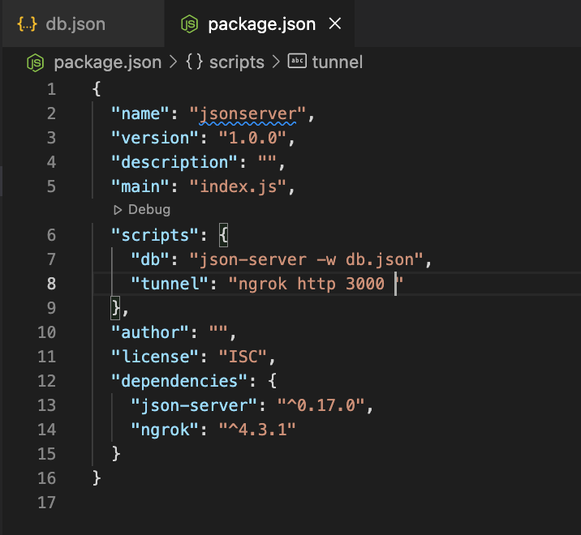 
                    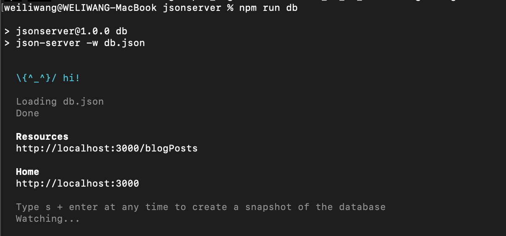 
                    </li>
                </ul>
                <li>Using .push(), .get(), .post() and .delete() to perform CRUD   
                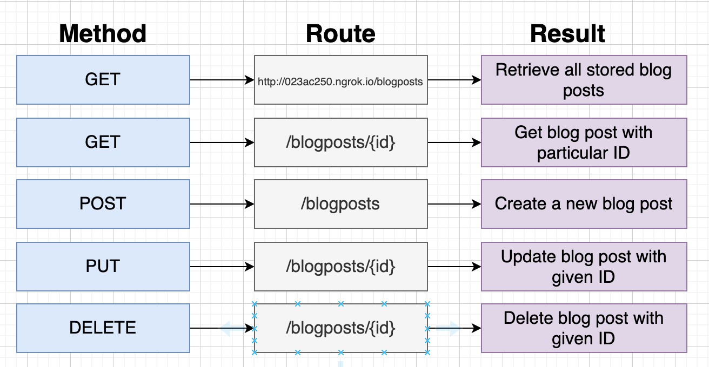
                </li>
                <li>useEffect with [] only run once when the screen render. But when we navigate to the add blogpost screen, the index screen are actually be invisible and running on some where. We face the issue that screen won't update when we navigate back to index screen. We are using navigation.addListener('focus', ()=> {} ) to fix is by calling the get blogpost function very time we focus on the index screen.</li>
                <li>Return the function to unsubscribe from the event so it gets removed on unmount.  
                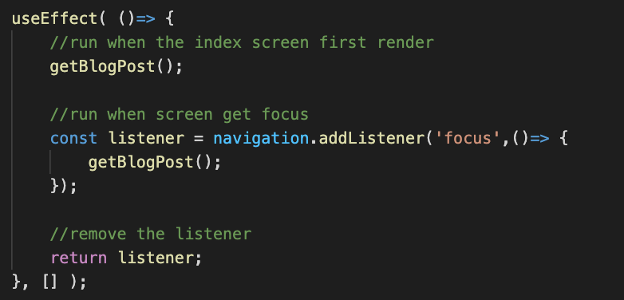
                </li>
            </ol>
        </li>
         <li>
            <b>Covert to useRecoil </b>  
             <ol>
                <li>npm i recoil -  To install recoil</li>
                <li>Component that use recoil state need RecoilRoot to appear somewhere in the parent tree.Wrap the AppStack with RecoilRoot.  
                  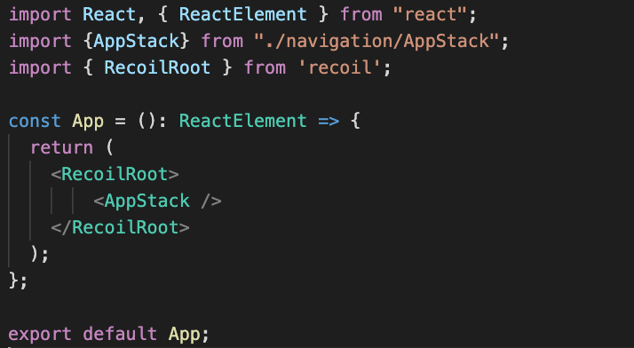
                </li>
                <li>Atom contain the source of truth for our application state. We give atom a unique key and set the default value.  
                  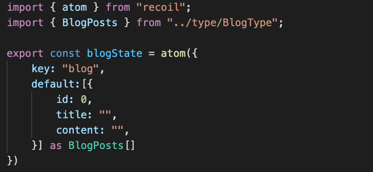
                </li>
                <li>Use useRecoilState to read state and to get setter function that we use to update the item.</li>
                <li>I am creating a custom hook to handle the global state and export the state(blog) and functions. 
                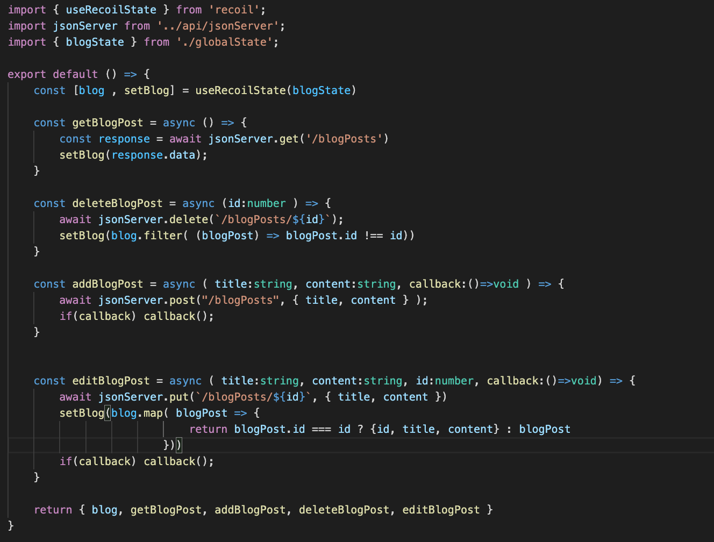
               </li>
            </ol>
        </li>
        <li>Code 
            <ol>
                <li>Index Screen  
                  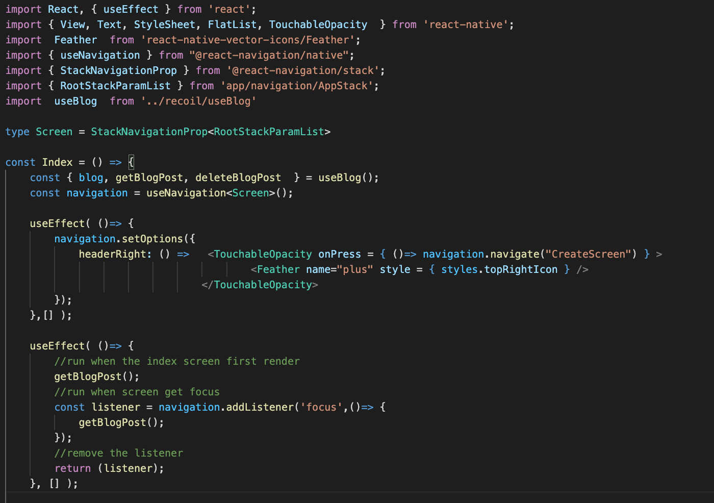 
                  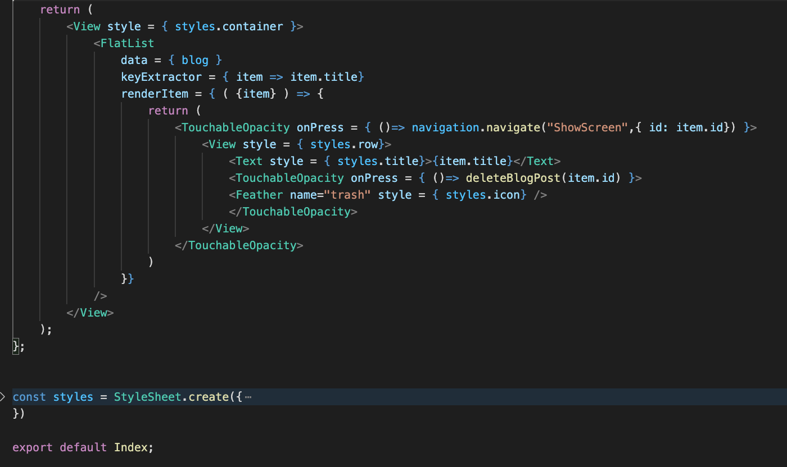 
                </li>
                <li>Create Screen.  
                  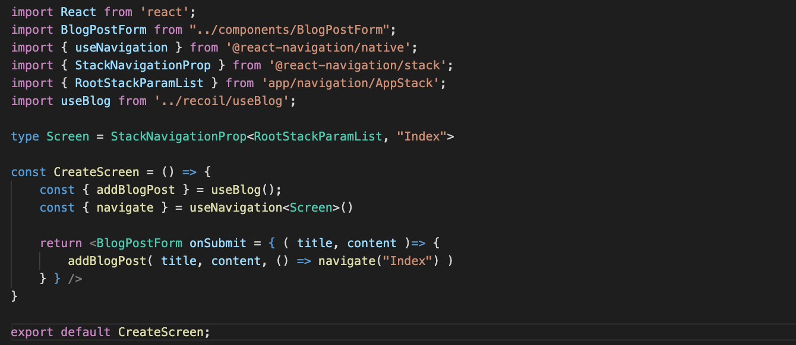
                </li>
                <li>Show Screen  
                  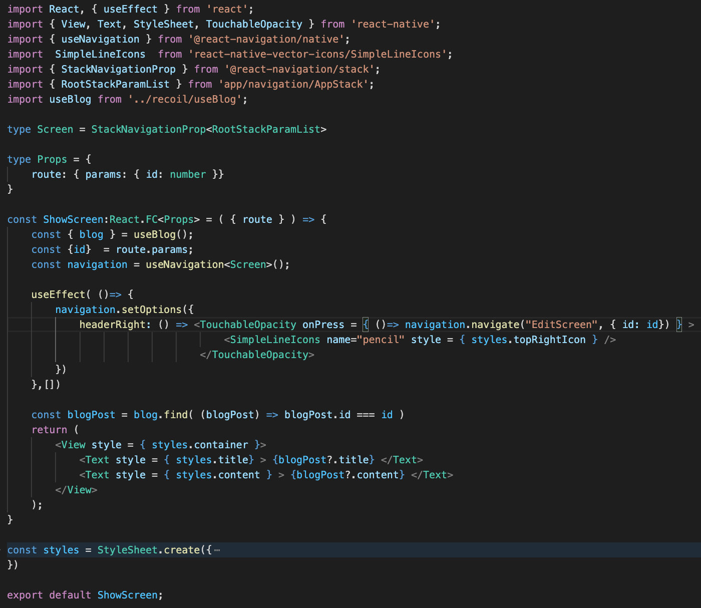
                </li>
                <li>Edit Screen  
                  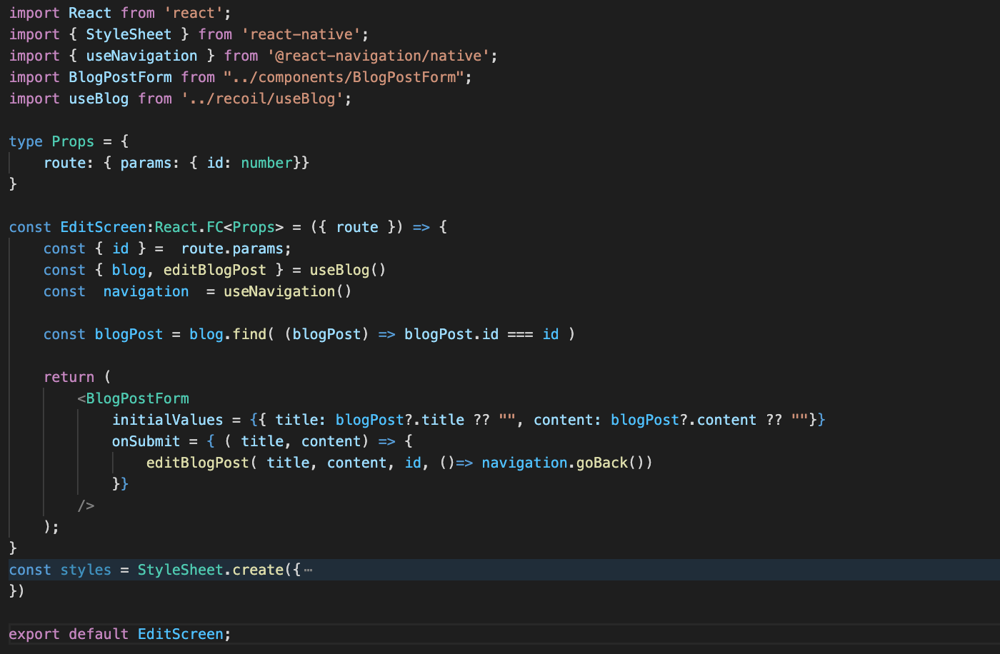
                </li>
            </ol>
        </li>
    </ul>
    </li>

</ol>
  

<!-- Challenge -->

## Challenge

<!-- CONTACT -->

## Contact

Wang Wei Li - weiliwang@activate.sg 
Project Link: [https://github.com/WillyWangwl/rn-training](https://github.com/WillyWangwl/rn-training)
  

<!-- Useful Link -->

## Useful Link

[Day 28: Blog App: Backend Touch](https://docs.google.com/document/d/1PFtfjQWa1HYAWfHVpiThGXYcwyxVO-QmNQ1OtDzRBMU/edit#) 
[The Complete React Native + Hooks Course](https://www.udemy.com/course/the-complete-react-native-and-redux-course/learn/lecture/15707598#overview) 
[Cannot update a component StackNavigator while rendering a different component](https://github.com/react-navigation/react-navigation/issues/9478) 
[How to use React Context with TypeScript](https://felixgerschau.com/react-typescript-context/) 
[Call a function when focused screen changes](https://reactnavigation.org/docs/function-after-focusing-screen/) 
[Recoil](https://recoiljs.org/docs/basic-tutorial/intro) 
[Recoil with React and TypeScript](https://dev.to/sirwanafifi/recoil-with-react-and-typescript-2hif) 
[React Recoil / Recoil js - All you need to know | React tutorial](https://www.youtube.com/watch?v=JvWukLAdS_8) 
[Get started with Recoil by building a Fantasy app in React Native](https://www.notjust.dev/blog/2021-06-28-get-started-with-recoil-by-building-a-fantasy-app-in-react-native) 
