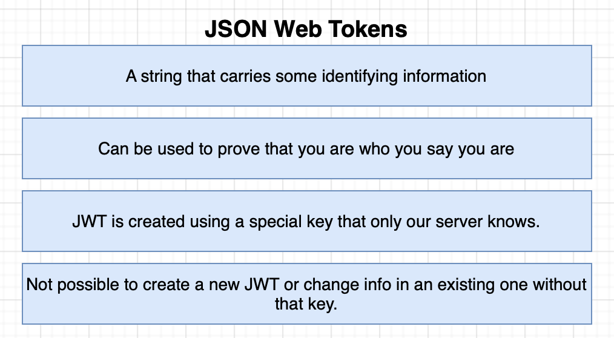
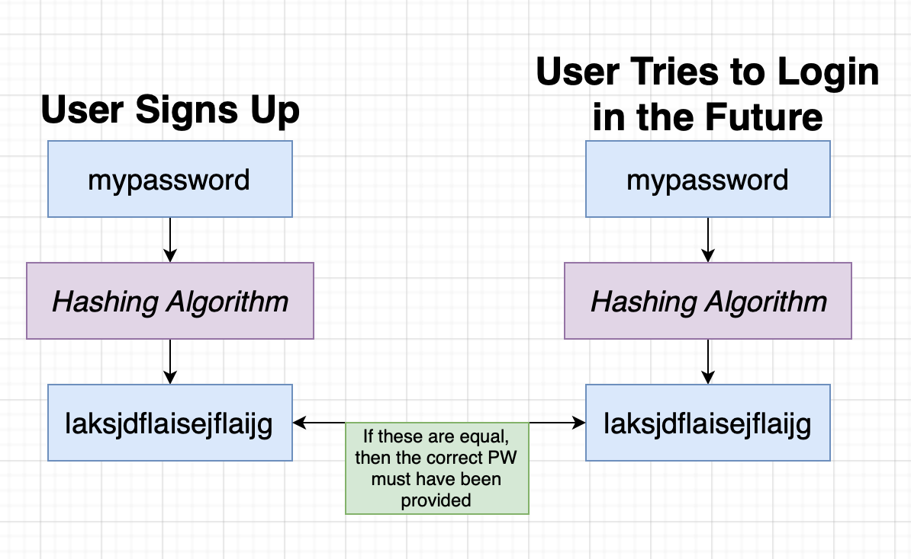
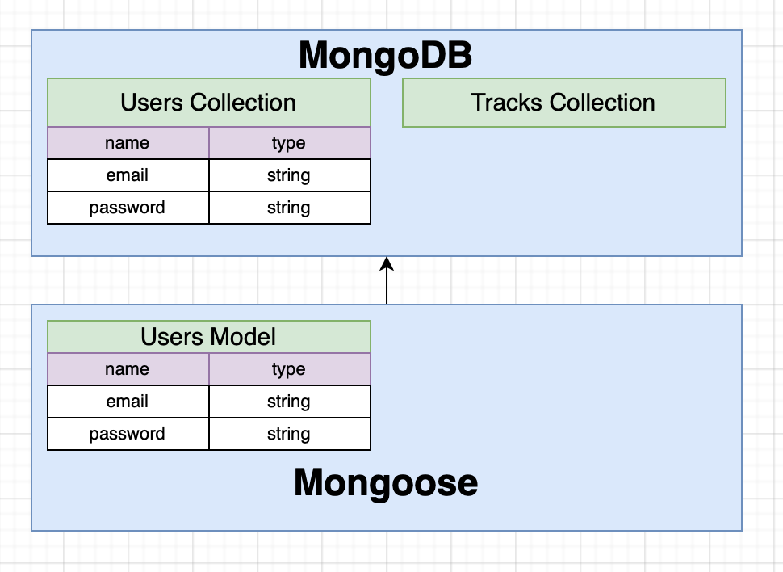
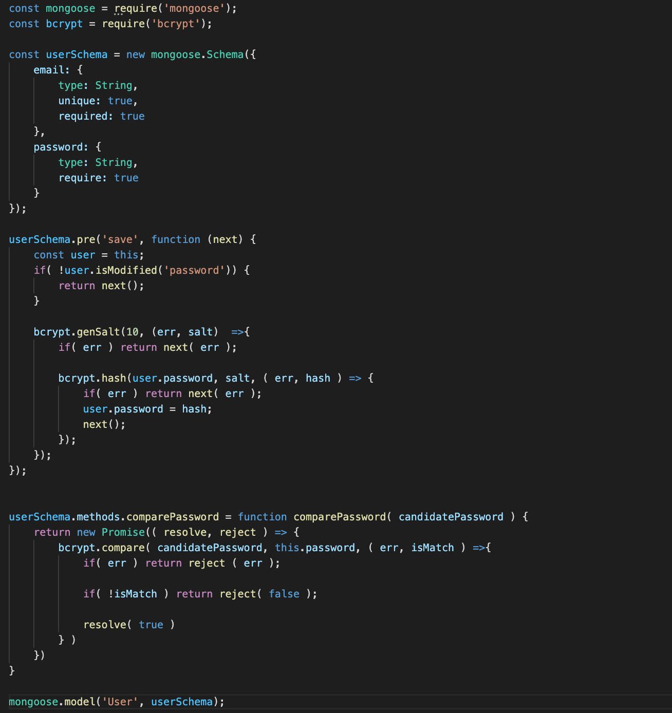

 

  <h3 align="center">Learning Journal Day 29 - 20/05/2022</h3>

  

    Hi, I am Wei Li, this is my learning journal with Activate for my apprenticeship. 
      
  

<!-- What I Am Doing -->

## What I Am Doing

<oL>
  <li>    
    Learning for React Native. 
    <ul>
        <li>
            <b>Tracker App 173-274</b>  
             <ol>
                <li>npm init - y to crete a json file</li>
                <li>npm i bcrypt express jsonwebtoken mongoose nodemon</li>
                <li>express - Express is a minimal and flexible Node. js web application framework that provides a robust set of features for web and mobile applications.</li>
                <li>mongoose - Is a Node. js-based Object Data Modeling (ODM) library for MongoDB. It is akin to an Object Relational Mapper (ORM) such as SQLAlchemy for traditional SQL databases. The problem that Mongoose aims to solve is allowing developers to enforce a specific schema at the application layer.</li>
                <li>nodemon - Is a command-line interface (CLI) utility developed by @rem that wraps your Node app, watches the file system, and automatically restarts the process.</li>
                <li>jsonwebtoken - JWT, or JSON Web Token, is an open standard used to share security information between two parties — a client and a server. Each JWT contains encoded JSON objects, including a set of claims. JWTs are signed using a cryptographic algorithm to ensure that the claims cannot be altered after the token is issued. 
                 
                </li>
                <li>bcrypt - A library to help you hash passwords.</li>
                 
                <li>Follow Udemy video to setup json and mongoDB</li>
                <li>Project > database > connect > Connect your application > connection string - to connect your database. </li>
                <li>package.json > script > "dev": "nodemon src/index.js" to automatically restart when we change any of our different files.</li>
                <li>Use Thunder Client on vscode to test api. </li>
                <li>const bodyParser = require('body-parser') - Body parser is a little helper library that will automatically pass information associated handle incoming JSON </li>
                <li>Everything in Mongoose starts with a Schema. Each schema maps to a MongoDB collection and defines the shape of the documents within that collection.</li>
                <li>Create user modal to tell mongoDB type of collection data inside.  
                  
                </li>
                <li>Pre middleware functions are executed one after another, when each middleware calls next.</li>
                <li>gensalt - generates a random text salt for use with hash password.</li>
                <li>Each Schema can define instance and static methods for its model.</li>
                <li>when we have an instance of User we can call our comparePassword method.</li>
                 
            </ol>
        </li>
    </ul>
    </li>
</ol>
  

<!-- Challenge -->

1. get the error when running mongoDB server. useCreateIndex is not supported.  
    
   useNewUrlParser, useUnifiedTopology, useFindAndModify, and useCreateIndex are no longer supported options. Mongoose 6 always behaves as if useNewUrlParser, useUnifiedTopology, and useCreateIndex are true, and useFindAndModify is false. Please remove these options from your code. 
   [MongoParseError: options useCreateIndex, useFindAndModify are not supported](https://stackoverflow.com/questions/68958221/mongoparseerror-options-usecreateindex-usefindandmodify-are-not-supported) 

## Challenge

<!-- CONTACT -->

## Contact

Wang Wei Li - weiliwang@activate.sg 
Project Link: [https://github.com/WillyWangwl/rn-training](https://github.com/WillyWangwl/rn-training)
  

<!-- Useful Link -->

## Useful Link

[Day 29-33: Tracker App](https://docs.google.com/document/d/1SKVpyDNItn_xRy_r2KFmNUKJ45IbYLMUYIao6mBLsSI/edit#heading=h.ufcujsb6qedn) 
[The Complete React Native + Hooks Course](https://www.udemy.com/course/the-complete-react-native-and-redux-course/learn/lecture/15707662#overview) 
