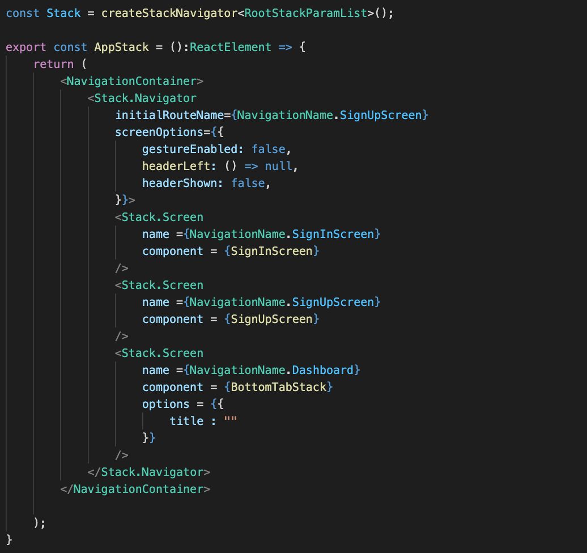
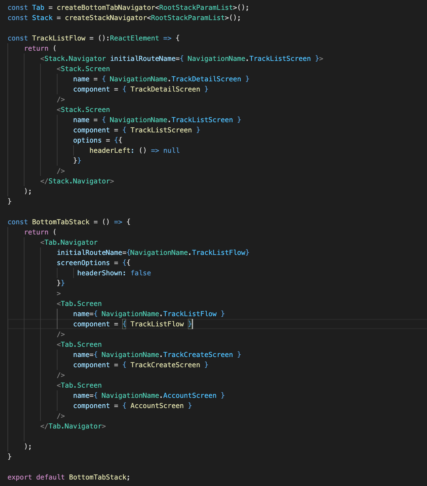
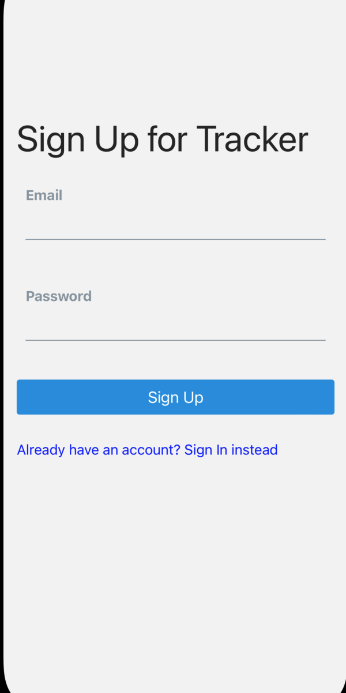
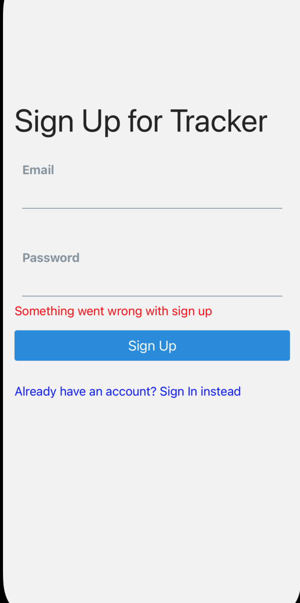
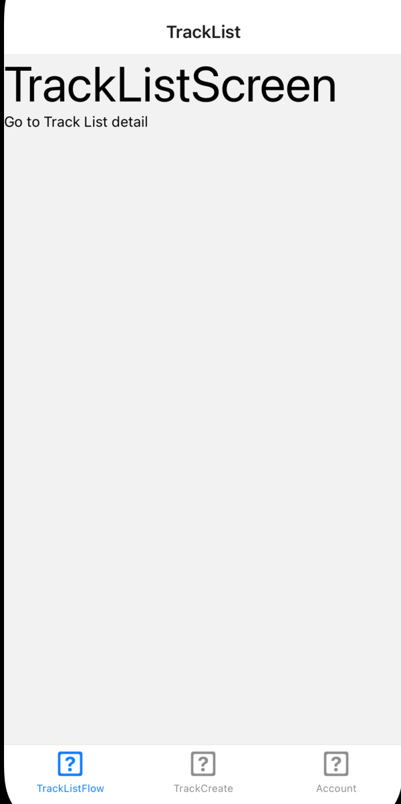
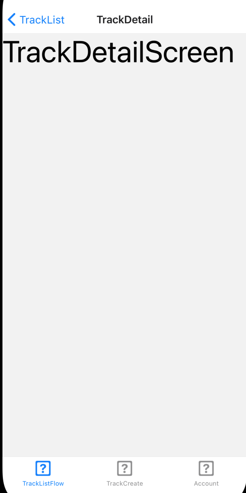

 

  <h3 align="center">Learning Journal Day 30 - 24/05/2022</h3>

  

    Hi, I am Wei Li, this is my learning journal with Activate for my apprenticeship. 
      
  

<!-- What I Am Doing -->

## What I Am Doing

<oL>
  <li>    
    Learning for React Native. 
    <ul>
        <li>
            <b>Tracker App 173-274</b>  
             <ol>
                <li>npm install react-native-elements</li>
                <li>if you want to implement a "switch" like feature with V5, you need to opt into using the new &#60;Stack.Navigator /&#62; definition. Basically, the &#60;Stack.Navigator /&#62; can have children which are &#60;Stack.Screen /&#62; and anytime you explicitly switch between them (or set them to null), it will animate between them. You can find more documentation on how to do this here:[Authentication flows] (https://reactnavigation.org/docs/auth-flow)</li>
                <li>Setting up for the navigation and bottom tab. 
                
                
                </li>
                <li>React Native Element - The aim of React Native Elements is to provide an all-in-one UI kit for creating apps in react native. There are many great ui components made by developers all around open source.</li>
                <li>AsyncStorage - currently apart of the React Native standard library, but being deprecated soon.</li>
                <li>import  useAsyncStorage  from '@react-native-async-storage/async-storage'.</li>
                <li>setItem(key: string , value:string) to store item.</li>
                <li>getItem(key: string) to retrieve item from AsyncStorage. </li>
                <li>removeItem(key: string) to remove single item, clear() to remove all item.</li>
            </ol>
        </li>
        <li>
            <b>Screen</b>  
             <ol>
                <li>
                    
                    
                    
                    
                </li>
            </ol>
        </li>
    </ul>
    </li>
</ol>
  

<!-- Challenge -->

## Challenge

<!-- CONTACT -->

## Contact

Wang Wei Li - weiliwang@activate.sg 
Project Link: [https://github.com/WillyWangwl/rn-training](https://github.com/WillyWangwl/rn-training)
  

<!-- Useful Link -->

## Useful Link

[Day 29-33: Tracker App](https://docs.google.com/document/d/1SKVpyDNItn_xRy_r2KFmNUKJ45IbYLMUYIao6mBLsSI/edit#heading=h.ufcujsb6qedn) 
[The Complete React Native + Hooks Course](https://www.udemy.com/course/the-complete-react-native-and-redux-course/learn/lecture/15707662#overview) 
[AsyncStorage](https://reactnative.dev/docs/asyncstorage) 
 
 
