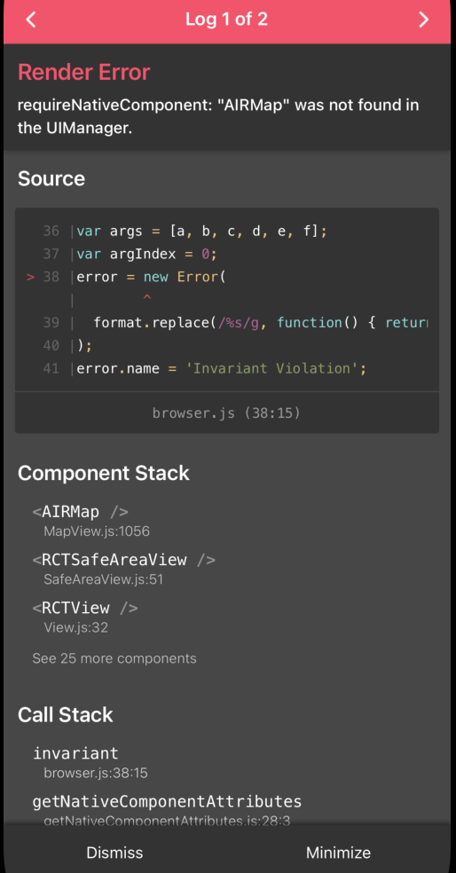
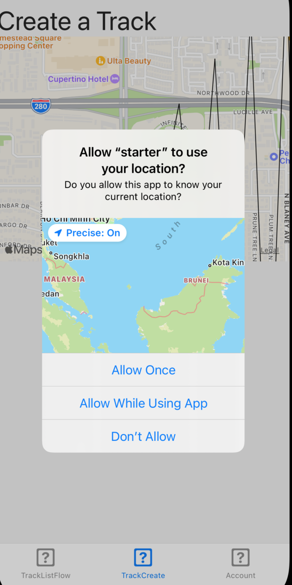
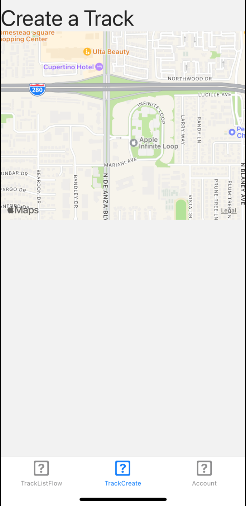

 

  <h3 align="center">Learning Journal Day 31 - 25/05/2022</h3>

  

    Hi, I am Wei Li, this is my learning journal with Activate for my apprenticeship. 
      
  

<!-- What I Am Doing -->

## What I Am Doing

<oL>
  <li>    
    Learning for React Native. 
    <ul>
        <li>
            <b>Tracker App 173-274</b>  
             <ol>
                <li>Sign in and sign up are using same component, make reuse able component use on both screen.</li>
                <li>onWillFocus is on navigationEvent v4 version. We can use addListener('focus') or useFocusEffect to preform same action. </li>
                <li>useFocusEffect
                    <ul>
                        <li>The useFocusEffect is analogous to React's useEffect hook. The only difference is that it only runs if the screen is currently focused.</li>
                        <li>The effect will run whenever the dependencies passed to React.useCallback change, i.e. it'll run on initial render (if the screen is focused) as well as on subsequent renders if the dependencies have changed. If you don't wrap your effect in React.useCallback, the effect will run every render if the screen is focused.</li>
                    </ul>
                </li>
                <li>SafeAreaView from react native renders nested content and automatically applies padding to reflect the portion of the view that is not covered by navigation bars, tab bars, toolbars, and other ancestor views. </li>
                <li>npm i react-native-maps - React Native Map components for iOS + Android</li>
                <li>cd ios && pod install to solve the issue 
                    source : https://github.com/react-native-maps/react-native-maps/blob/master/docs/installation.md 
                    
                </li>
                <li>npm i @react-native-community/geolocation </li>
                <li>getCurrentPosition to check permission to access location service. It will return error if not permission </li>
                <li>requestAuthorization to request for permission.</li>
                <li>Cant find any setting to reset the permission after doing testing on denied permission. 
                    Solution - delete starter in IOS and install again.  
                    
                    
                </li>
            </ol>
        </li>
    </ul>
    </li>
</ol>
  

<!-- Challenge -->

## Challenge

<!-- CONTACT -->

## Contact

Wang Wei Li - weiliwang@activate.sg 
Project Link: [https://github.com/WillyWangwl/rn-training](https://github.com/WillyWangwl/rn-training)
  

<!-- Useful Link -->

## Useful Link

[Day 29-33: Tracker App](https://docs.google.com/document/d/1SKVpyDNItn_xRy_r2KFmNUKJ45IbYLMUYIao6mBLsSI/edit#heading=h.ufcujsb6qedn) 
[The Complete React Native + Hooks Course](https://www.udemy.com/course/the-complete-react-native-and-redux-course/learn/lecture/15707662#overview) 
[useFocusEffect](https://reactnavigation.org/docs/use-focus-effect/) 
[SafeAreaView](https://reactnative.dev/docs/safeareaview) 
[react-native-maps](https://www.npmjs.com/package/react-native-maps?activeTab=readme) 
[React Native geolocation: A complete tutorial](https://blog.logrocket.com/react-native-geolocation-a-complete-tutorial/) 
[Geolocation watchPosition() API](https://www.tutorialspoint.com/html5/geolocation_watchposition.htm) 
[Geolocation in React Native](https://dev-yakuza.posstree.com/en/react-native/react-native-geolocation-service/) 
[@react-native-community/geolocation](https://www.npmjs.com/package/@react-native-community/geolocation) 
