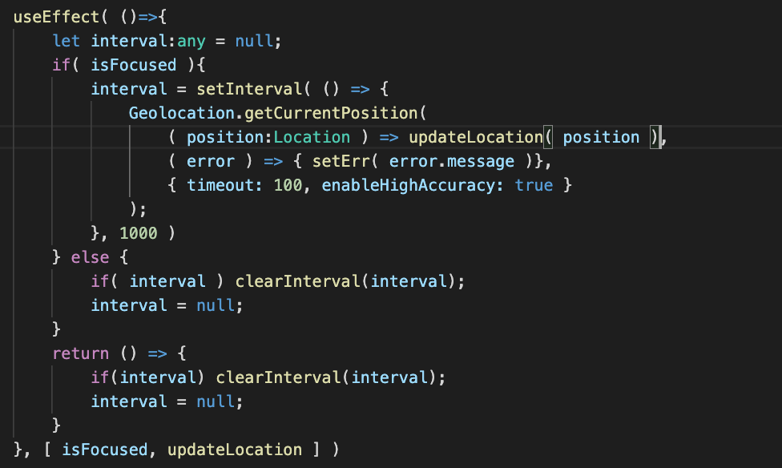
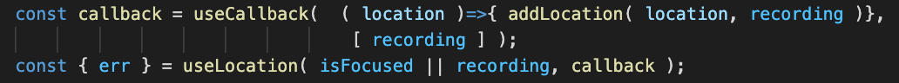
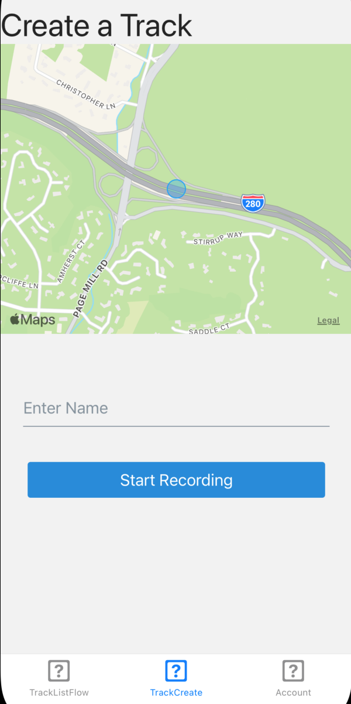
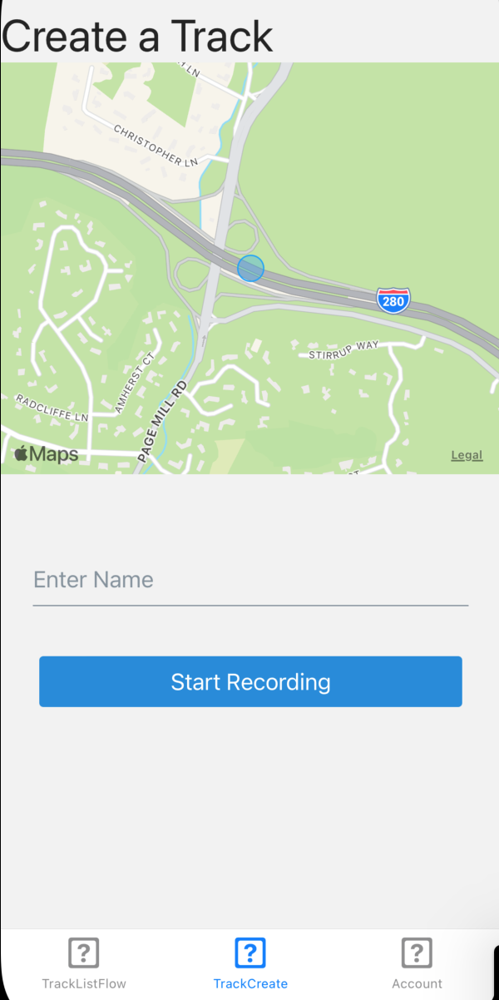
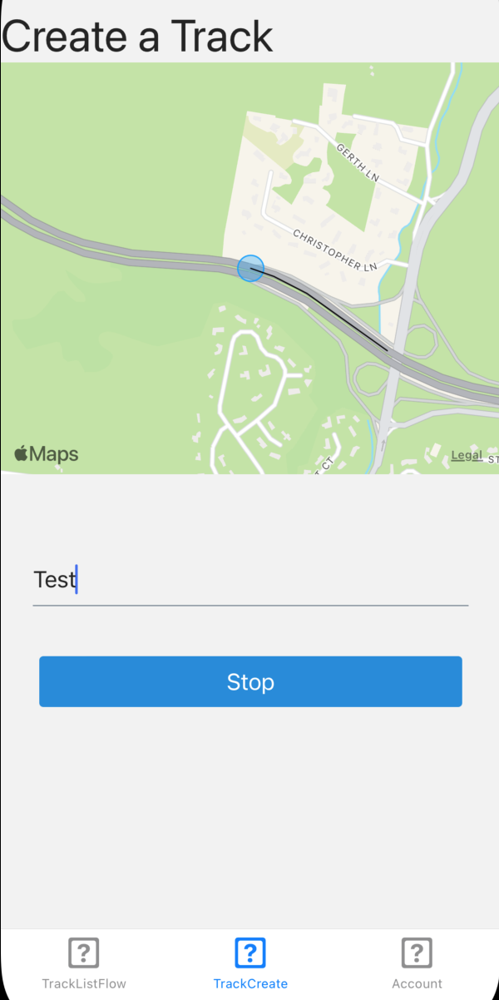
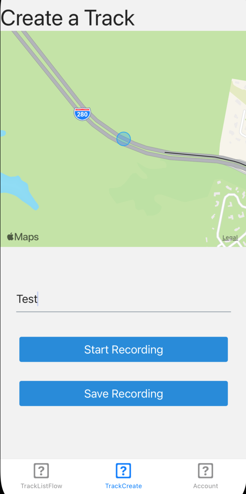

 

  <h3 align="center">Learning Journal Day 32 - 26/05/2022</h3>

  

    Hi, I am Wei Li, this is my learning journal with Activate for my apprenticeship. 
      
  

<!-- What I Am Doing -->

## What I Am Doing

<oL>
  <li>    
    Learning for React Native. 
    <ul>
        <li>
            <b>Tracker App 173-274</b>  
             <ol>
                <li>setInterval with getCurrentPosition to get the position every 1 second. </li>
                <li>useIsFocused -  render different content based on the current focus state of the screen.</li>
                <li>useEffect to wrap the setInterval and take in focus as 2nd argument.</li>
                <li>When its not focus or not recording it won't get the current location and free the interval memory. 
                    
                </li>
                <li>useCallback will return a memoized version of the callback that only changes if one of the dependencies has changed.</li>
                <li>To prevent we keep creating the setInterval use call back function will only update the callback when the recording change.  
                    
                </li>
                <li>Use const { state: { currentLocation, locations }} =  useLocation(); to destructure the state.</li>
            </ol>
        </li>
        <li>
            <b>Screen</b>  
            
            
            
            
        </li>
    </ul>
    </li>
</ol>
  

<!-- Challenge -->

## Challenge

<!-- CONTACT -->

## Contact

Wang Wei Li - weiliwang@activate.sg 
Project Link: [https://github.com/WillyWangwl/rn-training](https://github.com/WillyWangwl/rn-training)
  

<!-- Useful Link -->

## Useful Link

[Day 29-33: Tracker App](https://docs.google.com/document/d/1SKVpyDNItn_xRy_r2KFmNUKJ45IbYLMUYIao6mBLsSI/edit#heading=h.ufcujsb6qedn) 
[The Complete React Native + Hooks Course](https://www.udemy.com/course/the-complete-react-native-and-redux-course/learn/lecture/15707662#overview) 
[useIsFocused](https://reactnavigation.org/docs/use-is-focused/) 
