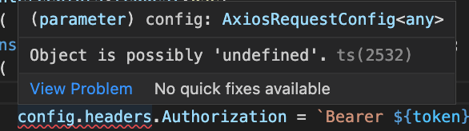
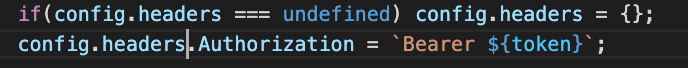
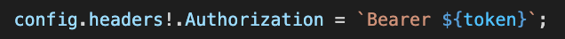
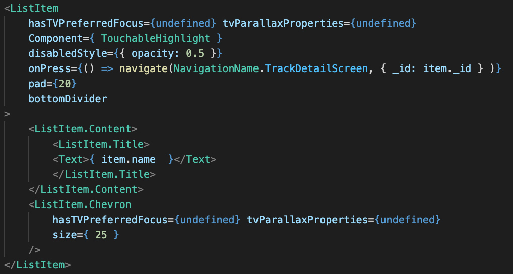
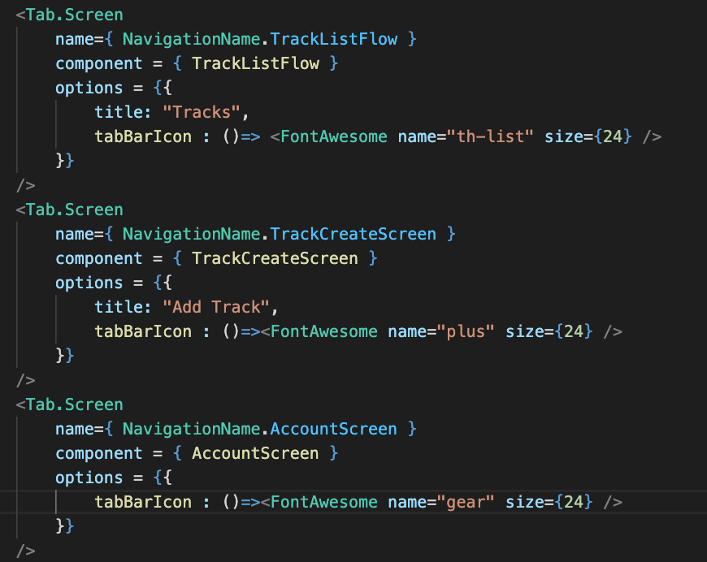
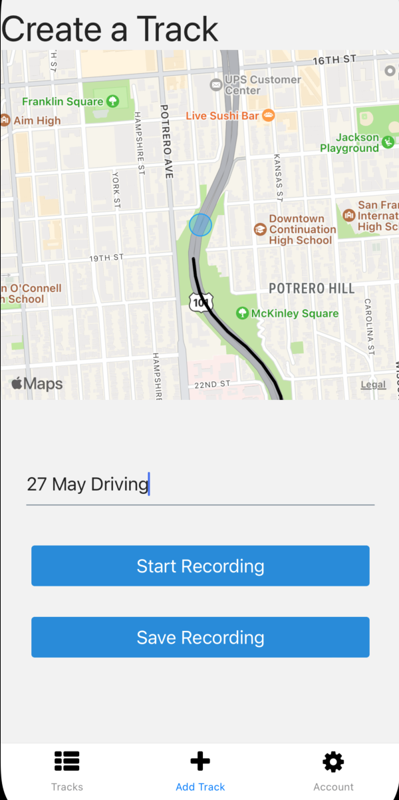
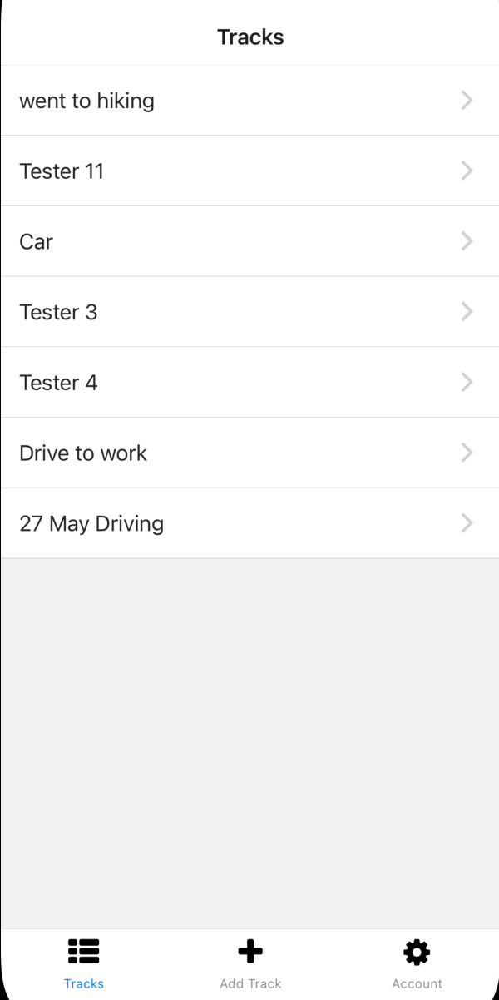
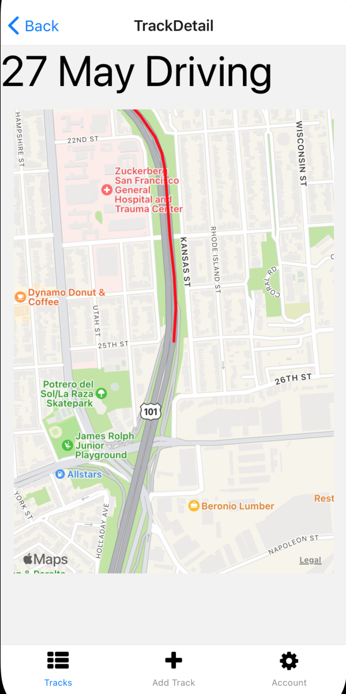

 

  <h3 align="center">Learning Journal Day 33 - 27/05/2022</h3>

  

    Hi, I am Wei Li, this is my learning journal with Activate for my apprenticeship. 
      
  

<!-- What I Am Doing -->

## What I Am Doing

<oL>
  <li>    
    Learning for React Native. 
    <ul>
        <li>
            <b>Tracker App 173-274</b>  
             <ol>
                <li>To avoid pull the token when we call every action function. We create a function that execute before we make a request in the Axios api.So we can grab the token inside there and appended on our request. 
                  <ul>
                    <li>import AsyncStorage to grab the token out.</li>
                    <li>Next up, assign Axios instance to a variable after export to tell the Axios run the function before make request.</li>
                    <li>Create the function name variable.interceptor.request.use with 2 parameter passed in.</li>
                    <li>First parameter is a function that going to call automatically when me make request and the argument is a config object. </li>
                    <li>axios.interceptors.request.use method to update each request header and set the access token in the Authorization HTTP header.</li>
                    <li>We going to get the token out from the asyncStorage. </li>
                    <li>in order to authorize us with our back in server and actually be recognized as some particular user, all we have to do is add on an authorization header with a value of Bearer. And then our token like so that's how we authenticate ourselves with our backend API.</li>
                    <li>there is some ts error of Object is possibly 'undefined'.ts(2532).  
                        
                       solution 1 , set to an {} object if the config.headers is undefined 
                        
                       solution 2 , put ! after config.headers if you are sure that is not undefined object. 
                        
                    </li>
                    <li>Second parameter is a function that going to call when error orcus</li>
                    <li>Use ListItem from react-native-elements to display item in list . 
                         
                    </li>
                    <li>Use tabBarIcon to set icon for the each element in tab bar. 
                         
                    </li>
                  </ul>
                </li>
            </ol>
        </li>
        <li>
            <b>Screen</b>  
            
            
            
        </li>
    </ul>
    </li>
</ol>
  

<!-- Challenge -->

## Challenge

<!-- CONTACT -->

## Contact

Wang Wei Li - weiliwang@activate.sg 
Project Link: [https://github.com/WillyWangwl/rn-training](https://github.com/WillyWangwl/rn-training)
  

<!-- Useful Link -->

## Useful Link

[Day 29-33: Tracker App](https://docs.google.com/document/d/1SKVpyDNItn_xRy_r2KFmNUKJ45IbYLMUYIao6mBLsSI/edit#heading=h.ufcujsb6qedn) 
[The Complete React Native + Hooks Course](https://www.udemy.com/course/the-complete-react-native-and-redux-course/learn/lecture/15707662#overview) 
[How to fix config.headers.Authorization "Object is possibly undefined" when using axios interceptors](https://stackoverflow.com/questions/70085215/how-to-fix-config-headers-authorization-object-is-possibly-undefined-when-usin) 
[Options for screens](https://reactnavigation.org/docs/screen-options) 
[React Native Elements](https://react-native-elements.js.org/#/list-item) 
