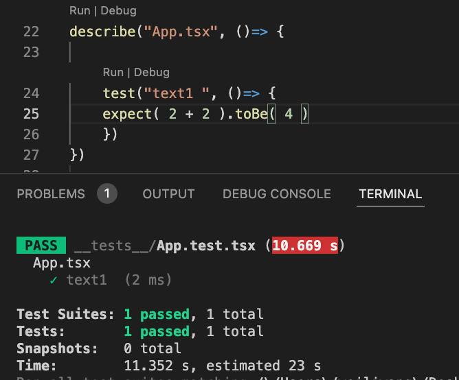
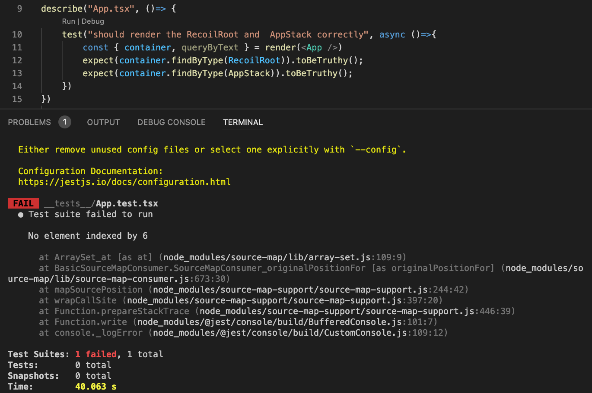
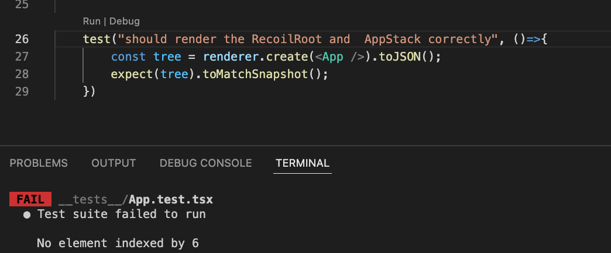
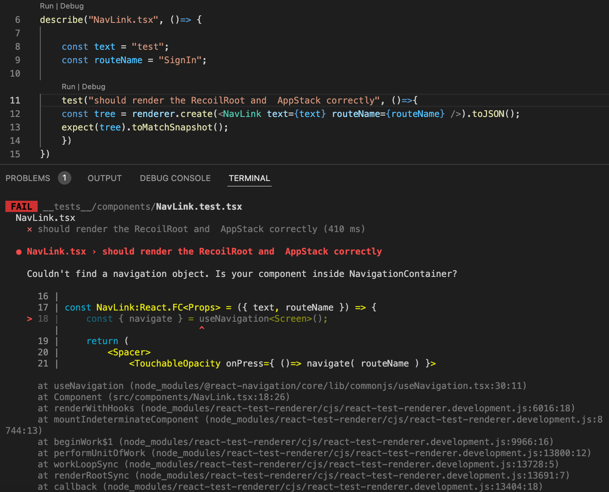

 

  <h3 align="center">Learning Journal Day 34 - 30/05/2022</h3>

  

    Hi, I am Wei Li, this is my learning journal with Activate for my apprenticeship. 
      
  

<!-- What I Am Doing -->

## What I Am Doing

<oL>
  <li>    
    Learning for React Native. 
    <ul>
        <li>
            <b></b>  
             <ol>
                <li>Unit Testing 
                  <ul>
                    <li>npm install --save-dev @testing-library/react-native</li>
                    <li>Unit test helps software development with lower costs, higher quality, and fast delivery</li>
                    <li>Test on 2 + 2 and expect 4  
                        
                    </li>
                    <li>Try to do testing on App.tsx. but keep getting error  
                        
                        
                    </li>
                    <li>Another Error on NavLink.tsx  
                     
                    </li>
                  </ul>
                </li>
            </ol>
        </li>
    </ul>
    </li>
</ol>
  

<!-- Challenge -->

## Challenge

1. Cant find answer on my error. Will try to fix it tomorrow

<!-- CONTACT -->

## Contact

Wang Wei Li - weiliwang@activate.sg 
Project Link: [https://github.com/WillyWangwl/rn-training](https://github.com/WillyWangwl/rn-training)
  

<!-- Useful Link -->

## Useful Link

[Testing library - Introduction](https://testing-library.com/docs/react-native-testing-library/intro/) 
[Testing](https://reactnative.dev/docs/testing-overview) 
[React Native Tutorial #32 (2021) - Testing with Jest and React Test Renderer](https://www.youtube.com/watch?v=bOJkNut1Qyo) 
[testing-library/native-testing-library-docs](https://github.com/testing-library/native-testing-library-docs/blob/master/website/versioned_docs/version-3.0.0/example-input-event.md) 
