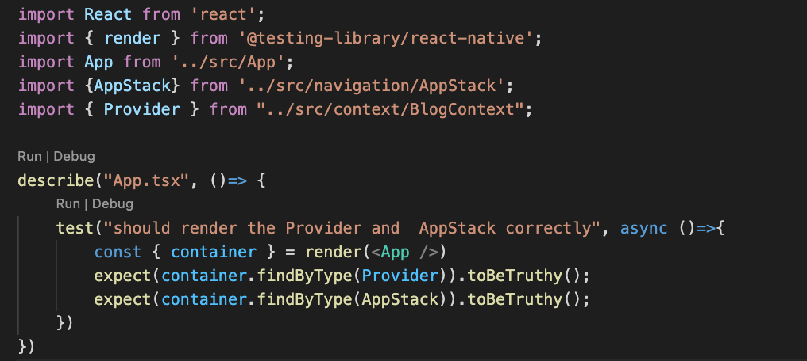

 

  <h3 align="center">Learning Journal Day 35 - 31/05/2022</h3>

  

    Hi, I am Wei Li, this is my learning journal with Activate for my apprenticeship. 
      
  

<!-- What I Am Doing -->

## What I Am Doing

<oL>
  <li>    
    Learning for React Native. 
    <ul>
        <li>
            <b></b>  
             <ol>
                <li>Unit Testing 
                  <ul>
                    <li>Still encounter Test suite fail to run No element indexed by 6 on tracker.app 
                        
                    </li>
                    <li>Decided to do the testing on blog app. And encounter react-native-gesture-handler not found on App.tsx. 
                        
                    </li>
                    <li>Do some research still can't find solution. And decide to go do the testing on component part.</li>
                    <li>Testing for Blog - Components - BlogPostForm.tsx
                        <ul>
                            <li>Declare default props. 
                                
                                 
                            </li>
                            <li>Do the testing for item to be shown on screen 
                                
                            </li>
                            <li>Testing TextInput with text change for title and contents 
                                
                            </li>
                            <li>Testing button onPress function. Function should be call. 
                                
                            </li>
                            <li>npm test -- --coverage --collectCoverageFrom="./src/**" to show coverage. 
                                 
                                show Branch is 0% and line 12 in BlogPostForm.tsx was not covered. And it is a header with option parameter.
                            </li>
                            <li>Try to testing with and without initialValue passed in and its show 100%.  
                                 
                                 
                            </li>
                        </ul>
                    </li>
                    <li>Special thanks to Jan help me solve the issue of react-native-gesture-handler not found  
                        https://reactnavigation.org/docs/testing/
                    </li>
                    <li>Test passed after follow the step to setup mock native modules.  
                         
                    </li>
                    <li>
                         
                    </li>
                  </ul>
                </li>
            </ol>
        </li>
    </ul>
    </li>
</ol>
  

<!-- Challenge -->

## Challenge

<!-- CONTACT -->

## Contact

Wang Wei Li - weiliwang@activate.sg 
Project Link: [https://github.com/WillyWangwl/rn-training](https://github.com/WillyWangwl/rn-training)
  

<!-- Useful Link -->

## Useful Link

[Configuring code coverage in Jest, the right way](https://www.valentinog.com/blog/jest-coverage/) 
[Common Test Scenarios with React Testing Library](https://react-testing-library-examples.netlify.app) 
[Firing Events](https://testing-library.com/docs/dom-testing-library/api-events/) 
